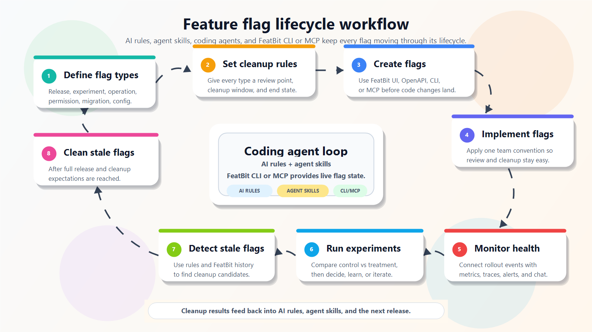

## Overview

Modern coding agents such as Codex, Claude Code, and GitHub Copilot are becoming part of everyday software development. FeatBit's position is that feature flag lifecycle management should use these coding agents as active collaborators, not only as code completion tools.

A feature flag lifecycle is more than creating a flag and deleting it later. It should connect the flag's purpose, expected lifetime, release evidence, audit history, and cleanup plan. Coding agents can help teams keep that lifecycle visible through AI rules, agent skills, and FeatBit data from CLI or MCP.

Agent-assisted flag lifecycle management has three foundations:

1. Define feature flag types based on your team's needs.
2. Assign each flag type a default cleanup expectation.
3. Use coding agents, project-level agent skills, and FeatBit data to add, update, clean up, and review flags continuously.

This gives the team a clear contract: every flag has a purpose, an owner, a review point, and an expected end state.

<Callout type="info">
  This page is the lifecycle map. Each step links to a dedicated page where the practice can be expanded with examples, CLI usage, coding-agent prompts, and review checklists.
</Callout>

## Lifecycle steps

### 1. Define flag types

Define the types of feature flags your project uses, such as release flags, experiment flags, operational flags, permission flags, migration flags, and configuration flags.

Read more: [Define flag types](flag-lifecycle-management/define-flag-types)

### 2. Set cleanup expectations

Set the default review and cleanup window for each flag type. For example, release and experiment flags can use a 30-day cleanup warning period after rollout completion or experiment decision.

Read more: [Set cleanup expectations](flag-lifecycle-management/set-cleanup-expectations)

### 3. Create feature flags

Create feature flags in FeatBit before they are implemented in application code. There are three common ways to do this:

- Create flags through the FeatBit UI. This is the traditional path and is covered in [Create two feature flags](/getting-started/create-two-feature-flags).
- Create flags through the OpenAPI. Use this when you need automation or integration with another system. Read more in the [API docs overview](/api-guides/overview).
- Create flags with a coding agent by using FeatBit CLI or FeatBit MCP. Read more in [Create feature flags with coding agents](flag-lifecycle-management/create-flags-with-agent-guidance).

### 4. Implement feature flags

Ask the coding agent to apply the project's feature flag implementation conventions, add tests for enabled and disabled behavior, and avoid spreading one flag across unrelated modules.

Read more: [Implement feature flags](flag-lifecycle-management/implement-feature-flags)

### 5. Monitor release health

Connect flag exposure with FeatBit Dashboard, Rich Webhook, Experimentation, and observability or APM tools so release health can be evaluated with evidence.

Read more: [Monitor release health](flag-lifecycle-management/monitor-release-health)

### 6. Control exposure, release decisions, and learning

Coordinate flag targeting, rollout percentage, protected audiences, and decision categories such as continue, pause, rollback, or iterate. After the decision, summarize what changed, who was exposed, what happened, and what the next iteration should be.

Read more: [Control exposure, release decisions, and learning](flag-lifecycle-management/control-exposure-and-release-decisions)

### 7. Detect stale feature flags

Identify flags that may no longer serve an active release, experiment, operation, migration, configuration, or business rule.

Read more: [Detect stale feature flags](flag-lifecycle-management/detect-stale-feature-flags)

### 8. Clean up feature flags with coding agents

Use coding agents to remove finished flags from code, simplify permanent code paths, update tests, and prepare cleanup pull requests.

Read more: [Clean up feature flags with coding agents](flag-lifecycle-management/clean-up-feature-flags-with-coding-agents)

## Recommended tooling

The best implementation depends on the team's development environment, but the recommended toolchain has three parts:

- The coding agent your team already uses, such as Codex, Claude Code, or GitHub Copilot.
- Project-level agent skills or repository instructions that encode your flag naming, ownership, cleanup, and review rules.
- FeatBit CLI or FeatBit MCP, so the coding agent can retrieve feature flag details, audit history, rollout state, and experiment context directly from FeatBit.

With these pieces in place, the coding agent can apply the same lifecycle rules every time it creates, implements, monitors, reviews, or cleans up a FeatBit flag.

## Related FeatBit pages

- [Archiving and Deleting](organizing-flags/archiving-and-deleting) explains the FeatBit product flow for archiving and deleting flags.
- [Audit log](audit-log) explains how to inspect historical flag changes.
