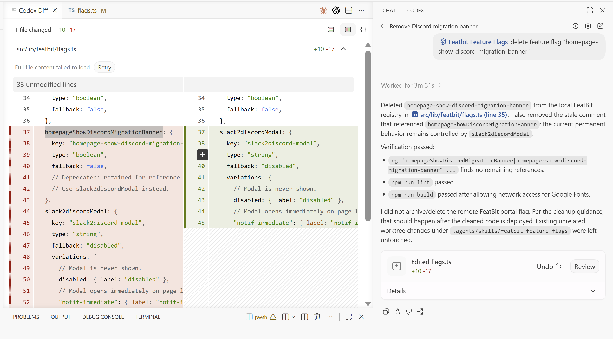

## Overview

When a feature flag reaches the end of its lifecycle, cleanup should remove both the temporary code in the repository and the corresponding flag in FeatBit. FeatBit recommends using coding agents such as Codex, Claude Code, GitHub Copilot, or similar tools to search references, apply project conventions, prepare the code change, and update the FeatBit flag only after the deployed code no longer evaluates it.

## Cleanup workflow

Start from the stale flag candidate, not from a random code search. The cleanup decision should come from your lifecycle rules and FeatBit state:

- Use [Set cleanup expectations](./set-cleanup-expectations) to define when different flag types should be reviewed or removed.
- Use [Detect stale feature flags](./detect-stale-feature-flags) to identify candidate flags from FeatBit state, tags, audit history, rollout state, experiment state, and repository usage.
- Use the convention from [Implement feature flags](./implement-feature-flags) so each flag has predictable keys, registry entries, evaluation helpers, and consumption points that are easy to find later.

After you choose the flag to remove, ask the coding agent to locate every usage of the flag key and related registry entry. Then let the agent apply the permanent behavior, remove the obsolete branch, update or delete tests, and prepare a focused pull request.

Only remove the FeatBit flag from the service after the deployed code no longer evaluates it. Depending on your team's FeatBit policy, this may mean archiving the flag first, then deleting or leaving the archived record for release history.

## Use a coding agent for cleanup

A practical pattern is to extend your existing feature flag agent skill with cleanup instructions instead of treating cleanup as a one-off chat prompt. The skill should teach the agent how your project introduces flags, how stale flags are detected, and how removal should be performed.

For example, add a cleanup reference to the same feature flag skill used during implementation:

````md
# FeatBit Feature Flags

Use this skill before adding, consuming, updating, or removing FeatBit flags in this repository.

## References

- `references/integration-architecture.md`: owned files, SDK setup, and runtime model.
- `references/flag-registration.md`: how flag keys, types, fallbacks, and variations are registered.
- `references/flag-consumption.md`: how pages and components consume evaluated flag values.
- `references/stale-flag-detection.md`: how to classify flags as `remove`, `retain`, or `needs-owner-decision`.
- `references/flag-cleanup.md`: how to remove repository code, tests, tracking, and the FeatBit flag after deployment.
````

The example below shows a coding agent using project rules to clean up a feature flag.



During ongoing product iterations, keep improving this skill with real cleanup cases. If an agent misses a reference, removes the wrong branch, or leaves test or tracking code behind, add that case back into the cleanup reference so the next cleanup run has a better project-specific rule.
