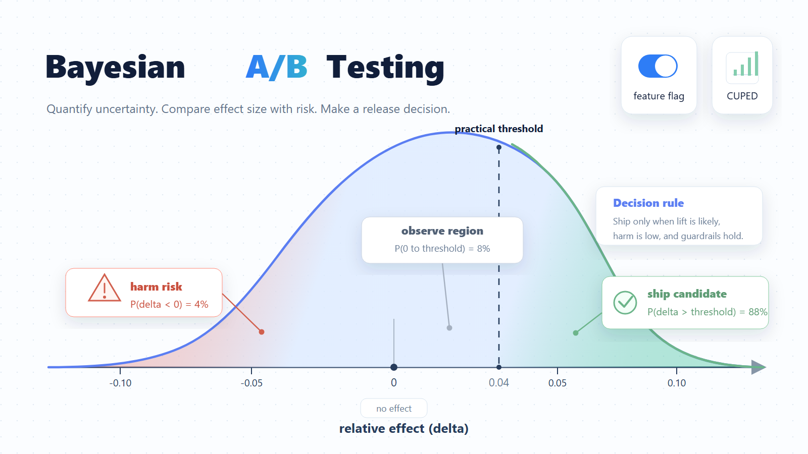
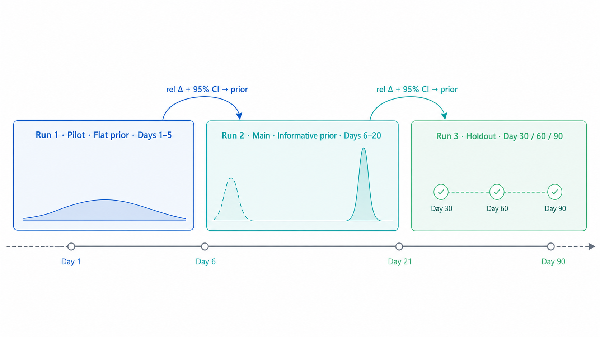

## Overview

After a feature is implemented and its early release health is stable, the next lifecycle step is to use a controlled experiment to decide whether the new version should be expanded, paused, rolled back, or used as evidence for the next investment direction. This matters because a feature flag controls who sees each version, while an experiment measures what changed because of that exposure. Treating them as one release decision object turns rollout from opinion-driven approval into evidence-based learning. For more background, see [Industrial A/B Testing in 2026: Bayesian Methods, CUPED, and Lessons from Meta and Statsig](https://www.featbit.co/blogs/industrial-ab-testing-2026-bayesian-methods-cuped).

## What this step does and why it matters

This step turns a flagged release into a decision loop:

- Define the hypothesis the team wants to test.
- Choose one primary metric that decides success.
- Choose guardrail metrics that must not degrade.
- Define the audience, traffic split, and observation window.
- Record flag exposure events and metric events with the same user identity.
- Read the result as an action decision, such as continue, pause, rollback candidate, or inconclusive.
- Capture what was learned so the next iteration starts from evidence instead of memory.

This is important because most product ideas are uncertain before they meet real users. A controlled experiment compares the current version and the candidate version under the same traffic conditions, so the team can separate actual user impact from release timing, anecdotes, and reviewer preference. It also protects the team from over-reading dashboards: one primary metric keeps the decision focused, guardrails catch unacceptable harm, and a clear decision category tells the team what to do next.

## How FeatBit supports it

FeatBit treats the feature flag and the experiment as the same release object: the flag controls who sees each version, and the experiment measures whether the observed effect is strong enough to ship, pause, roll back, or keep learning.

The AI-agentic workflow starts from the `featbit-release-decision` skill. It routes the team through the full loop instead of treating A/B testing as a dashboard-only task:

`intent -> hypothesis -> implementation -> exposure -> measurement -> interpretation -> decision -> learning -> next intent`

Core capabilities include hypothesis design, reversible exposure control, primary metric and guardrail design, experiment run management, Bayesian A/B analysis, bandit-style optimization, decision framing, and learning capture. The result is a professional experimentation workflow that product managers, engineers, and growth teams can use without acting as full-time data scientists.

Teams can use FeatBit-managed event collection, or a data warehouse-native mode that reads variant statistics from the company's own warehouse, metric layer, and data pipeline.

The open-source experimentation implementation and skills catalog are available at [featbit/featbit-release-decision-agent](https://github.com/featbit/featbit-release-decision-agent).
