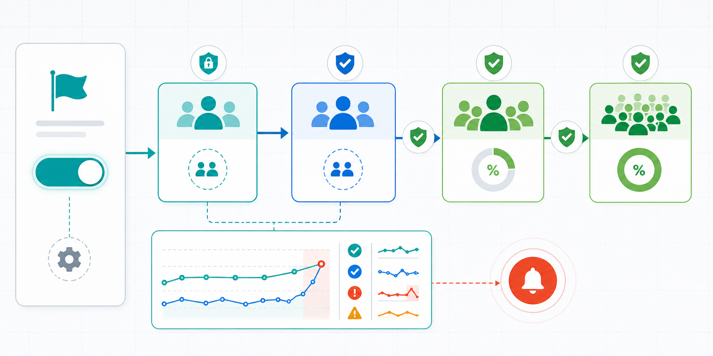
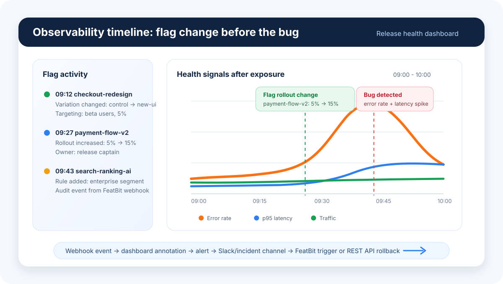
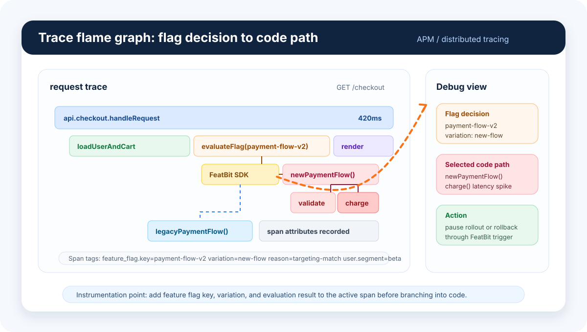

## Overview

New features can fail in many ways after release, from product bugs to performance regressions or data collection gaps. Feature flags reduce the impact by separating deployment from exposure, so teams can expand gradually and monitor release health closely during the early rollout window, especially before the feature reaches about 10% of the target audience.

## Use progressive rollout to limit bug impact

A progressive rollout keeps the blast radius small while the team gains confidence. A common path is:

- Release the feature first to internal QA or the product team. This can happen in production with internal targeting, or in a test or staging environment when that is the safer first step.
- Invite trusted external users who understand the context and are unlikely to create serious negative impact if they hit a bug.
- Roll the feature out to a small production percentage, such as 5% of the target audience.
- Expand gradually based on release health signals, until the feature reaches 100% rollout or reaches the exposure level required for an A/B test.

For experiment features, do not treat the A/B test as the first validation step. Use an initial canary rollout to confirm that the feature flag targets the right users, variation assignment is stable, exposure events are recorded, and experiment metrics are emitted correctly. After that validation, the team can increase exposure to the level needed for the experiment.

For a broader implementation example across front-end, mobile, and back-end applications, see [How Senior Developers Successfully Implement Feature Flags](https://featbit.medium.com/how-to-implement-feature-flags-fc99396da710). The article also covers testing in production, canary release, beta testing, observability, experimentation, and limiting rollout risk with a small percentage such as 10%.

## Connect observability, alerts, and rollback

Fine-grained rollout control is useful only when the team can detect problems quickly. Connect feature flag exposure with logs, metrics, traces, APM data, alerting, and team communication channels so a release problem can be found and acted on before the rollout expands.

[FeatBit Webhooks](/integrations/webhooks) are the bridge between flag changes and the rest of the release health workflow. They can send feature flag activity to observability tools so rollout steps appear next to application health signals. They can also send flag changes to teamwork and incident channels so the right people know when exposure changes.

For observability and alerting, the pattern is the same across tools: record the flag change or rollout step, correlate it with health signals, and use alerts to decide whether to continue, pause, or roll back. See the integration guides for [Datadog](/integrations/observability/datadog), [New Relic One](/integrations/observability/newrelic), and [Grafana](/integrations/observability/grafana).

Feature flag evaluation can also be recorded inside traces. When a request calls a feature flag, add the flag key, variation, and evaluation result to the trace span or span attributes. This makes the flag decision visible in the request flame graph, so engineers can see which code path was selected when debugging latency, errors, or unexpected behavior.

For team communication, use Webhooks with chat integrations such as [Slack](/integrations/chat-apps/slack). This helps the team see when a flag is turned on, expanded, paused, or rolled back without manually checking the FeatBit dashboard.

The practical goal is a short feedback loop: a feature flag change creates an observable event, dashboards and alerts show whether health changes after exposure, the team is notified in the right channel, and rollback can happen through a FeatBit trigger, FeatBit REST API, or an operational runbook.

## Use AI agents in the release health loop

AI agents can also participate in this loop when observability platforms expose APIs, MCP servers, or agent integrations. For example, an agent can inspect logs, metrics, and traces around a rollout, summarize likely causes, suggest whether the team should pause or roll back, and help debug the code path behind the flagged feature. Similar patterns are emerging in tools such as Microsoft Aspire, where debugging can use logs, metrics, and traces together to locate problems faster.
