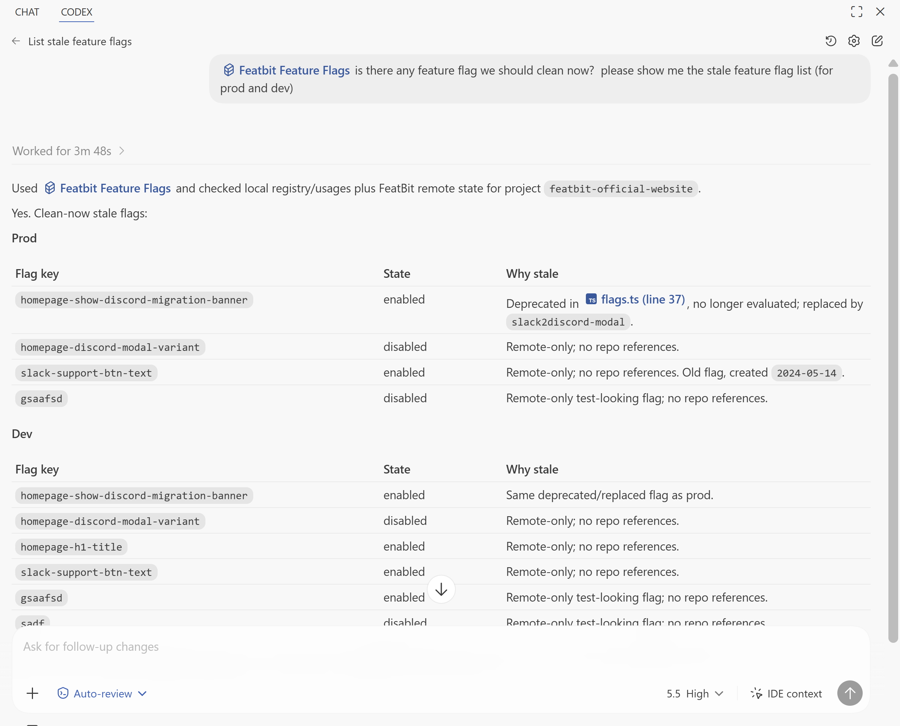

## Overview

In the AI era, FeatBit recommends using AI coding agents such as Codex, Claude Code, GitHub Copilot, or similar tools to help manage the feature flag lifecycle. Cleanup expectation is one part of that lifecycle: it gives the agent a project-specific contract for how long different flags should live and how cleanup should be performed.

A cleanup expectation should define:

- The lifecycle rule for each flag type or for a specific flag. For example, a release flag may become a cleanup candidate 30 days after it reaches 100% rollout.
- The coding rules for removing the flag and the old logic it controls, based on the project's standard FeatBit integration pattern.
- The business and module reference points the agent must check before deletion, such as rollout decisions, experiment results, operational ownership, downstream services, metrics, documentation, or customer impact.
- The FeatBit, MCP, CLI, documentation, and repository evidence the agent should use when deciding whether a flag is ready for cleanup.

FeatBit does not currently provide a native cleanup expectation field. FeatBit can provide useful metadata, such as creation time, tags, audit history, rollout state, and experiment state. The cleanup expectation itself should usually be defined in the repository rules used by coding agents such as Codex, Claude Code, GitHub Copilot, or similar tools.

Put the rule where your coding agent can read it, for example:

- `.agents/feature-flag/skill.md`
- `AGENTS.md`
- `.cursorrules`
- another project rules file used by your team

The goal is simple: when an agent adds, reviews, or removes a FeatBit flag, it should apply the same cleanup expectations every time.

## Rule example

The following example can be copied into `.agents/feature-flag/skill.md`, `AGENTS.md`, `.cursorrules`, or another project rules file.

```markdown
// some other feature flag rules

## Feature Flag Cleanup Expectations

| Field | Value |
| --- | --- |
| FeatBit project key | `featbit-official-website` |
| Flag registry | `src/lib/featbit/flags.ts` |
| Server evaluation | `src/lib/featbit/server.ts` |
| User context | `src/lib/featbit/user.ts` |
| Default remote state tool | Use `featbit-cli` by default; see `references/featbit-cli.md`. FeatBit MCP is optional and should be used only when the agent environment already has MCP configured. |

| Flag type | Cleanup expectation |
| --- | --- |
| Release flag | Cleanup clock starts when rollout reaches 100%. Review after 30 stable days, then remove the temporary branch. |
| Experiment flag | Cleanup clock starts when the experiment decision is recorded. Remove losing variants and experiment-only branches within 14 days. |
| Migration flag | Cleanup clock starts when cutover is complete. Remove the old path after validation and rollback window close, usually within 7 to 30 days. |
| Operational flag | Review monthly while active. Long-lived kill switches need an owner and runbook. |
| Permission or entitlement flag | Treat as a long-lived business rule. Review when pricing, packaging, tenant model, or entitlement logic changes. |
| Configuration flag | Review quarterly, or when the configured value has not changed for 180 days. |

Specific flags can override the default expectation:

| Flag key | Type | Cleanup expectation | Coding rules | Business or module references | Evidence to inspect |
| --- | --- | --- | --- | --- | --- |
| `new-checkout-flow` | Release flag | Cleanup clock starts when rollout reaches 100%. Remove the old checkout path after 30 stable days. | Remove the flag from the project flag registry, server evaluation helper, page props, tests, and experiment-only tracking. | Payment callbacks, invoice emails, analytics events, support scripts. | FeatBit audit history, rollout state, repository references, checkout analytics, linked release issue. |

FeatBit CLI reference:

- Discover projects: `featbit project list --json`
- Inspect project environments: `featbit project get --project-id <project-id> --json`
- Build the remote flag inventory: `featbit project flags --project-id <project-id> --all --json`
- Filter by lifecycle or team tag: `featbit project flags --project-id <project-id> --tags <tags> --all --json`
- Inspect one environment: `featbit flag list --env-id <env-id> --all --json`
- Inspect audit history: `featbit flag audit-logs --env-id <env-id> --flag-key <key> --all --json`
- Evaluate a flag when needed: `featbit flag evaluate --user-key <key-id> --env-secret <secret> --flag-keys <keys> --json`
- Archive after deployed code no longer evaluates the flag: `featbit flag archive --env-id <env-id> --flag-key <key> --json`

Optional FeatBit MCP tools:

- `GetProjectFeatureFlags(projectId, tags, fetchAll: true)`
- `GetFeatureFlags(envId, name, tags, isEnabled, isArchived, fetchAll: true)`
- `GetFeatureFlag(envId, key)`
- `GetFeatureFlagAuditLogs(envId, flagKey, fetchAll: true)`
- `EvaluateFeatureFlags(userKeyId, flagKeys, tags, tagFilterMode)`
- `ArchiveFeatureFlag(envId, key)`

Use `featbit-cli` as the default remote state tool. The MCP tools above are
optional alternatives when the agent environment already has FeatBit MCP
configured. If credentials are not available, use repository references, linked
issues, project documentation, and owner confirmation.

Before removing a flag:

1. Inspect FeatBit creation time, tags, audit history, rollout state, and experiment state.
2. Use `featbit-cli` by default for remote FeatBit state; use FeatBit MCP only when it is already configured for the agent.
3. Search the repository for the flag key and related registry name.
4. Compare the current state with the cleanup expectation.
5. Choose the permanent behavior.
6. Check business and module dependencies.
7. Follow the project's standard coding rules for FeatBit cleanup.
8. Remove obsolete code paths, tests, props, evaluation calls, and experiment-only tracking.
9. Deploy the code change.
10. Archive or delete the FeatBit flag only after production no longer evaluates it.

If ownership, permanent behavior, or downstream dependency is unclear, mark the
flag as `needs-owner-decision` instead of deleting it.

Cleanup review decisions:

- `remove`: the cleanup trigger has been reached, the permanent behavior is known, and no active dependency remains.
- `retain`: the flag still has an active release, experiment, operational, business, migration, or configuration purpose.
- `needs-owner-decision`: ownership, permanent behavior, FeatBit state, or dependency impact is unclear.

// some other feature flag rules
```

The specific flag row can also live in a pull request, linked issue, or project lifecycle document. The FeatBit flag description can link back to it.

## Stale flag review example

The example below shows Codex using the project feature flag rules, local repository references, and FeatBit remote state to list stale feature flags for the FeatBit official website project.



## Best practices

- Keep cleanup expectations close to the codebase, not only in chat or memory.
- Use FeatBit metadata as evidence, but let project rules define the cleanup policy.
- Let flag type provide the default expectation, then allow explicit per-flag overrides.
- Include expected effect and causal assumption so cleanup preserves release learning.
- Delete or archive the FeatBit flag after deployed code no longer evaluates it.
