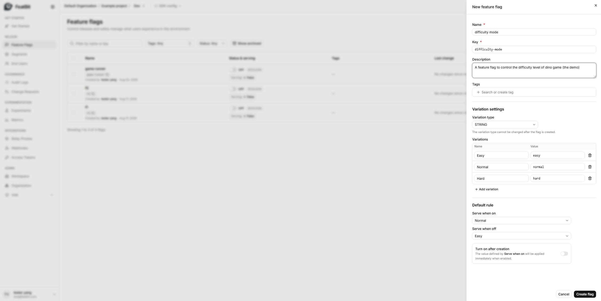
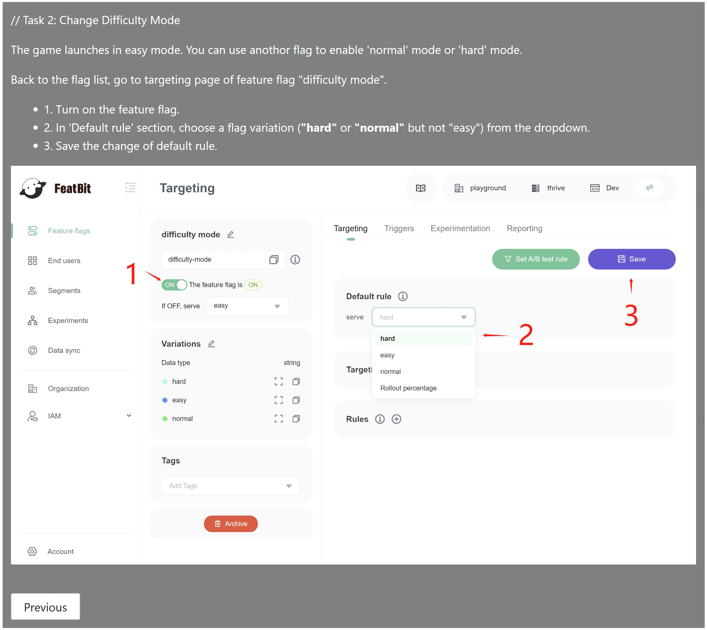
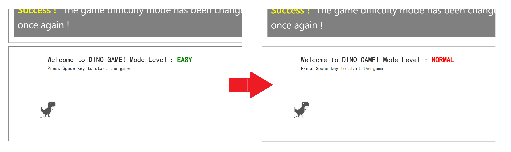

## Create feature flag

To create a feature flag with multiple variants, follow these steps:

1. Navigate to the **Feature Flags** page.
2. Click on the "**+ New flag**" button located in the top right corner.
3. Name the feature flag "difficulty mode".
4. Configure the flag as follows:
   - Choose **string** as the **Variation type**.
   - Add three variants: `easy`, `normal`, and `hard`.

- If the flag is turned ON, it serves the `Normal` value.
- If the flag is turned OFF, it serves the `Easy` value.
- After creation, this flag is set to `OFF`.

Then click the "Create flag" button to create the feature flag.

## Interacting with the demo

Back to the demo page, click the "Next Task" button, the Dino Game demo will show you how to change the game difficulty.

Follow the instructions in the image above, change the rule, you will see the change happens in the game area.

## Next

You have successfully completed the task of creating feature flags and interacting with the demo. In the upcoming topics, you will learn more about:

- [Integrating the FeatBit SDK into your application](connect-an-sdk.md).
- [Basic guides for using FeatBit](how-to-guides/testing-in-production.md).
