## Overview

This topic explains how to manage team members, team maintainers, and team permissions in FeatBit (an [open source feature flags](https://www.featbit.co/blogs/Free-and-Open-Source-Feature-Flag-Tools) service).

## Managing members in default Team

At the moment, FeatBit provides only one default team. You can create, update, delete and manage members on the team page in the IAM section.

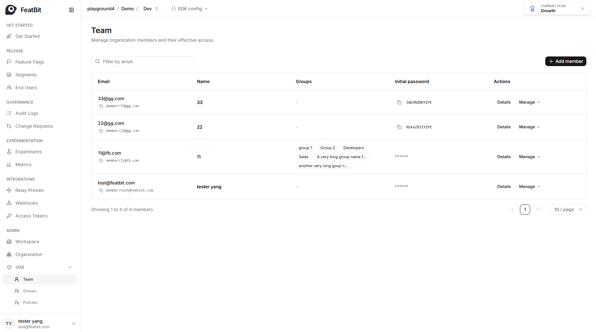

### Adding a member to the team

1. Navigate to the Team page in the IAM section.
2. Click **Add member** button. The "Add team member" dialog appears.
3. Enter the email of the member.
4. Choose the initial permission of the member.
5. Choose the initial group.
6. Click **Add member** button to create a new member.

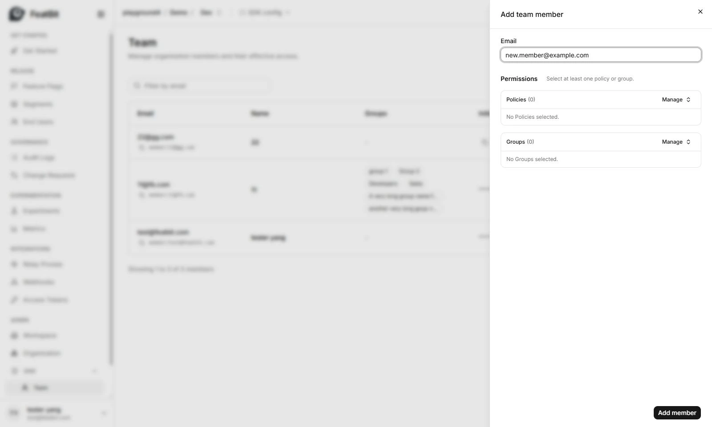

The new member was created with an initial password. It would be best if you paste it to your colleague.

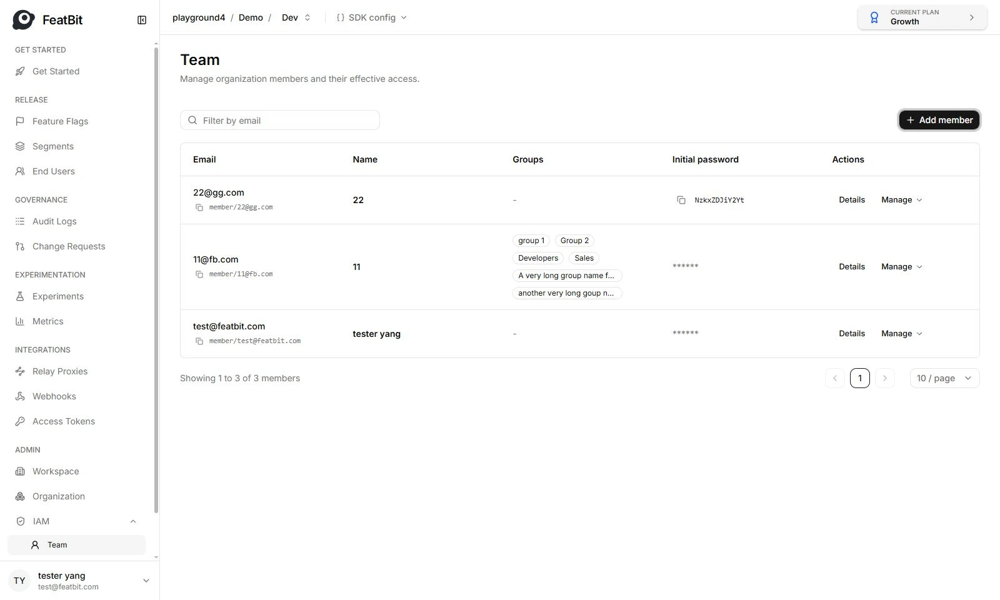

### Delete a member from the team

You can remove a member from **IAM - Team** page. Click the **Manage** then **Remove** button of the member/user you want to delete from the list. Member/User won't be able to log in if it's not in the team list.

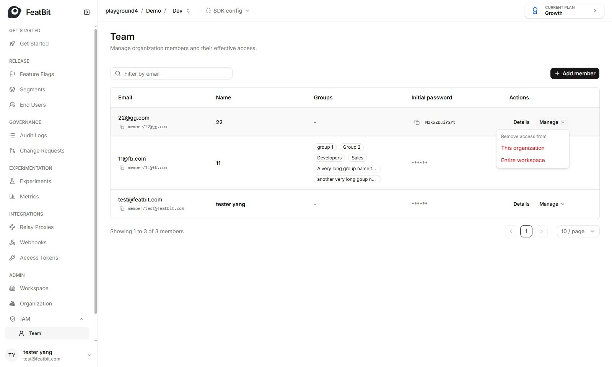

### Update member information

Only members him/her-self can modify his/her information, it includes email and name. Members can change their information on the Profile page.

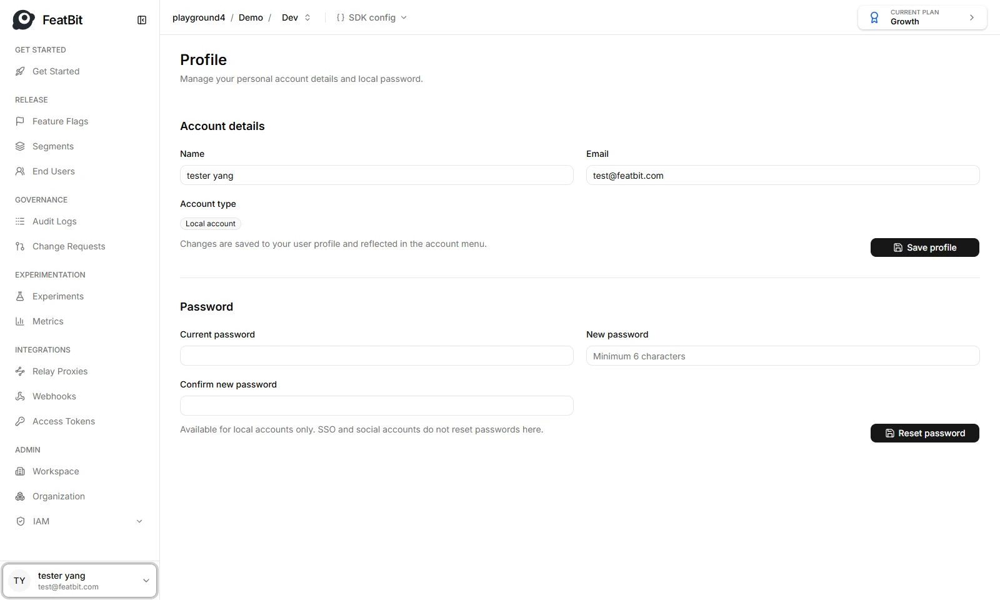

### Member list

You can filter members by email.

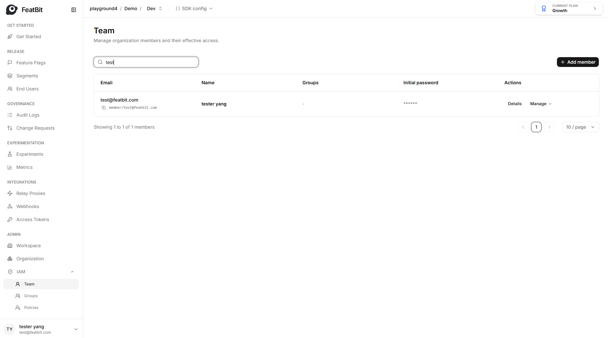

## Assign permission policies to a member

Permissions are managed on the Policy page. You can configure member's policies on the **Direct policies** tab on the member detail page.

1. Click the **Attach policies** button, the **attach policies to xxx** drawer should appear
2. Select the policies, if too many policies, you can filter with policy name.
3. Click **Attach** button
4. You can click **Remove** to detach the policy from the team memebr.

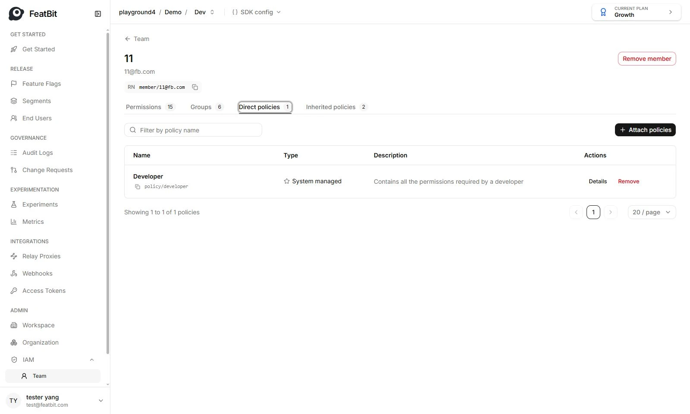

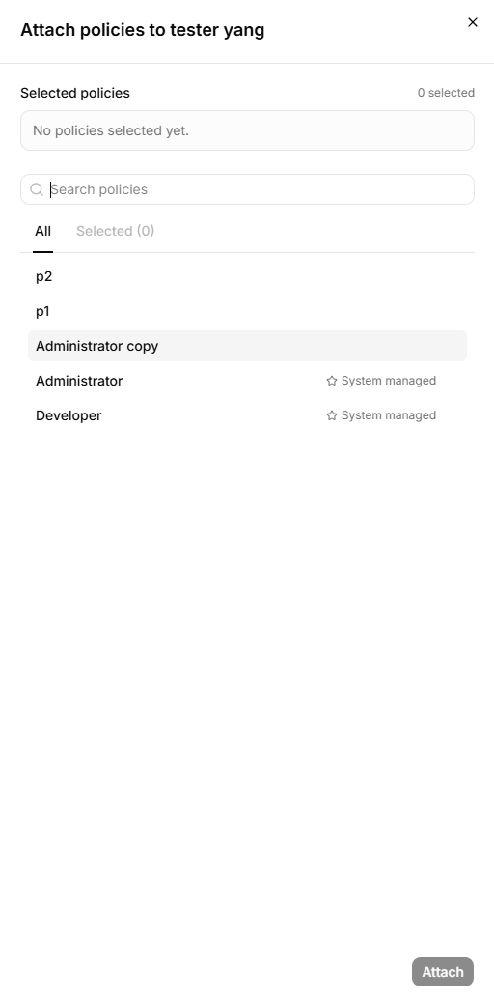

If a member is added to a group, this user will also inherit the policies from this group.

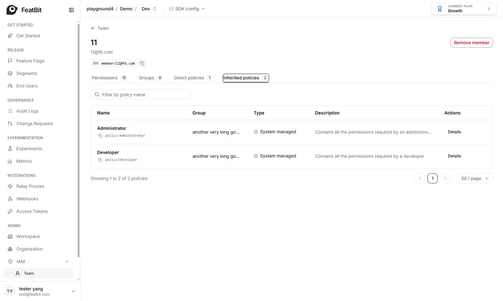

## Assign a member to a group

You can give member one or multiple groups, this member will inherit all permision policies of these groups. You can configure member's groups on the **Groups** tab on the member detail page.

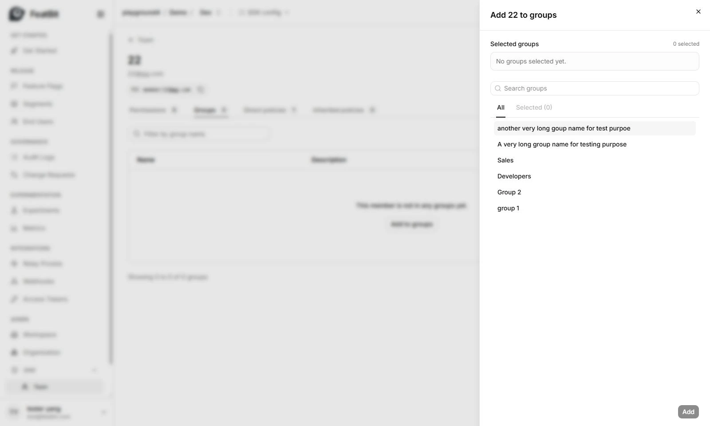

* Click the **Add to groups** button, the **add xxx to groups** drawer should appear
* Select the groups, if too many groups, you can filter with group name.
* Click **Add** button
* You can click **Remove** to detach the group from the user(member).

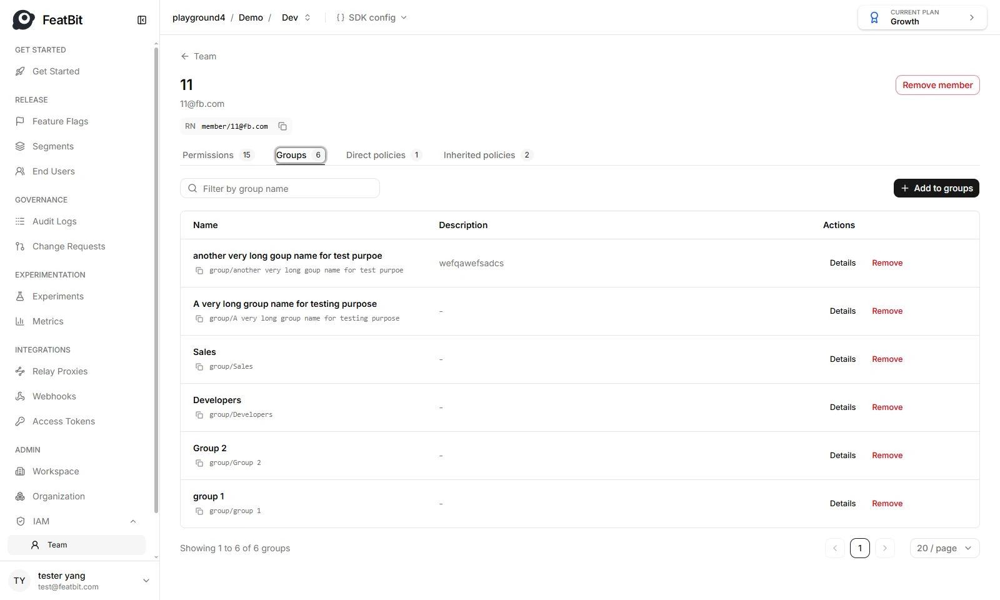
