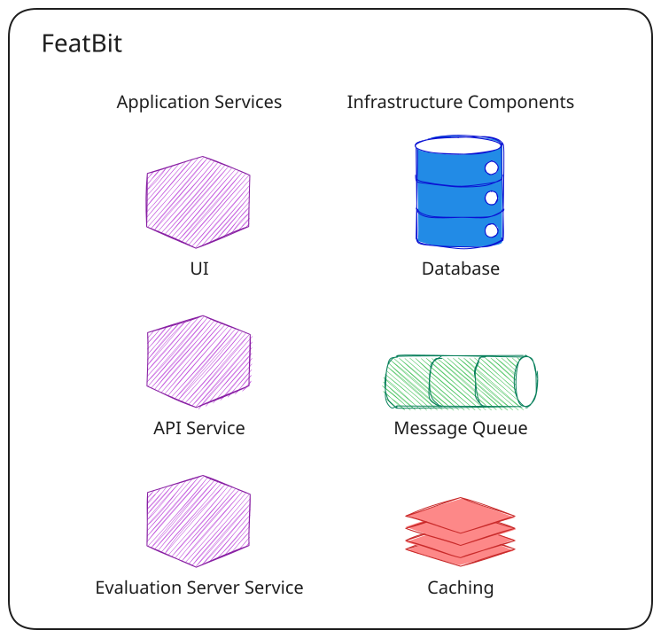

FeatBit is a **scalable**, **fast**, and **lightweight** feature management platform designed for businesses of all
sizes. It provides robust feature flag management with real-time updates and comprehensive analytics capabilities.

## Scalability, Performance and Privacy

When designing the architecture, our most important and the only concerns were how to make it scalable and how to obtain
the best performance possible. To do so, we carefully selected our tech stack and containerized all services, which
makes it very easy to be deployed as a cluster and **scale horizontally**.

FeatBit supports both **WebSocket** and **long polling** to deliver feature flag and segment changes to SDKs in near real
time. WebSocket proactively pushes changes over a persistent connection, while long polling delivers updates through
HTTP requests that remain open until changes are available or the request times out. To keep memory usage efficient
with many concurrent connections, we carefully selected how data is serialized and deserialized to avoid extra memory
consumption during these operations.

The overall architecture also ensures privacy aspects since all the data and communication stays within the system. It
will not send any data to any third party service.
