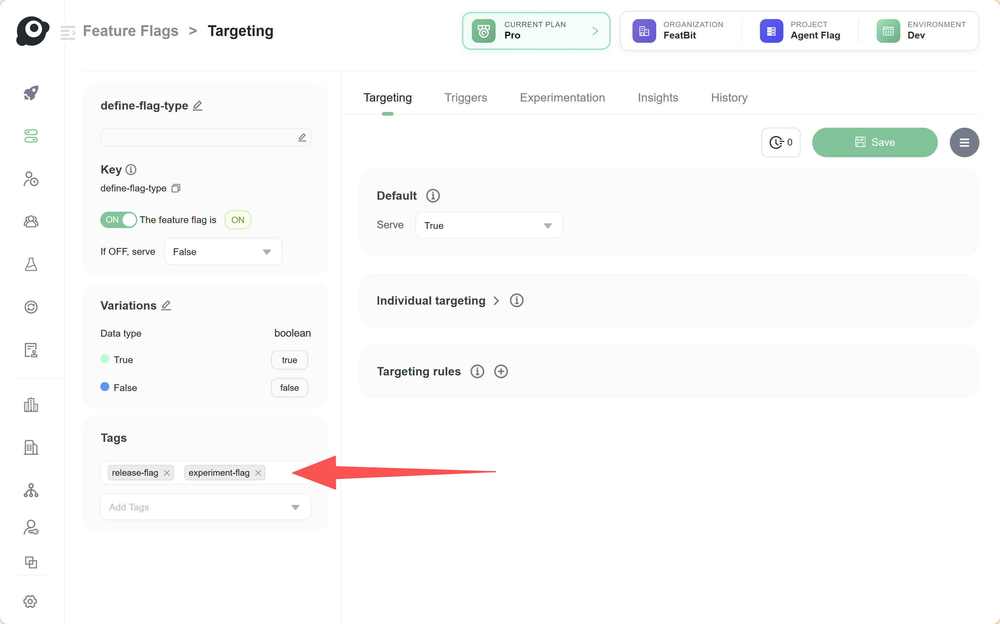
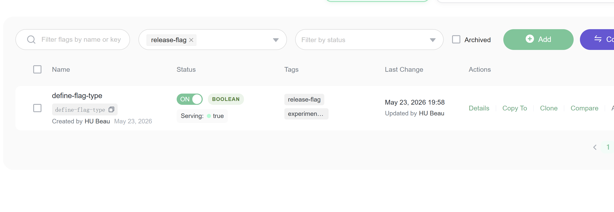

## Overview

Define the types of feature flags your project uses before asking a coding agent to create, review, or clean up flags. The flag type tells the agent what the flag is for, how long it should normally live, and what evidence is needed before it can be removed.

In FeatBit, you can represent a flag type with tags. A tag is flexible enough to match the lifecycle model your team already uses, so each team can define its own type vocabulary instead of being forced into a fixed list.

## Typical flag types

| Flag type | Purpose | Lifecycle expectation |
| --- | --- | --- |
| Release flag | Gradually release a new feature or code path | Temporary |
| Experiment flag | Compare variants for a product hypothesis | Temporary |
| Operational flag | Pause, throttle, or bypass behavior during incidents | Temporary or reviewed periodically |
| Permission or entitlement flag | Control access by plan, tenant, or user group | Long-lived business rule |
| Migration flag | Move traffic between old and new infrastructure or data paths | Temporary |
| Configuration flag | Tune behavior without redeployment | Long-lived, but reviewed periodically |

## Define flag types with tags

On a feature flag's detail page, use the **Tags** section in the left panel to assign one or more lifecycle tags to the flag. For example, a team might use tags such as `release-flag`, `experiment-flag`, `operational-flag`, `permission-flag`, `migration-flag`, or `configuration-flag`.

The important part is that the tag names are friendly to your team and stable enough for humans, coding agents, scripts, and API clients to rely on. A flag can also have more than one tag when it belongs to more than one lifecycle concern, such as `release-flag` and `experiment-flag`.

## Filter flags by type

After type tags are added, the feature flag list can be filtered by tag. This lets teams quickly find all flags for a specific lifecycle workflow, such as all active release flags that may need cleanup, all experiment flags that need a decision, or all long-lived permission flags that should be reviewed as business rules.

This tag-based workflow keeps the lifecycle type visible in the FeatBit Dashboard without requiring a separate custom field or external inventory.

## Evaluate flags by tag

The [Flag Evaluation API](/docs/v5/api-docs/flag-evaluation-api) can also evaluate flags by tag. Use the `filter.tags` field to request feature flag evaluation results for one or more tags, and use `filter.tagFilterMode` to decide whether multiple tags should be matched with `and` or `or`.

For example, an internal tool or agent workflow can request only flags tagged as `release-flag`, or only flags that match both `release-flag` and `frontend`.

## Agent guidance

At the moment, FeatBit CLI and FeatBit MCP are the easier touchpoints for AI agents and coding agents to collaborate with the FeatBit Dashboard. Learn more at [featbit/featbit-cli](https://github.com/featbit/featbit-cli) and [featbit/featbit-mcp](https://github.com/featbit/featbit-mcp).
