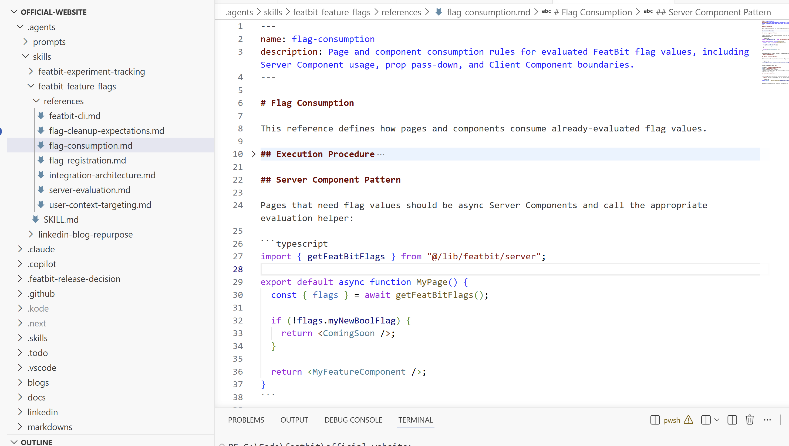

## Overview

Implementing a feature flag is not just adding an `if/else` statement. It requires a team-wide code convention that makes flagged code easy to review, update, and remove.

For language-specific integration, including FeatBit SDKs and OpenFeature support, see [SDK overview](/v5/sdk/overview). This page focuses on how to avoid common feature flag implementation problems with project rules and coding agent skills in the AI era.

## Why conventions matter

Without a shared convention, feature flags often become hard to review and hard to remove.

Common problems include:

- Different developers integrate flag checks in different styles, making it hard to verify whether the `if/else` correctly controls the old and new behavior.
- Existing feature flags are updated without noticing all of the logic that belongs to the flag, such as validation, analytics, experiment exposure events, or cache behavior.
- Code that should stay inside the flag boundary is moved outside it during later edits.
- Cleanup removes the wrong code path, deletes useful tests, or leaves stale references behind.

A written rule is useful, but it is easy to miss details during normal development. In the AI era, FeatBit recommends putting the repository's feature flag convention into coding agent skills, rules, or project instructions. This gives every developer and agent the same local contract for adding, updating, reviewing, and removing flagged code.

## Define the convention in an agent skill

Every team can define feature flag usage in its own way. You do not need to copy another team's pattern. The important part is that the convention is clear, close to the repository, and easy for both humans and coding agents to follow.

For example, the FeatBit official website is a Next.js project. It uses the FeatBit Node SDK and defines its own rules for flag registration, server-side evaluation, frontend consumption, and cleanup expectations. The convention is stored in a `featbit-feature-flags` agent skill, and the skill is split into small reference files instead of one long rule document.



Its skill entry can look like this:

````md
# FeatBit Feature Flags

Use this skill before adding, consuming, updating, or removing FeatBit flags in this repository.

## References

- `references/integration-architecture.md`: owned files, environment variables, SDK singleton setup, and runtime model.
- `references/flag-registration.md`: how to register keys, types, fallbacks, string variations, and typed content helpers in `src/lib/featbit/flags.ts`.
- `references/server-evaluation.md`: how server helpers return fallback and live evaluation results.
- `references/flag-consumption.md`: how pages and components consume already-evaluated flag values.
- `references/flag-cleanup-expectations.md`: how cleanup should be prepared after a flag reaches its final state.
````

This is only a reference from the FeatBit official website project. Your team's skill should describe your own architecture, SDK usage, review expectations, and cleanup workflow.

## Keep flags easy to reference and clean up

Make feature flags easy to reference, compare, and remove. Many teams do this by keeping flag keys, types, fallbacks, or variations in a readable registry, but the exact shape should follow your own codebase.

For example:

```ts
export const featBitFlags = {
  newCheckoutFlow: {
    key: "new-checkout-flow",
    type: "boolean",
    fallback: false,
  },
  pricingPageExperiment: {
    key: "pricing-page-experiment",
    type: "string",
    fallback: "control",
    variations: {
      control: { label: "control" },
      variantA: { label: "variant-a" },
    },
  },
} as const;
```

Whatever structure you choose, it should help developers and agents find the flag definition, locate references, and prepare cleanup when the flag reaches its final state. See [Set cleanup expectations](./set-cleanup-expectations) and [Clean up feature flags with coding agents](./clean-up-feature-flags-with-coding-agents) for the cleanup workflow.

## Keep the convention up to date with real cases

When the team encounters a bad case of flagged code, add that case into the agent skill reference or rule. This way, the next developer or coding agent can check for that case and avoid making the same mistake.

When a bad case happens, add it back into the rule. For example, if tracking code was once moved outside the flag branch and polluted experiment data, write that case into the reference so the next coding agent checks for it.
