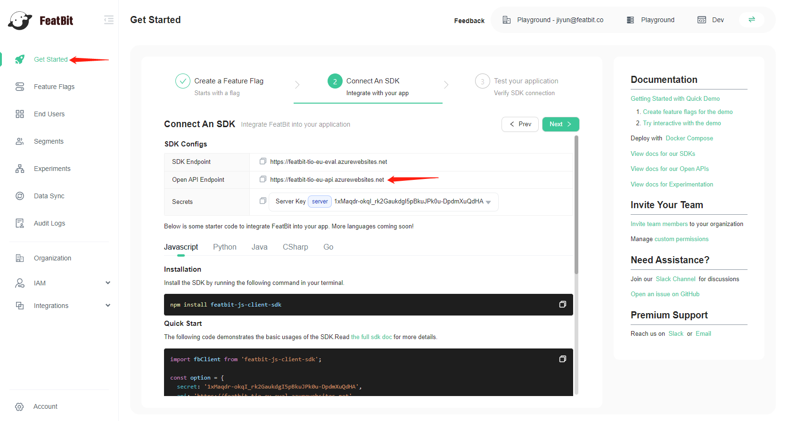
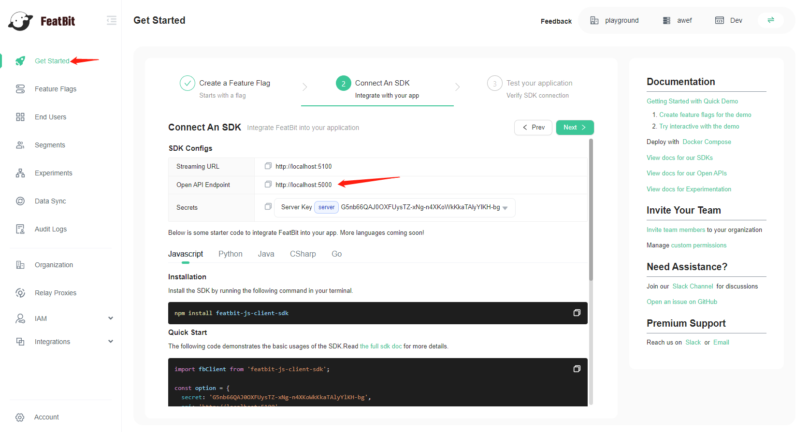

# FAQ

**How to get the REST API endpoint**

1. Go to **Get Started** page
2. Create a feature flag or select an existing one and click on next
3. Copy the **Open API Endpoint** from the **SDK Configs** section



## How to check the REST API doc

You have two ways to check the REST API doc

1. You can check it on the demo site: [https://featbit-tio-eu-api.azurewebsites.net/docs/index.html](https://featbit-tio-eu-api.azurewebsites.net/docs/index.html)
2. If you are running FeatBit on premise, find the OPEN API Endpoint and add the suffix **/docs/index.html**



for example: it should be **http://localhost:5000/docs/index.html** in the above example.

## Feature flag definition

Feature flag is the main entity of FeatBit, the following doc explains its definition.

### Anatomy of a feature flag

The feature flag API allows you to control percentage rollouts, target specific contexts, or even toggle off a feature programmatically. By looking at the representation of a feature flag, we can see how to do any of these tasks.

```json
{
  "envId": "a244b0fe-63ff-49e8-a949-e113383ba3e7",
  "name": "enable access token",
  "description": "This flag manipulate the access token feature",
  "key": "enable-access-token",
  "variationType": "boolean",
  "variations": [
    {
      "id": "73590b69-00e2-4ea0-99b3-67de155f0d90",
      "value": "true"
    },
    {
      "id": "986379ec-3d4c-44fe-83db-2ea607db0cab",
      "value": "false"
    }
  ],
  "targetUsers": [
    {
      "keyIds": ["user1", "user2"],
      "variationId": "73590b69-00e2-4ea0-99b3-67de155f0d90"
    },
    {
      "keyIds": ["user3"],
      "variationId": "986379ec-3d4c-44fe-83db-2ea607db0cab"
    }
  ],
  "rules": [
    {
      "id": "aa1641dc-6e20-44ff-8f60-afe5c5e7c447",
      "name": "Rule 1",
      "dispatchKey": null,
      "includedInExpt": false,
      "conditions": [
        {
          "property": "keyId",
          "op": "IsOneOf",
          "value": "[\"user10\",\"user11\",\"user12\"]"
        }
      ],
      "variations": [
        {
          "id": "73590b69-00e2-4ea0-99b3-67de155f0d90",
          "rollout": [0, 1],
          "exptRollout": 1
        }
      ]
    }
  ],
  "isEnabled": false,
  "disabledVariationId": "986379ec-3d4c-44fe-83db-2ea607db0cab",
  "fallthrough": {
    "dispatchKey": null,
    "includedInExpt": true,
    "variations": [
      {
        "id": "986379ec-3d4c-44fe-83db-2ea607db0cab",
        "rollout": [0, 1],
        "exptRollout": 1
      }
    ]
  },
  "exptIncludeAllTargets": true,
  "tags": [],
  "isArchived": false,
  "disabledVariation": {
    "id": "986379ec-3d4c-44fe-83db-2ea607db0cab",
    "value": "false"
  },
  "creatorId": "f7c637ac-fc8c-4f55-9238-cedf0908df35",
  "updatorId": "f7c637ac-fc8c-4f55-9238-cedf0908df35",
  "createdAt": "2023-03-20T19:07:50.217Z",
  "updatedAt": "2023-03-20T19:09:11.32Z",
  "id": "808d5b7e-e463-489f-b660-afcb013b434b"
}
```

