import {Callout} from 'nextra/components'

## Overview

This section describes a temporary method for exporting feature flag usage data and experiment events to your preferred data store or warehouse. This allows you to analyze the data using your own tools and systems.

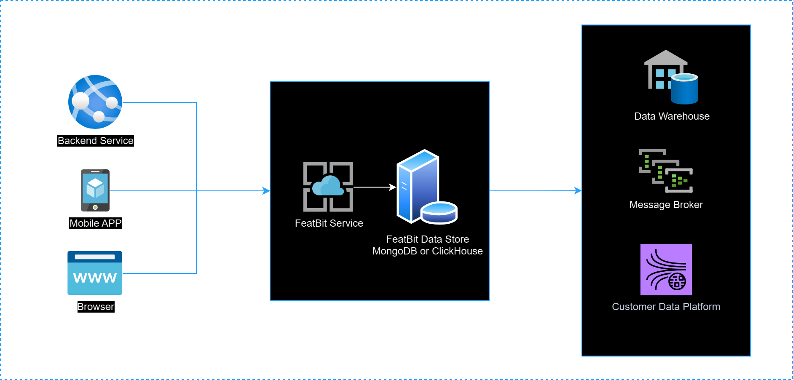

As the diagram above shows, the current process involves extracting data from FeatBit's ClickHouse database (or MongoDB for the standard version) and then transferring it to a third-party or your own Custom Data Platform, Message Brokers, Data Warehouse, etc.

> We refer to this as the '**temporary method**' because it's an interim measure while we better understand the specific needs and best practices of each customer. We invite you to [join our Slack](https://join.slack.com/t/featbit/shared_invite/zt-1ew5e2vbb-x6Apan1xZOaYMnFzqZkGNQ) channel for further discussion on this topic, or you can email us at `contact@featbit.co` for more information.

## Extract Data From ClickHouse

### Data Store

In the Pro version of FeatBit, we store data related to feature flag usage and custom experiment events in the ClickHouse database. For those using the Standard version, this information, along with insights on feature flag evaluations, is housed in the MongoDB database. You can access data from these databases.

- **Feature Flag Usage Data**: Each time a feature flag is evaluated for a user (whether in the backend SDK or frontend SDK), a record is created in the database. The data in the insights view on your feature flag page are derived from these records.
- **Experiment Events**: These are custom events for metrics like button click events, page stay duration, or any Boolean or Double values you track for further data analysis needs. These events are created by calling the `track` method in the SDK.

For the FeatBit Pro version, both types of data are stored in the `events` table in ClickHouse.

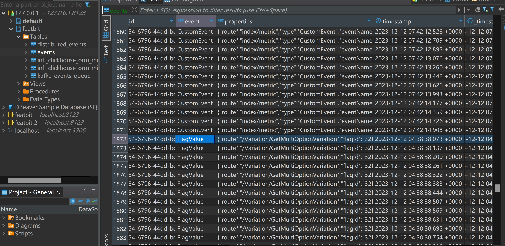

For the FeatBit Standard version, both types of data are stored in the `Events` collection in MongoDB.

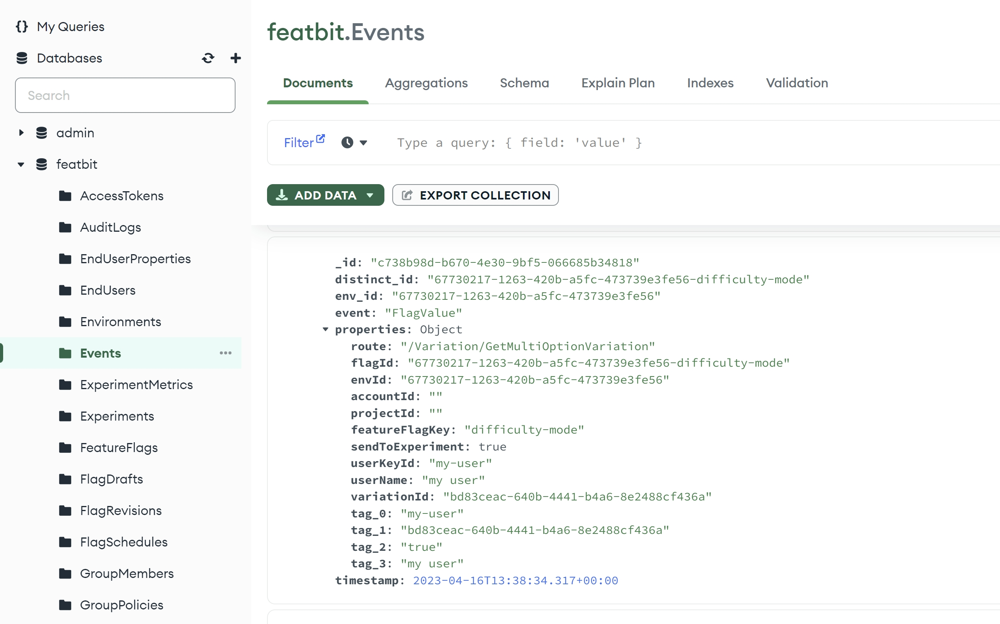

The data structures are not exactly the same between the FeatBit Pro and Standard versions. However, the data are similar. The following table explains what each property means.

### Feature Flag Usage Data

**Feature Flag Usage Data**: Each time a feature flag is evaluated for a user (whether in the backend SDK or frontend SDK), a record is created in the database. The data in the insights view on your feature flag page are derived from these records.

| Property | Description |
| --- | --- |
| `uuid` | The unique id of the record |
| `env_id` | The unique id of the environment |
| `distinct_id` |  |
| `event` | The type of event: `FlagValue` represents "Feature Flag Usage Data" or `CustomEvent` represents Experiment Events |
| `timestamp` | The timestamp of the event treated in SDK or API |
| `_timestamp` | The timestamp sent to Clickhouse. No such property in MongoDB |
| `properties` | The information of the event, a json data in string format |
| `properties/route` | The route of the event |
| `properties/flagId` | The unique id of the feature flag |
| `properties/featureFlagKey` | The key of the feature flag |
| `properties/sendToExperiment` | Whether the FlagValue event should be considered in experiment |
| `properties/userKeyId` | The unique id of the user |
| `properties/userName` | The name of the user |
| `properties/variationId` | The unique id of the variation. E.g. the id of True variation in a Boolean feature flag |
| `properties/tag_0` | The first tag of the event |
| `properties/tag_1` | The second tag of the event |
| `properties/tag_2` | The third tag of the event |
| `properties/tag_3` | The fourth tag of the event |

This is a ClickHouse query statement that I have refined:

```sql
SELECT 
    uuid as Id,
    env_id as EnvId,
    distinct_id as DistinctId,
    event as EventName,
    timestamp as Timestamp,
    _timestamp as CHTimestamp,
    JSONExtract(properties, 'route', 'String') as Route,
    JSONExtract(properties, 'flagId', 'String') as FeatureFlagId,
    JSONExtract(properties, 'accountId', 'String') as AccountId,
    JSONExtract(properties, 'projectId', 'String') as ProjectId,
    JSONExtract(properties, 'featureFlagKey', 'String') as FeatureFlagKey,
    JSONExtract(properties, 'sendToExperiment', 'Bool') as SendToExperiment,
    JSONExtract(properties, 'userKeyId', 'String') as UserId,
    JSONExtract(properties, 'userName', 'String') as Username,
    JSONExtract(properties, 'variationId', 'String') as VariationId,
    JSONExtract(properties, 'tag_0', 'String') as Tag0,
    JSONExtract(properties, 'tag_1', 'String') as Tag1,
    JSONExtract(properties, 'tag_2', 'String') as Tag2,
    JSONExtract(properties, 'tag_3', 'String') as Tag3
FROM events
WHERE
    timestamp > '{Your TimeStamp}' AND
    event = 'FlagValue' AND
    env_id = '{Your FeatBit Environment Id}'
ORDER BY timestamp
LIMIT {Your Page Size}
```

### Experiment Events

**Experiment Events**: These are custom events for metrics like button click events, page stay duration, or any Boolean or Double values you track for further data analysis needs. These events are created by calling the `track` method in the SDK.

| Property | Description |
| --- | --- |
| `uuid` | The unique id of the record |
| `env_id` | The unique id of the environment |
| `distinct_id` |  |
| `event` | The type of event: `FlagValue` for "Feature Flag Usage Data" or `CustomEvent` for Experiment Events |
| `timestamp` | The timestamp of the event treated in SDK or API |
| `properties` | The information of the event, a json data in string format |
| `properties/user/keyId` | The unique id of the user |
| `properties/user/name` | The name of the user |
| `properties/route` | The route of the event |
| `properties/eventName` | The name of the metric |
| `properties/numericValue` | The numeric value of the metric |
| `properties/applicationType` | The type of the application: web, mobile, backend, etc. |
| `properties/tag_0` | The first tag of the event |
| `properties/tag_1` | The second tag of the event |
| `properties/tag_2` | The third tag of the event |
| `properties/tag_3` | The fourth tag of the event |

This is a ClickHouse query statement that I have refined:

```sql
SELECT 
    uuid as Id,
    env_id as EnvId,
    distinct_id as DistinctId,
    event as EventName,
    timestamp as Timestamp,
    _timestamp as CHTimestamp,
    JSONExtract(JSONExtract(properties, 'user', 'String'), 'keyId', 'String')  as UserId, 
    JSONExtract(JSONExtract(properties, 'user', 'String'), 'name', 'String')  as Username, 
    JSONExtract(properties, 'route', 'String') as Route,    
    JSONExtract(properties, 'eventName', 'String') as CustomEventName,    
    JSONExtract(properties, 'numericValue', ' Float32') as NumericValue,   
    JSONExtract(properties, 'applicationType', ' String') as ApplicationType,   
    JSONExtract(properties, 'projectId', 'String') as ProjectId,
    JSONExtract(properties, 'accountId', 'String') as AaccountId,
    JSONExtract(properties, 'tag_0', 'String') as Tag0,
    JSONExtract(properties, 'tag_1', 'String') as Tag1,
    JSONExtract(properties, 'tag_2', 'String') as Tag2,
    JSONExtract(properties, 'tag_3', 'String') as Tag3
FROM events
WHERE
    timestamp > '{Your TimeStamp}' AND
    event = 'CustomEvent' AND
    env_id = '{Your FeatBit Environment Id}'
ORDER BY timestamp
LIMIT {Your Page Size}
```

### Sample Project

I have used .NET 8 to write a sample project for extracting data from ClickHouse. The [source code can be found here](https://github.com/featbit/featbit-samples/tree/main/samples/export-data).

In this sample solution, the project `FeatBit.DataExport.ClickHouse` provides two functions in the `ClickHouseReader` class:

- `RetrieveFlagValueEventsAsync`: This function retrieves feature flag usage data from ClickHouse.
- `RetrieveCustomEventEventsAsync`: This function retrieves experiment events from ClickHouse.

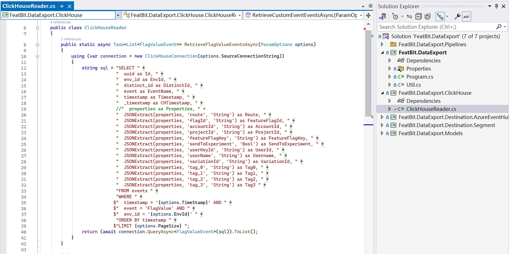

## Export Data to Segment

### Source: HTTP API

You can send data to Segment through HTTP APIs. First, you need to create an HTTP API as a data source in Segment.

- Go to the "Source" page, click on the **+ Add source** button. 
- In the "Catalog" page, search "HTTP API". Then click on the source.
- Click on the **Add Source ->** button.
- On the "Add Source" page, enter the name of the source, then click on the **Add Source** button.
- After the source is created, go to **Settings** page, enable the source, and then click on the **Save Changes** button.

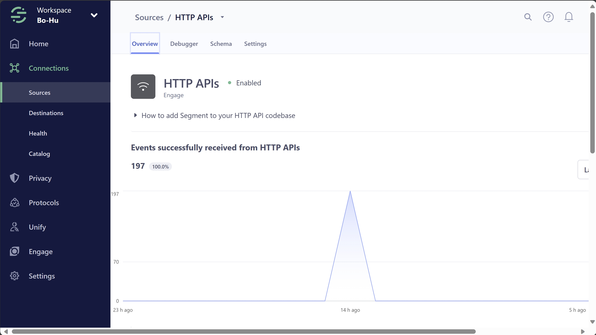

### Destination

In Segment, you can add any destination you desire. For example, you can add Snowflake as a destination. For more information, you can follow the [tutorial](https://segment.com/docs/connections/destinations/).

### Sending data to Segment


To send data to Segment via the HTTP API, you can follow the [tutorial](https://segment.com/docs/connections/sources/catalog/libraries/server/http-api/). Essentially, you will need to call two APIs:

- `identify` lets you tie a user to their actions and record traits about them. It includes a unique User ID and any optional traits you know about them. Segment recommends calling identify a single time when the user’s account is first created, and only identifying again later when their traits change.
- `track` lets you record the actions your users perform. Every action triggers an “event”, which can also have associated properties.

Before we send data through these APIs, you first need to obtain the write key for the Segment destination. You can find the write key on the "Settings" page of each.

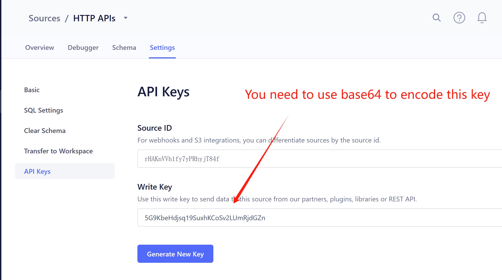

Next, we need to send the data we retrieved in the previous step to Segment through HTTP APIs. Below is an example of how to use `identify` and `track` APIs to send FeatBit feature flag usage data to Segment.

```http
# Identify
curl --location --request POST 'https://api.segment.io/v1/identify' \
--header 'Content-Type: application/json' \
--header 'Authorization: Bearer NUc5S2JlSGRqc3ExOVN***Fake***JMVW1SamRHWm4=' \
--data-raw '{
  "Id": "4be3e7b9-3db7-4537-8e46-b2831f579bcf",
  "userId": "tester-id-6973",
  "EnvId": "32f6be54-6796-44dd-bc82-f4824b0da13c",
  "FeatBitTimestamp": "2023-12-12T07:42:13.32Z",
  "EventName": "FlagValue",
  "CHTimestamp": "2023-12-12T07:42:14Z",
  "Username": "tester-6973"
}'

########

# Track
curl --location --request POST 'https://api.segment.io/v1/track' \
--header 'Authorization: Bearer NUc5S2JlSGRqc3ExOVN***Fake***JMVW1SamRHWm4=' \
--header 'Content-Type: application/json' \
--data-raw '{
  "Id": "4be3e7b9-3db7-4537-8e46-b2831f579bcf",
  "userId": "tester-id-6973",
  "EnvId": "32f6be54-6796-44dd-bc82-f4824b0da13c",
  "FeatBitTimestamp": "2023-12-12T07:42:13.32Z",
  "VariationId": "7e03db60-7605-4428-a972-aa3b66a3f898",
  "DistinctId": "32f6be54-6796-44dd-bc82-f4824b0da13c-growthbook-test-001",
  "EventName": "FlagValue",
  "CHTimestamp": "2023-12-12T07:42:14Z",
  "Route": "/Variation/GetMultiOptionVariation",
  "FeatureFlagId": "32f6be54-6796-44dd-bc82-f4824b0da13c-growthbook-test-001",
  "AccountId": "",
  "ProjectId": "",
  "FeatureFlagKey": "growthbook-test-001",
  "SendToExperiment": true,
  "Username": "tester-6973",
  "Tag0": "tester-id-6973",
  "Tag1": "7e03db60-7605-4428-a972-aa3b66a3f898",
  "Tag2": "true",
  "Tag3": "tester-6973"
}'
```

### Sample Project

I have used .NET 8 to write a sample project for sending data to Segment. The [code is available here](https://github.com/featbit/featbit-samples/tree/main/samples/export-data).

In this sample solution, the project `FeatBit.DataExport.Destination.Segment` contains code for:

- Sending Feature Flag Usage Data (data type 'FlagValue') to Segment via HTTP API.
- Sending Experiment Events (data type 'CustomEvent') to Segment via HTTP API.

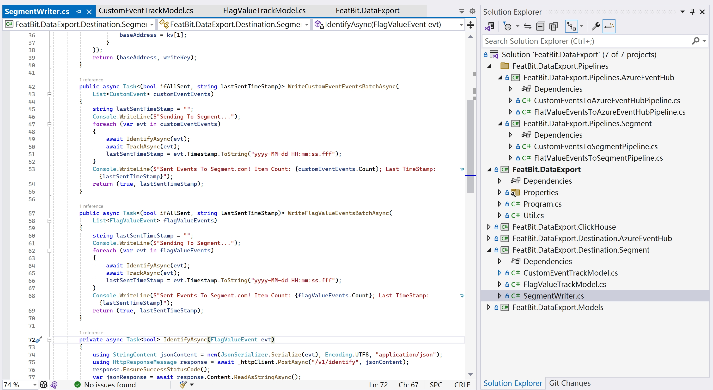

The project `FeatBit.DataExport.Pipelines.Segment` demonstrates two pipelines for querying data from ClickHouse and then sending it to Segment.

- The `CustomEventsToSegmentPipeline` class queries experiment metric events from ClickHouse and then sends them to Segment.
- The `FlatValueEventsToSegmentPipeline` class queries feature flag usage data from ClickHouse and then sends it to Segment.

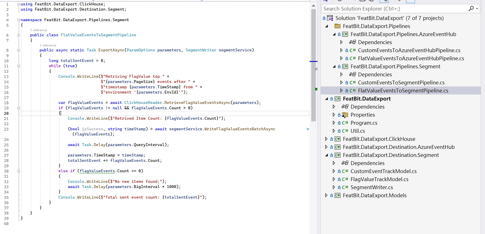

You can run the `FeatBit.DataExport` project with arguments to execute these pipelines. Below are some examples:

Running the pipeline for exporting Feature Flag Usage Data to Segment:

```bash
./FeatBit.DataExport -e "32f6be54-6796-44dd-bc82-f4824b0da13c" -t "2023-12-12 07:41:51.288" -c "Host=127.0.0.1;Protocol=http;Port=8123;Database=featbit" -g "WriteKey=NUc5S2JlS***FAKE******Fake***JMVW1SamRHWm4=;Host=https://api.segment.io" -s 1000 -i 100 -b 5 --eventtype "CustomEvent" --pipeline "CustomEventToSegment"
```

Running the pipeline for exporting Experiment Metric Events to Segment:

```bash
./FeatBit.DataExport -e "32f6be54-6796-44dd-bc82-f4824b0da13c" -t "2023-12-12 07:42:13.288" -c "Host=127.0.0.1;Protocol=http;Port=8123;Database=featbit" -g "WriteKey=NUc5S2JlS***FAKE******Fake***JMVW1SamRHWm4=;Host=https://api.segment.io" -s 1000 -i 100 -b 5 --eventtype "CustomEvent" --pipeline "FlagValueToSegment"
```

Alternatively, you can copy the initial arguments in Visual Studio's Debug settings.

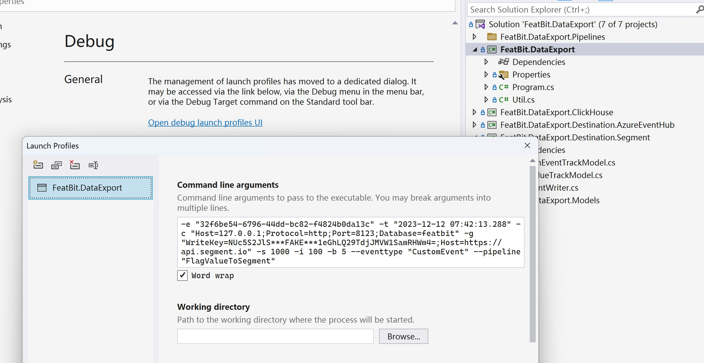

Once you successful sent the data to Segment, you will see the record in Debugger panel.

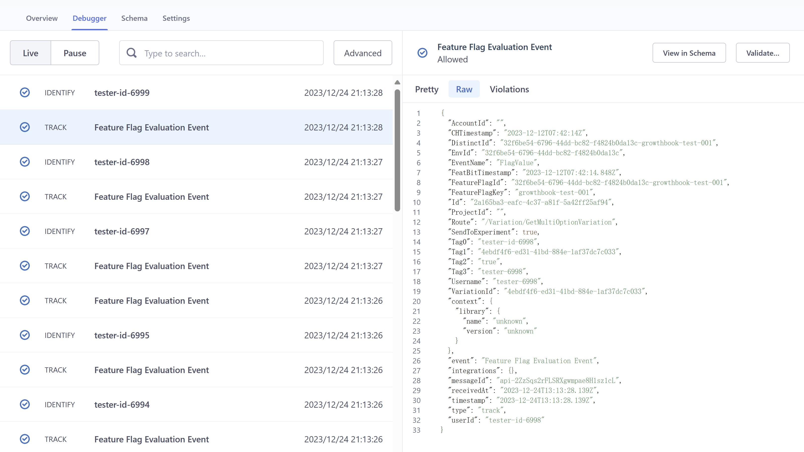

> The definitions of the parameters can be found in the sample project below:

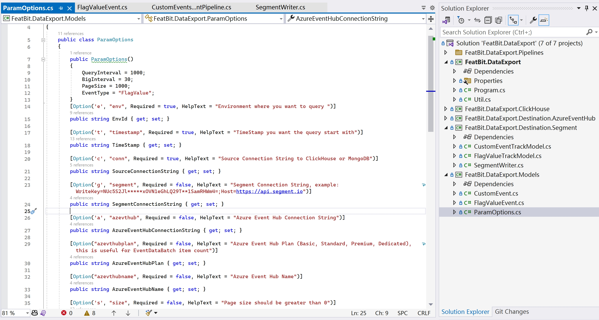

## Export To Azure Event Hub

### Prerequisites

Before sending data to Azure Event Hub, you will need to:

1. Have an Azure Account.
2. Create an Azure Event Hub Namespace and an Event Hub. Optionally, you can also create a Shared Access Policy for the Event Hub.
3. Optionally, create an Azure Storage Account and a Blob Container to capture the data sent to the Event Hub.

We assume that you have already completed the above steps. If not, please follow the [tutorial](https://docs.microsoft.com/en-us/azure/event-hubs/event-hubs-create).

### Sending data to Event Hub

To send data to Azure Event Hub, you can follow this [tutorial](https://learn.microsoft.com/en-us/azure/event-hubs/event-hubs-dotnet-standard-getstarted-send). Choose the SDK corresponding to your programming language to facilitate data transmission to Azure Event Hub.

### Sample Project

I have used .NET 8 to write a sample for sending data to Azure Event Hub. The [code is available here](https://github.com/featbit/featbit-samples/tree/main/samples/export-data).

In this sample solution, the project `FeatBit.DataExport.Destination.AzureEventHub` contains code for:

- The `WriteFlagValueEventsBatchAsync` in `AzureEventHubWriter` class: Sending Feature Flag Usage Data (data type 'FlagValue') to Event Hub.
- The `WriteCustomEventEventsBatchAsync` in `AzureEventHubWriter` class: Sending Experiment Events (data type 'CustomEvent') to Segment via HTTP API.

The code use .NET SDK to send batch events to the Azure Event Hub.

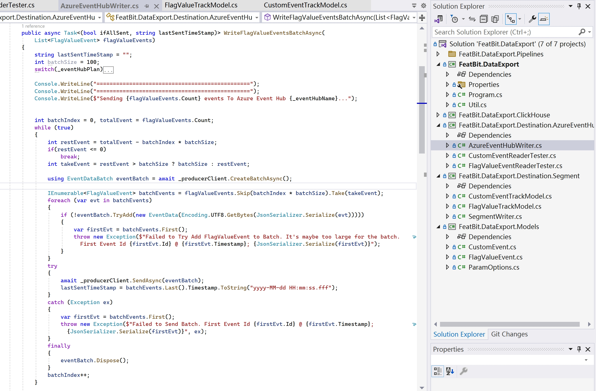

The project `FeatBit.DataExport.Pipelines.AzureEventHub` demonstrates two pipelines for querying data from ClickHouse and then sending it to Azure EventHub.

- The `CustomEventsToAzureEventHubPipeline` class queries experiment metric events from ClickHouse and then sends them to Event Hub.
- The `FlatValueEventsToAzureEventHubPipeline` class queries feature flag usage data from ClickHouse and then sends it to Event Hub.

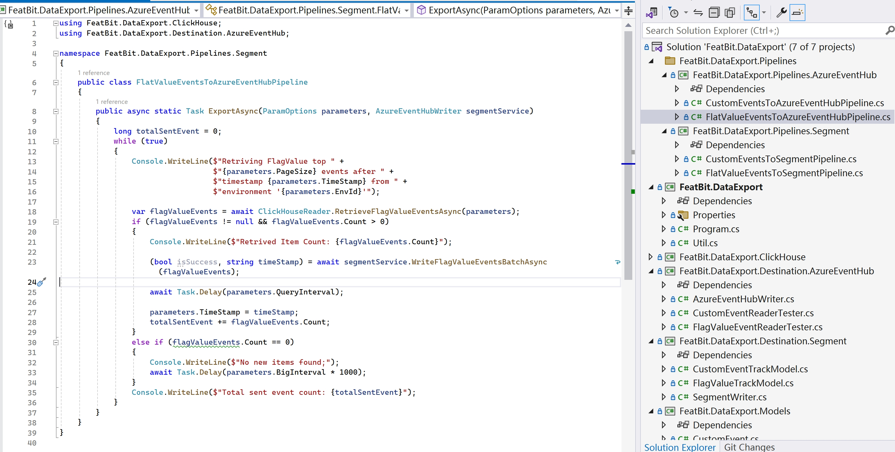

You can execute these pipelines by running the `FeatBit.DataExport` project with specific arguments. Here are some examples:

Running the pipeline for exporting Feature Flag Usage Data to Azure Event Hub:

```bash
./FeatBit.DataExport -e "32f6be54-6796-44dd-bc82-f4824b0da13c" -t "2023-12-12 07:42:13.288" -c "Host=127.0.0.1;Protocol=http;Port=8123;Database=featbit" -s 1000 -i 100 -b 5 -a "Endpoint=sb://featbitexportdata.servicebus.windows.net/;SharedAccessKeyName=flagvalueevents;SharedAccessKey=Q0sXMCyF***FAKE***Yz/kUnGu1wAbjeRnB+AEhJIzHhU=" --azevthubplan "Basic" --azevthubname "flagvaluecapture" --eventtype "CustomEvent" --pipeline "FlagValueToAzureEventHub"
```

Running the pipeline for exporting Experiment Metric Events to Azure Event Hub:

```bash
./FeatBit.DataExport -e "32f6be54-6796-44dd-bc82-f4824b0da13c" -t "2023-12-12 07:41:51.288" -c "Host=127.0.0.1;Protocol=http;Port=8123;Database=featbit" -s 1000 -i 100 -b 5 -a "Endpoint=sb://featbitexportdata.servicebus.windows.net/;SharedAccessKeyName=flagvalueevents;SharedAccessKey=Q0sXMCyF***FAKE***Yz/kUnGu1wAbjeRnB+AEhJIzHhU=" --azevthubplan "Basic" --azevthubname "flagvaluecapture" --eventtype "CustomEvent" --pipeline "CustomEventToAzureEventHub"
```

Alternatively, you may copy the initial arguments into Visual Studio's Debug settings.

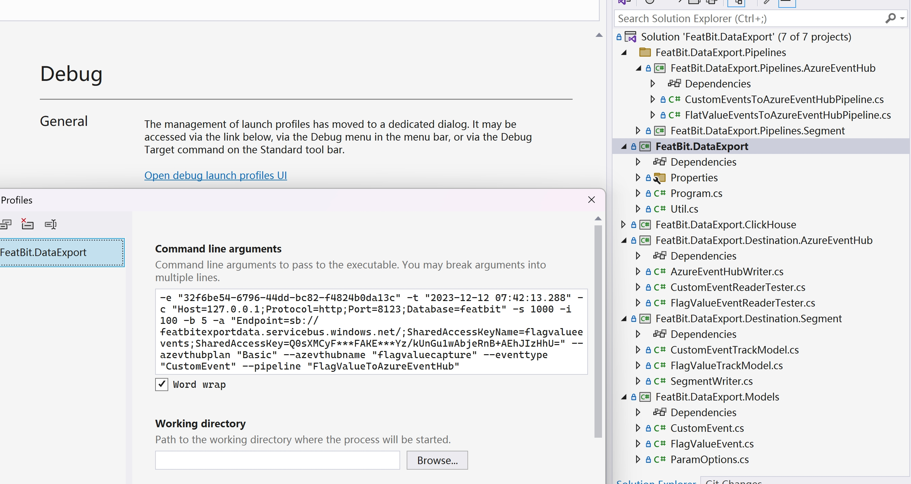

To verify whether the data has been sent successfully, you have two options:

1. Check the Azure Storage Account and Blob Container (or by using other Azure Data Service) to see if the data has been captured correctly.
2. Use the code I provided in the sample project to read the data from Azure Event Hub, as shown in the figure below.

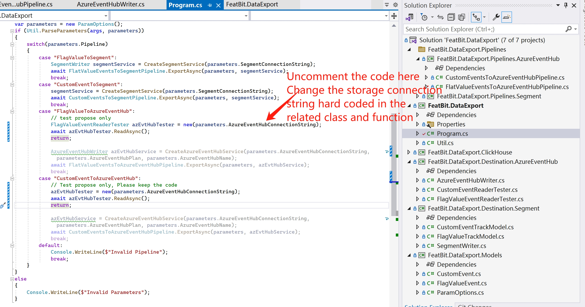

## Export Data To GrowthBook

GrowthBook is an A/B Testing tool that enables you to use your own data warehouse to conduct experiments. It's an excellent tool for companies that wish to own their data and run experiments on it.

GrowthBook supports ClickHouse as its data source. You can use the following SQL to create the necessary tables for GrowthBook to integrate with FeatBit.


## Feedback

We welcome any feedback and suggestions for features, such as:

- Creating a native data export feature in FeatBit for Segment.com and Azure Event Hub.
- Enabling data export to other Customer Data Platforms (CDPs), Data Warehouses, and Message Brokers.
- Export Data via REST APIs.
- Incorporating the ability to send data to third-party tools in SDK's evaluation callbacks.
- And more.

Please let us know your thoughts by sending us an email at `contact@featbit.co` or by joining our [Slack](https://join.slack.com/t/featbit/shared_invite/zt-1ew5e2vbb-x6Apan1xZOaYMnFzqZkGNQ) channel. We appreciate any practical suggestions that may assist you.