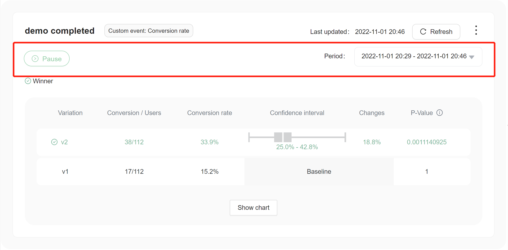
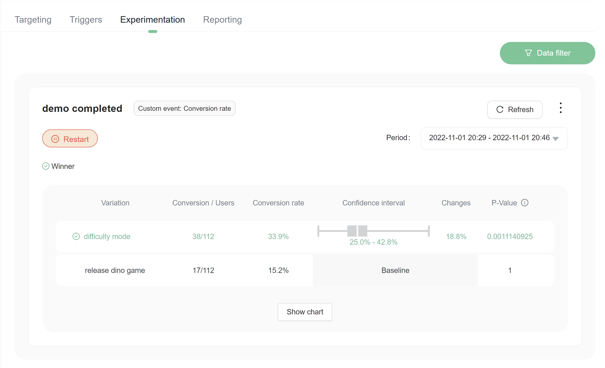

# Analyzing Experiments

## Overview 

This topic explains how to read an experiment's results in the flag's Experimentation tab and apply its findings to your product.

## Understanding experiments as they run 

When your experiments are running, you can view information about them on the **Experiments** list or on the related flag's **Experimentation** tab. The **Experimentation** tab displays all the experiments a flag is participating in, including both experiments that are currently recording and experiments that are stopped.

Here are some things you can do with each experiment:

1. Stop the experiment or start a new iteration.
2. Edit the metrics connected to the experiment and start a new iteration.
3. View experiment data over set periods of time.

## Reading experiment data 

We use frequentist approach to calculate the result of the experiment. There was no WHY if we didn't use bayesian approaches, because we will maybe provide both ways of calculating the result. (see different [between confidence interval and credible interval](https://stats.stackexchange.com/questions/2272/whats-the-difference-between-a-confidence-interval-and-a-credible-interval))

As a result, to express uncertainty in our knowledge after an experiment, the frequentist approach uses a "confidence interval" -- a range of values designed to include the true value of the parameter with some minimum probability, 95% in FeatBit. A frequentist will design the experiment and 95% confidence interval procedure so that out of every 100 experiments run from start to finish, at least 95 of the resulting confidence intervals will be expected to include the true value of the parameter. The other 5 might be slightly wrong, or they might be complete nonsense -- formally speaking that's ok as far as the approach is concerned, as long as 95 out of 100 inferences are correct.

### Confidence intervals and p-values

* A confidence interval calculated for a measure of treatment effect shows the range within which the true treatment effect is likely to lie (subject to a number of assumptions).
* A p-value is calculated to assess whether trial results are likely to have occurred simply through chance (assuming that there is no real difference between new treatment and old, and assuming, of course, that the study was well conducted).
* Confidence intervals are preferable to p-values, as they tell us the range of possible effect sizes compatible with the data.
* P-values simply provide a cut-off beyond which we assert that the findings are ‘statistically significant’ (by convention, this is p<0.05).
* A confidence interval that embraces the value of no difference between treatments indicates that the treatment under investigation is not significantly different from the control.
* Confidence intervals aid interpretation of clinical trial data by putting upper and lower bounds on the likely size of any true effect.
* Bias must be assessed before confidence intervals can be interpreted. Even very large samples and very narrow confidence intervals can mislead if they come from biased studies.
* Non-significance does not mean ‘no effect’. Small studies will often report non-significance even when there are important, real effects which a large study would have detected.
* Statistical significance does not necessarily mean that the effect is real: by chance alone about one in 20 significant findings will be spurious.
* Statistically significant does not necessarily mean clinically important. It is the size of the effect that determines the importance, not the presence of statistical significance.

## Choosing a winning variation

The winning variation for a completed experiment is the variation that is most likely to be the best option out of all of the variations tested. FeatBit indicates clearly which variation is likely to be the best option with an icon of **green correct in a circle** 

> Consider stopping an experiment after you choose a winning variation
>
> If you're done with an experiment and have rolled out the winning variation to your user base, it is a good time to stop your experiment. Experiments running on a user base that receives only one flag variation do not yield useful results. Stopping an experiment retains all the data collected so far.

