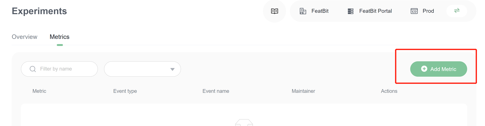
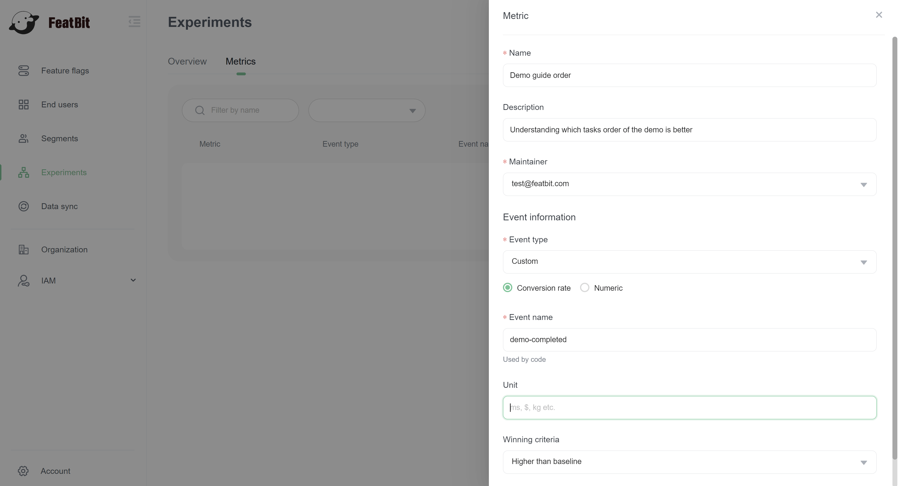
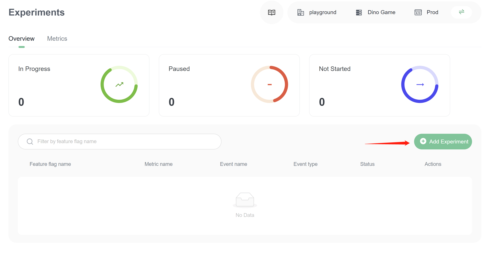
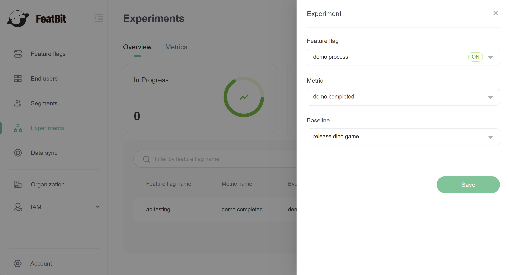
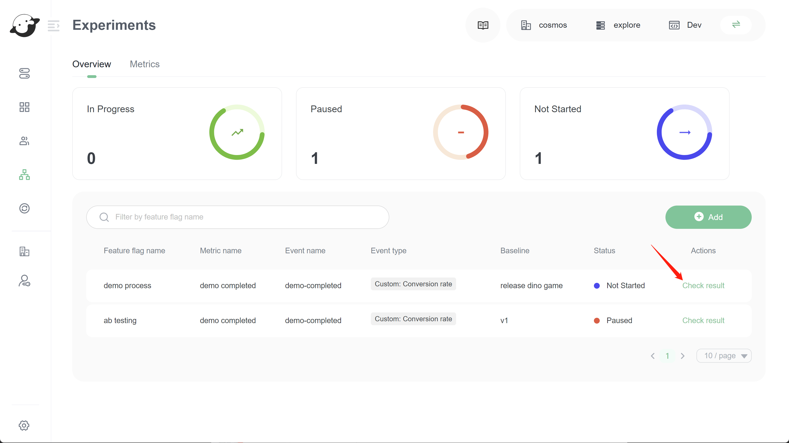
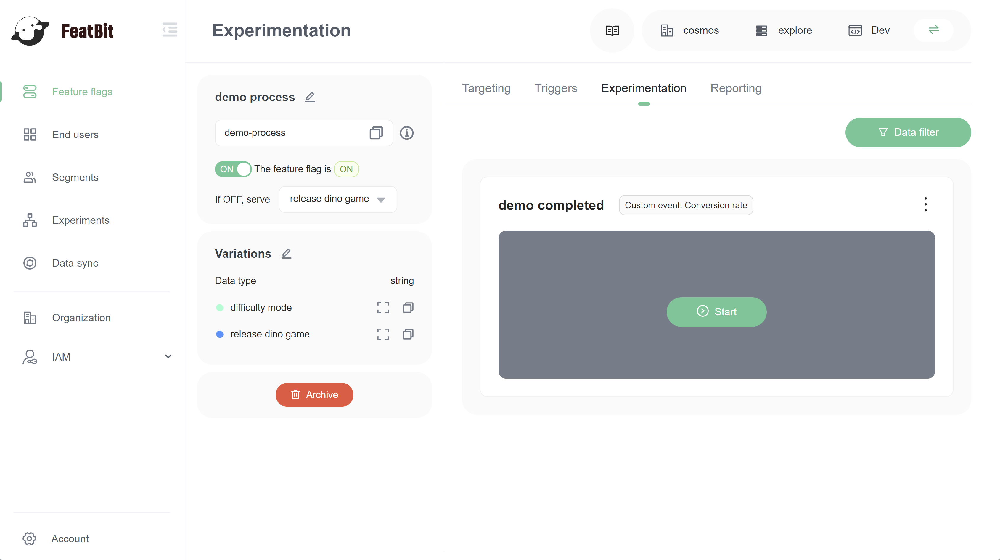
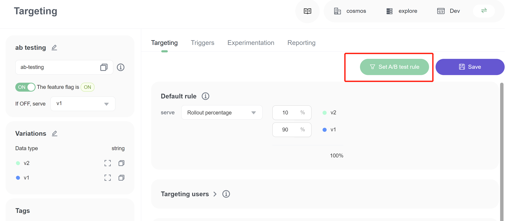
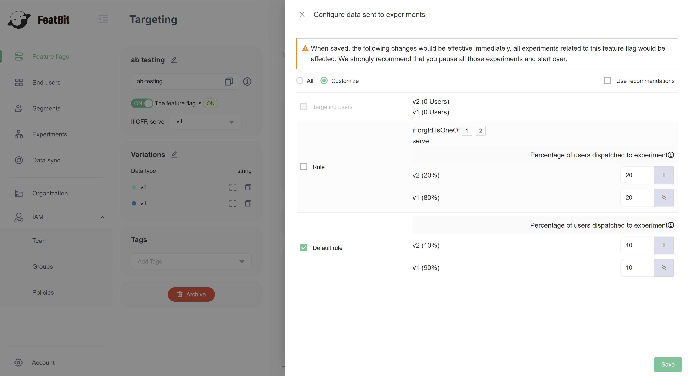

# Creating Experiments

## Overview

This topic explains how to set up and configure an experiment in FeatBit. It introduces the concepts of metrics, explains different metric types, and explains how metrics interact with feature flags to create experiments.

In FeatBit, the combination of metrics and flags is an experiment. Experiments let you measure the effect of flags on users by mapping them to the metrics your team cares about.

## Creating metrics 

Metrics are the measure against which you evaluate flag events. You can use metrics to track all kinds of things, from how often users access a URL to how long that URL takes to load a page. If users load a URL, click an element, or otherwise participate in the behavior the metric tracks, you can use FeatBit SDK to send an event to your experiment.

You don't need to create a new metric for each new experiment. You can reuse existing metrics in multiple experiments, which allows you to compare how the metric performs with different flags. Similarly, a single experiment can use primary and secondary metrics, which allow you to observe how the variations perform against various measurements.

### Using primary and secondary metrics 

You can designate only one metric as the primary metric in an experiment, but you can attach secondary metrics to your experiments if you want to track the performance of additional measurements. We recommend using no more than ten metrics per experiment.

The primary metric is sometimes called the "overall evaluation criterion." When you are making decisions about the winning variation in an experiment, you should base your decision making only on your primary metric, because decision making becomes much more complicated when you include multiple metrics in a decision.

If you are using just one metric, there are two possible outcomes: up or down. If you are using two metrics, there are four possible outcome combinations: up/down, down/up, up/up, or down/down.

For each metric you add to an experiment, the possible outcomes increase quickly. If you are using three metrics, there are eight different possible outcome combinations. If you are using ten metrics, there are 1,024 possible outcome combinations. For this reason we recommend basing your decision-making on only your primary metric.

### Metric Types

The following table explains the kinds of events you can track with a metric and their SDK compatibility:

<table><thead><tr><th width="217.33333333333331">Metric type</th><th>Description &#x26; Example uses</th></tr></thead><tbody><tr><td>Click conversion</td><td>Tracks the clicks on a user interface (UI) element.  - How often do users click a "Save" button?  - How many times do users click on a link?  - When is the best point during a process to display a sign-up invitation?</td></tr><tr><td>Custom conversion</td><td>Tracks events for any arbitrary event.  - Do user searches call a particular service?  - Do customers contact customer service within a set period of time?  - Do customers renew their contract within 30 days? Do user payments succeed?</td></tr><tr><td>Page view conversion</td><td>Tracks how many times a page is viewed.  - How many times do users view a blog post?</td></tr><tr><td>Custom numeric</td><td>Tracks increases or decreases in numeric value against a baseline you set.  - How much do users spend per transaction in my store?  - How much do users spend in total?  - How many items do users purchase per transaction?  - How many items do users purchase total?  - How much time do users spend on a page?  - How long does it take for a server to respond to a request?  - How long until the time to first byte (TTFB)?</td></tr></tbody></table>

### Create a metric

Go to **Experiments** page, in **Metrics** tab, click on **Add Metric** button.

In Metric drawer, fill information of the metric.

* `Name`, name of the metric
* `Description`, (optional) description of the metric
* `Maintainer`, the maintainer of this metric
* `Event type`, FeatBit has only `custom` event type for now, but it supports actually the type below:
  * Custom conversion, you need to choose **Conversion rate** below the selector
  * Custom numeric, you need to choose **Numeric** below the selector
  * Click conversion & Pageview conversion, these can be treated as custom conversion
* `Event name`, the name which will identify events in FeatBit experimentation evaluation. This name will be passed as a parameter when you call SDK to track the events.
* `Unit`, when you choose Numeric as event type, this is will be identify which kind of numeric you're measuring.
* `Winning criteria`, define winning criteria by choose `higher than baseline` or `lower than baseline`

## Create an experimentation

Go back to the Overview sub-panel and click the **Add** button

In the **Experiment** drawer, select the feature flag you created before, choose a **Metric**, choose a variation as baseline. Click on the **Save** button.

## Run experiment

In the experiment list, click on button **Check result** of an experimentation.

You'll be directed to the feature flag **Experimentation** tab. Click on the start button in the Experiment. It starts to run!

## Creating experiment audiences 

You can run an experiment on a flag's default rule, or you can create a custom experiment audience by selecting a specific flag targeting rule to include in your experiment. You can target by any user attribute you collect. To learn how, read [Targeting rules](../feature-flags/targeting-users-with-flags/targeting-rules.md).

When you build your experiment, you can allocate all or a percentage of the user traffic that encounters a flag in an experiment. Audience allocation gives you flexibility when selecting your experiment audience and ensures accurate experiment results. FeatBit analyzes only users that you choose to be part of the experiment.

You can selecting a specific flag targeting rule by click on button **Set A/B test rule**.

You can configure specific ab test traffic in the drawer panel. The image below shows only 10% of total users who matched default rule are included in the experiment. 80% of users who matched default rule of v1 are excluded in the experiment.

