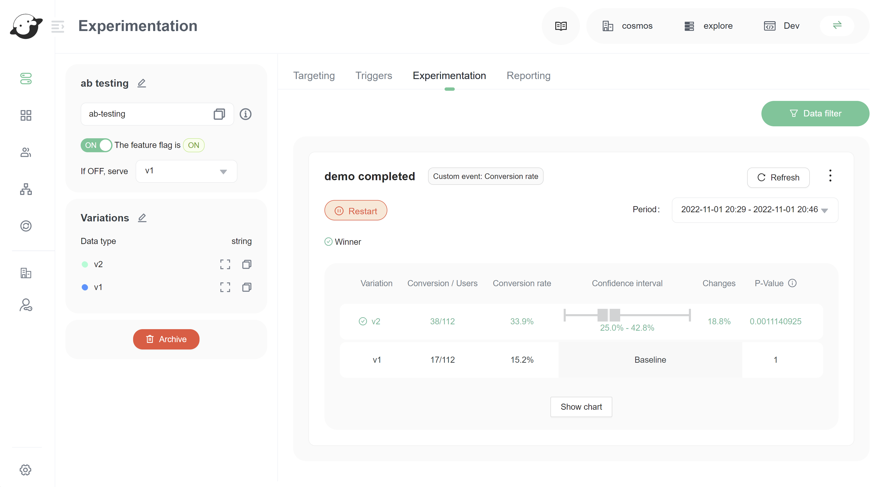

# Understanding Experimentation

## Overview 

This topic explains the concepts and value of FeatBit's Experimentation feature. Experiments let you measure the effect of flags on users by tracking metrics your team cares about.

## Understanding Experimentation

Experimentation lets you validate the impact of features you roll out to your app or infrastructure. You can measure things like page views, clicks, load time, infrastructure costs, and more.

By connecting metrics you create to flags in your FeatBit environment, you can measure the changes in your users' behavior based on what flags they evaluate. This helps you make more informed decisions, so the features your development team ships align with your business objectives.



The image above showed an **AB Test** result of which version (v1 or v2) let users complete the demo easily. Version 2 won the competition, and version 2 became the final version of **Get Started** demo.

## Using Experimentation 

We designed Experimentation to be accessible to a variety of roles within your organization. For example, product managers can use experiments to measure the value of the features they ship, designers can use experiments to conduct multivariate testing on UI and UX components, and DevOps engineers can use them to test the efficacy and performance of their infrastructure changes.

If an experiment tells you a flag has positive impact, you can roll that flag out to your entire user base to maximize its value. Alternatively, if you don't like the results you're getting from one flag, you can switch it off and minimize its impact on your user base.

Some of the things you can do with Experimentation include:

* A/B/n testing, also called multivariate testing
* Start and stop experiments at any time so you have granular control over when data is recorded
* Review credible intervals in experiment results so you can decide which variation you can trust to have the most impact
* Expose specific groups of users to experiments, refining your testing audience
* Validate new ideas by testing multiple variations of a feature,
* Determine your user base's interest in a feature before you build it,
* Gather performance data for a feature, service, or API,
* Increase the adoption of a product by determining the features your users prefer,
* Drive revenue and conversion rate by rolling out successful variations to the rest of your user base,
* And more.

## Analyzing experiment results 

Experiment data is collected on **Experimentation** tab in feature flag detail page, which displays experiment data in near-real time.

As your experiment collects data, FeatBit calculates the variation that is most likely to be the best choice out of all the variations you're testing. After you decide which flag variation has the impact you want, you can gradually roll that variation out to 100% of your users with FeatBit's percentage rollouts feature. To learn more about percentage rollouts, read [Percentage rollouts](../feature-flags/targeting-users-with-flags/percentage-rollouts.md).

You can export experiment data to an external destination using Clickhouse & APIs.

## Experimentation best practices 

As you use Experimentation, consider these best practices:

* **Use feature flags on every new feature you develop.** This is a best practice, but it especially helps when you're running experiments in FeatBit. By flagging every feature, you can quickly turn any aspect of your product into an experiment.
* **Consider experiments from day one.** Create hypotheses in the planning stage of feature development, so you and your team are ready to run experiments as soon as your feature launches.
* **Define what you're measuring.** Align with your team on which tangible metrics you're optimizing for, and what results constitute success.
* **Plan your experiments in relation to each other.** If you're running multiple experiments simultaneously, make sure they don't collect similar or conflicting data.
* **Associate users who interact with your app before and after logging in.** If a user accesses your experiment from both a logged out and logged in state, each state will generate its own user key.

You can use experiments to measure a variety of different outcomes. Some example experiments include:

* Testing the efficacy of different search implementations, such as Elasticsearch versus SOLR versus Algolia
* Tracking how features you ship are increasing or decreasing page load time
* Calculating conversion rates by monitoring how frequently users click on various page elements

## Understanding experimentation events

An Experimentation event is any event an SDK produces that impacts your experimentation event count. There are two categories of Experimentation events:

* **Metric events**: `click`, `page view`, and `custom` events from metrics used in running experiments.
* **Evaluation events**: `feature` events from flags with targeting rules included in running experiments.

#### Understanding metric events 

All FeatBit SDKs send `custom` metric events when you call the SDK's method like

```
fbClient.sendCustomEvent([{
  eventName: 'your event name',
  numericValue: 1
}])
```

To learn more about the track method, read [SDKs](https://github.com/featbit/featbit-js-client-sdk#experiments-abn-testing).

#### Understanding evaluation events 

All FeatBit SDKs send a `feature` conversion event when you call the SDK's `.variation()` method for a flag in an experiment.
