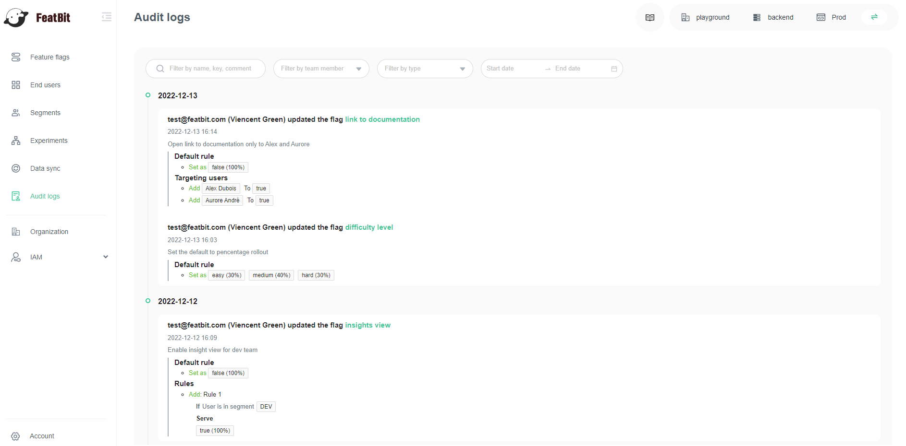

import { Callout } from 'nextra/components'

# Audit log

### Overview 

This topic explains how to use the audit log to track changes made in FeatBit.

### Using the audit log 

The **Audit log** is a running tally of changes made to feature flags in a given environment. You can access the audit log from the side menu.

The audit log displays changes to feature flags for your current environment only. To view the changes for other environments, use the **Switch environment** menu at the top right.

By default, the audit log displays the most recent ten entries. You can use the date picker and other filters to filter out the entries the audit log displays.

Here is an image of the audit log:

