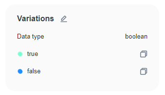
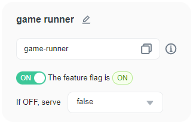
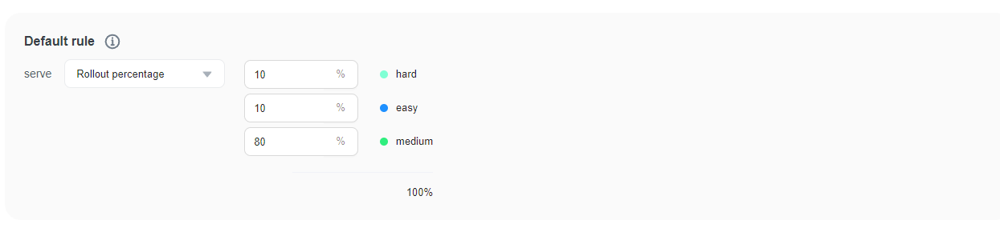
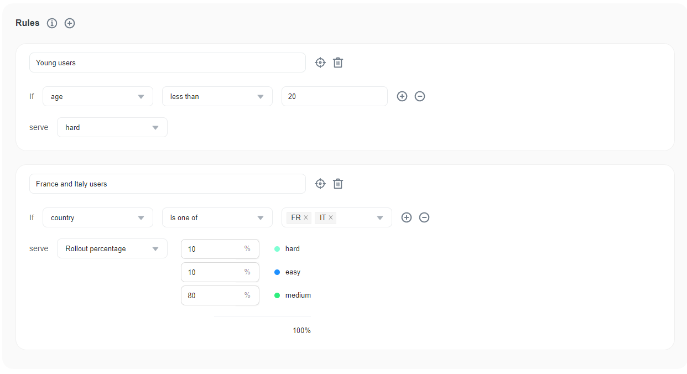

import { Callout } from 'nextra/components'

# Create flag variations

### Overview 

This topic explains how to create and edit your feature flag's variations and outlines the different types of flag variations.

### Understanding flag types 

FeatBit supports boolean and multivariate flags. On the **Variations** section, you can add, edit, or delete variations of existing flags:

* **Boolean** flags have two variations: `true` or `false`.
* **Multivariate** flags can have more than two variations. The allowed variations depend on the type of flag. Multivariate flag types are strings, numbers, and JSON.

On the **Variations** section, you can change the variation type, add, edit, or delete variations of existing flags.

Here is an example of a boolean variations

#### Deleting variations

When you delete a variation, if that variation is used by any rule or some targeting users have been added to that variation, a warning message would appear, you must modify those rules before removing the variation.

### Changing default flag values 

When you create a feature flag, some of its values are designated as defaults. A flag's default values are the values that are served when a flag is on or off, unless you specify otherwise. The default value when a flag is **On** can be either a single variation or a rollout. The default value when a flag is **Off** can be only a single variation.

For example, a boolean flag could have `true` set as its default rule when on and `false` set as its default off variation. A multivariate flag could have `variation 2` set as its default rule when on and `variation 1` set as its default off variation, with `variation 3` and `variation 4` configured to appear when users match certain targeting rules.

Default values are designated automatically every time you create a feature flag. You can accept the default values or change them.

You can change a flag's default values by changing **If OFF, serve** or change the serve value of the default rule.

### Understanding multivariate flags 

Multivariate flags let you use one flag to serve more than two variations of a feature simultaneously. There is no limit to the number of variations you can add to a multivariate flag, making it useful for complex use cases and for managing multiple variations of a feature.

Multivariate flag variation types include strings, numbers, or JSON.

You can use a percentage rollout to refine the rollout of a feature. For example, a multivariate flag that serves strings as variations can be used to enable different difficulties for a the dino game, serving a percentage rollout of those types to users. In this example, the default rule serves hard difficulty to 10% of users, easy difficulty to 10% of users, and the medium difficulty to 80% of users.

Here is an image of a flag with a percentage rollout:

You can use custom rules to target multiple sets of users and refine a rollout even more. In this next example, the first rule serves hard difficulty to all users whose age is less than 20. The second rule targets users whose country is FR or IT and serves hard difficulty to 10%, easy difficulty to 10%, and medium difficulty to 80% of those users. All users who are not targeted in the custom rules are served the default rule.

Here is an image of a flag with custom rules:

You can also use multivariate flags to perform testing with FeatBit's Experimentation feature. To learn more, read [Creating Experiments](../experimentation/creating-experiments.md).

