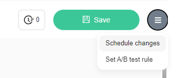
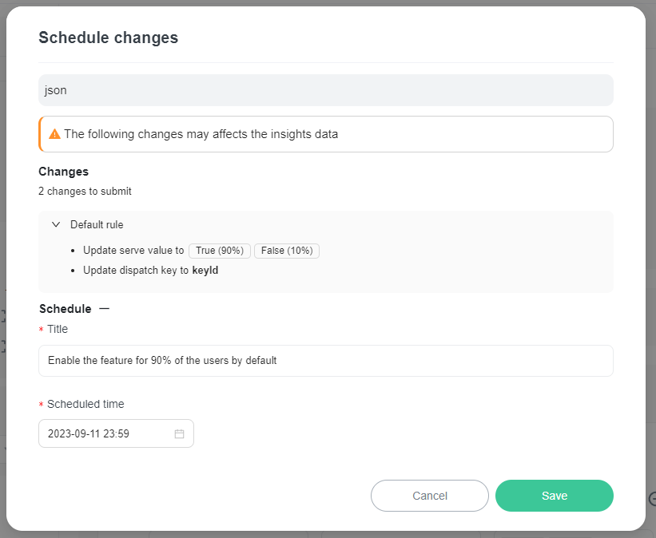
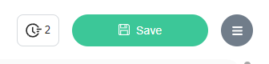
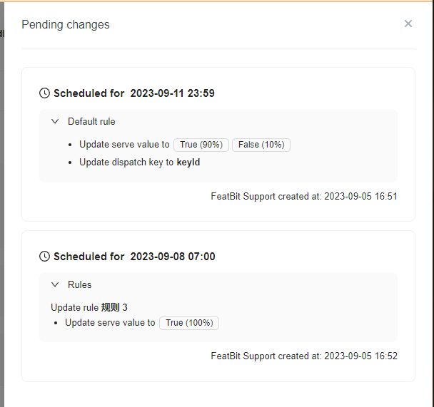
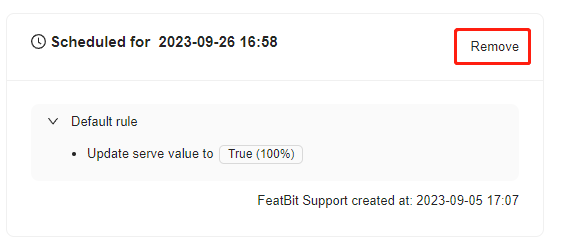

# Scheduled flag changes

## Overview

This topic explains how to schedule flag changes to take effect at a date in the future.

Scheduling flag changes lets you define and schedule changes to your flag’s targeting rules for future points in time. You can create a progressive delivery strategy by scheduling the incremental steps to release your feature to 100% of your user base.

For example, you can schedule a feature to turn on for internal testing two days from today, then enable it for your ‘beta’ customer segment four days later, and finally start an automated rollout increasing to 100% over the following five days.

### Benefits of scheduling flag changes

Benefits of scheduling flag changes include:

* **Timing an early launch**: Scheduling your flag to turn on or off on a specified date/time lets you plan your release without having to manually make changes at desired release times.
* **Progressive feature rollouts**: This functionality lets you create a set of scheduled changes to your flag once, and FeatBit slowly release the feature for you. For example, you can schedule your flag to roll out to 20% of your user base tomorrow, 35% the day after, 50% the day after that, and increase that percentage until it reaches 100%.
* **Temporary access**: You can schedule rules that target certain contexts and segments to be added to or removed from your flag’s targeting to better manage customer access.
* **Flag hygiene**: You can schedule your flag’s targeting rules to clean up once your flag has been rolled out to 100% of your user base.

### Creating scheduled flag changes 

To schedule a set of flag changes:

1. Navigate to the flags list and select the flag for which you want to schedule targeting changes. The flag's **Targeting** tab appears.
2. Make the changes you want to the flag’s targeting.
3.  Click the **hamburger icon** at the top right and select "Schedule changes":\

4.  In the "Schedule" section, put a title and select a date, time for when you want the changes to take effect.

5. Review and confirm the changes displayed in the dialog.
6. Click **Save**.

Your changes have now been scheduled.

You can schedule multiple changes for different dates and times for a single flag. For example, you can implement a progressive rollout strategy by scheduling multiple sequential changes to targeting rules.

## Viewing scheduled flag changes

To view all the scheduled changes for a flag:

1. Navigate to the flags list and select the flag for which you want to view the scheduled changes. The flag's **Targeting** tab appears.
2.  The number of scheduled changes appear in the upper right corner:\

3.  To view the complete list of changes, click on the **clock** icon. A panel appears that displays all the pending changes that are scheduled for this flag. The changes are listed chronologically, with the earliest upcoming change listed first:\

    

## Deleting scheduled flag changes 

To delete a scheduled flag change:

1. Follow the steps in [Viewing scheduled flag changes](scheduled-flag-changes.md#viewing-scheduled-flag-changes) to open the list of pending scheduled changes for the flag.
2.  For the scheduled change you wish to delete, click on the **Remove** button in the upper right:\

    
