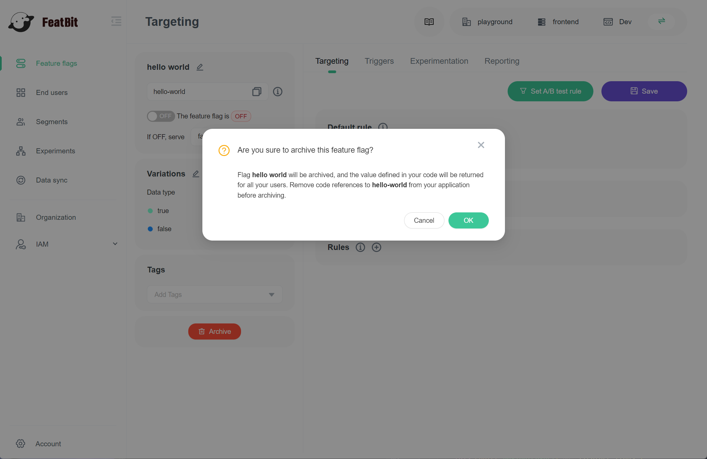
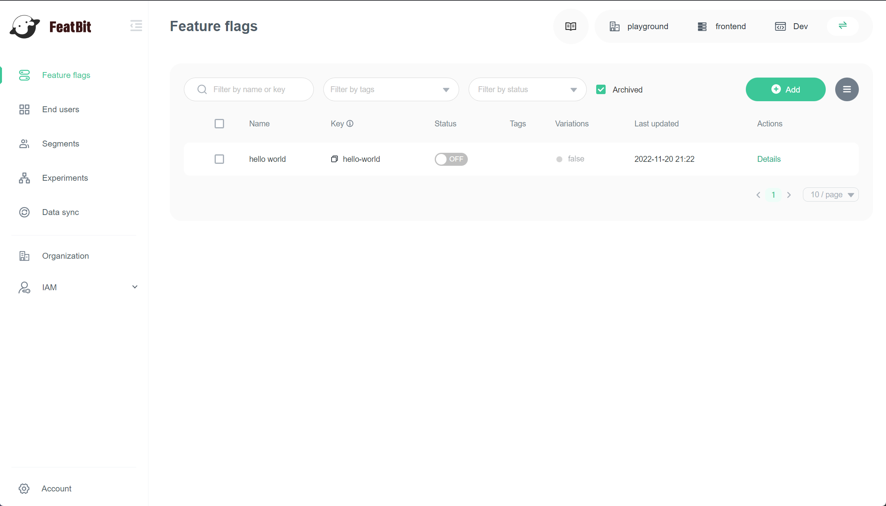
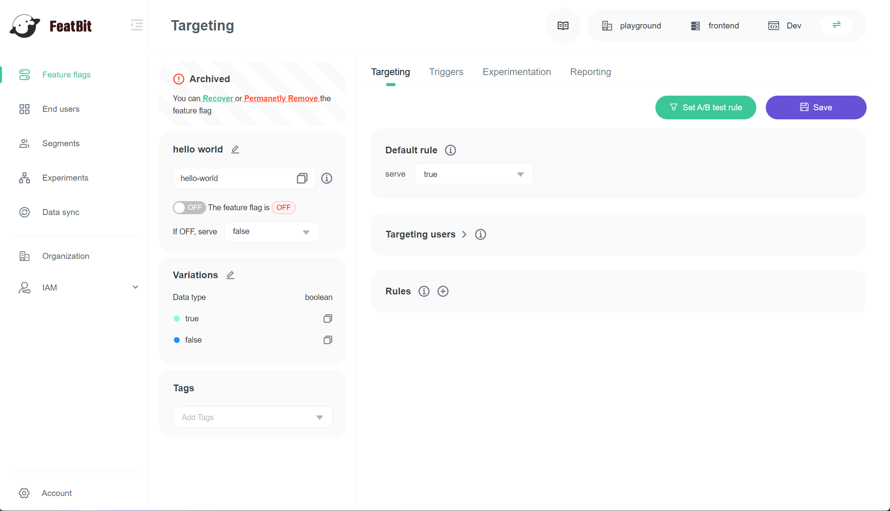

import { Callout } from 'nextra/components'

# Archiving and Deleting

## Overview

This topic explains how to archive flags you no longer need, or delete flags that are archived.

When a flag is no longer being served to users, it may be time to archive it. Archiving a flag retires it from FeatBit without deleting it. You can restore an archived flag if you need it, or find it to reference its configuration later.

You can delete an archived flag after you determine that it will no longer be needed in your project.

## Archiving flags

Flags are good candidates for archival when they are **serving only one variation** in the environment you choose and **have not been requested in the last seven days**.

When you archive a flag in FeatBit, you should also remove the flag from your code.&#x20;

<Callout type="warning">
If you do not remove an archived flag from your code, then all end users encountering the feature will receive the fallback value.
</Callout>

<Callout type="error">
Be absolutely certain you can archive a flag without any unintended impact.
</Callout>

To archive a flag:

1. Navigate to the flags list.
2. Find the flag you wish to archive.
3. Click on the flag name or the "Details" link to go to the flag details page
4.  Click **Archive**. A confirm dialog appears.

5. Click **Ok**.

The flag is archived and removed from the flags list. You can find it in the archived flags list. To learn more, read Viewing and restoring archived flags.

## Viewing archived flags

Archived flags are not visible from the flags list. Check the 'Archived' checkbox to view them:

## Restoring and Deleting archived flags

After you archive a flag, you can restore or delete it.

When you restore an archived flag, it returns to evaluation just like any other flag. So it is important to confirm that the flag will have no unexpected impact after you restore it.

<Callout type="warning">
When you delete an archived flag, the flag value defined in code will be returned for all users. Remove any references to the feature flag from your application code before you delete it.
</Callout>

<Callout type="error">
If you delete a flag, you cannot restore it. Be absolutely certain you do not need a flag any more before you delete it.
</Callout>

To restore or delete a flag:

1. Navigate to the flags list.
2. Check the 'Archived' checkbox to view archived flags.
3. Find the flag you wish to restore or delete
4. Click on the flag name or the "Details" link to go to the flag details page
5.  if you wish to restore this flag, Click **Recover**; if you wish to delete this flag, click **Permanently Remove**

