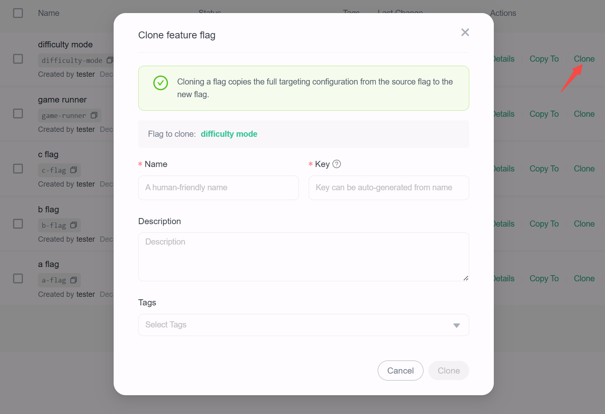

# Cloning existing flags

## Overview

This topic explains how to create new flags within the same environment by cloning existing flags. When you clone a flag, FeatBit creates a new flag and copies the original flag’s on/off state and targeting settings to the new flag. You can then modify the clone’s configuration if needed.

To clone a flag:

1. Navigate to the flag list and choose the flag you want to clone.
2. Click the **Clone** action button to open the "Clone feature flag" dialog.

   

3. In the dialog, enter a unique, human-readable **Name** for the new flag. 
4. (Optional) The **Key** field auto-populates based on the name you enter, but you can modify it if needed.
5. (Optional) Enter a Description of the new flag. A brief, human-readable description helps your team members understand what the flag is for.
6. (Optional) Choose one or more tags for your flag.
7. Click the **Clone** button to create the new flag.