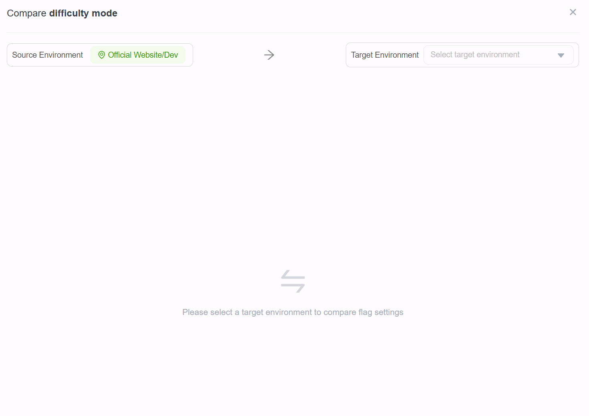
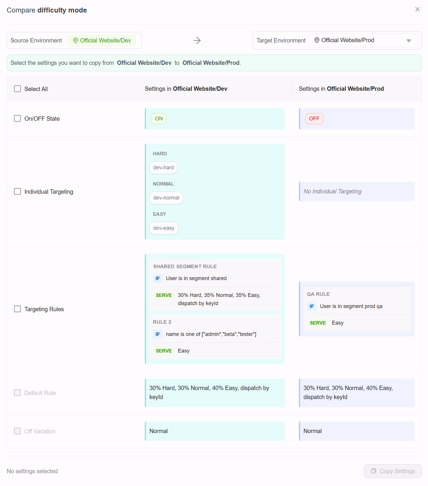
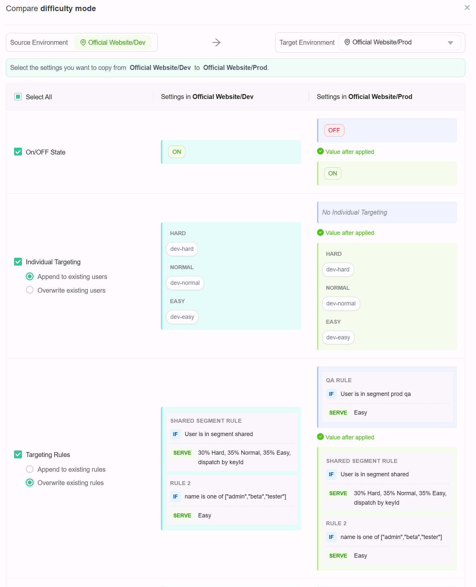
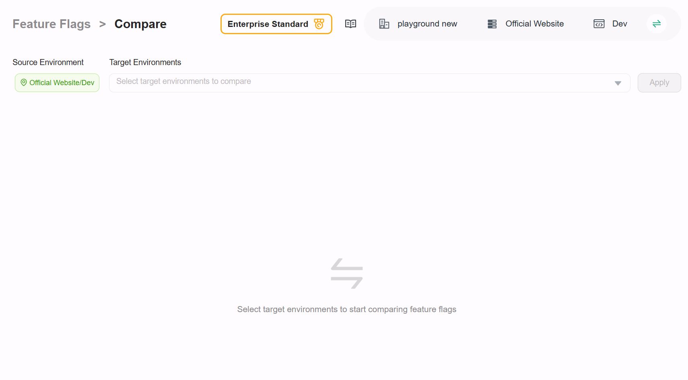
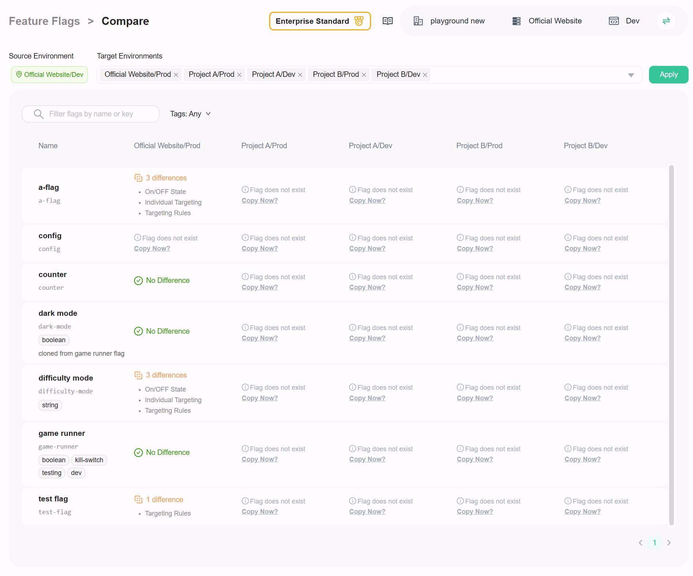

import { Callout } from 'nextra/components'

# Compare and copy settings

## Overview

This topic explains how to compare a feature flag’s settings between two project environments and copy selected settings to another environment for the same flag key.
 
## Compare settings

To compare flag settings between two project environments:

1. Navigate to the flags list and select the flag you want to compare.
2. Click **Compare** to open the Compare drawer, as shown below:

   

3. In the drawer, select the target environment to compare with the current environment.
4. If a flag with the same key does not exist in the target environment, you will see a message indicating that. Otherwise, a side-by-side comparison of the flag settings appears, as shown below:

   

## Copy settings

When reviewing the comparison result, you can select settings that differ and copy them from the current environment to the target environment.

When copying `Individual Targeting` and `Targeting Rules`, you can choose whether to **append** to the existing settings in the target environment or **overwrite** them.

<Callout type="info">
Targeting rules cannot be copied if any rule references environment-specific segments or uses shared segments that are incompatible with the target environment.
</Callout>

1. In the comparison view, select the settings you want to copy by checking the corresponding checkboxes.
2. When you select a setting, the "Value after applied" section shows the expected value after the copy is applied.

   
  
3. After selecting the desired settings, click the **Copy Settings** button.

## Helicopter view

You can also get a helicopter view of all flags with differences between project environments. To do this:

1. Navigate to the flag list of your project.
2. Click the **Compare** button in the top right corner of the page to open the helicopter view index page.

   
3. On the helicopter view index page, select the target project environments you want to compare with the current environment, and then click **Apply**.
4. A comparison overview table appears. Columns represent the selected target environments, while rows represent the flags. Each cell shows differences between the current environment and the target environment for that flag.

   