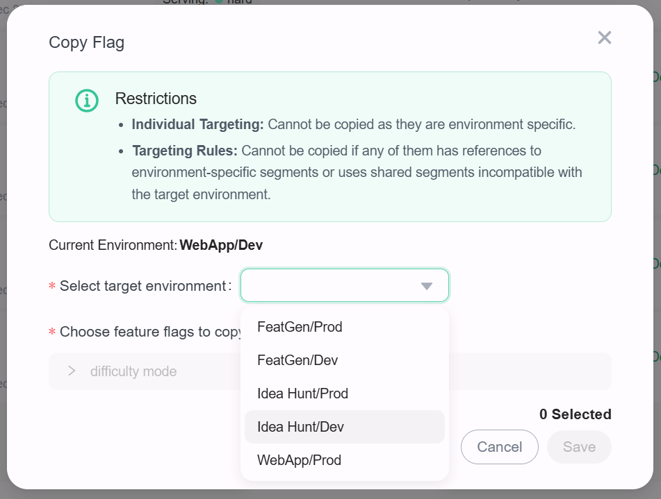
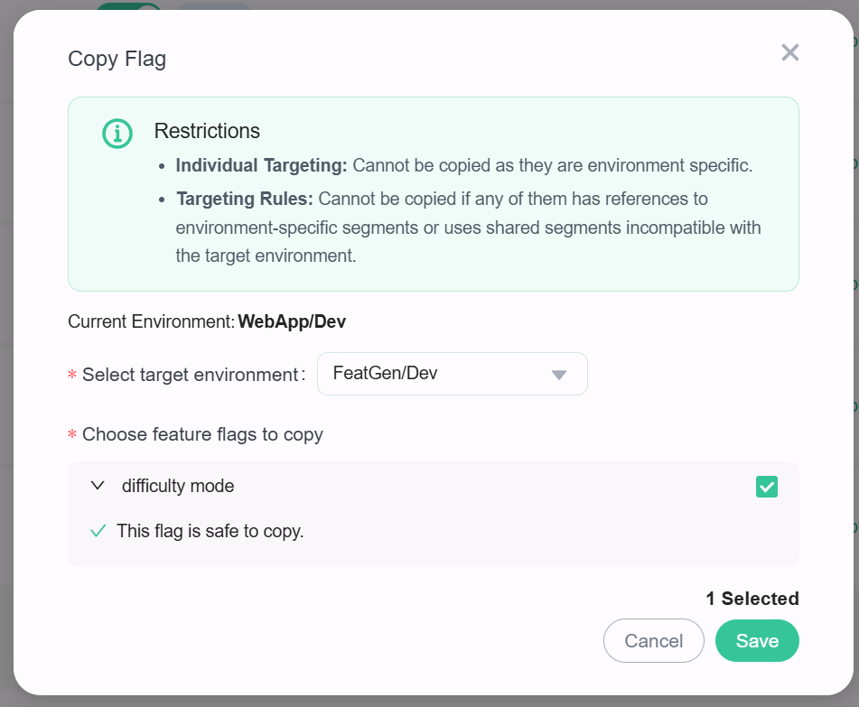
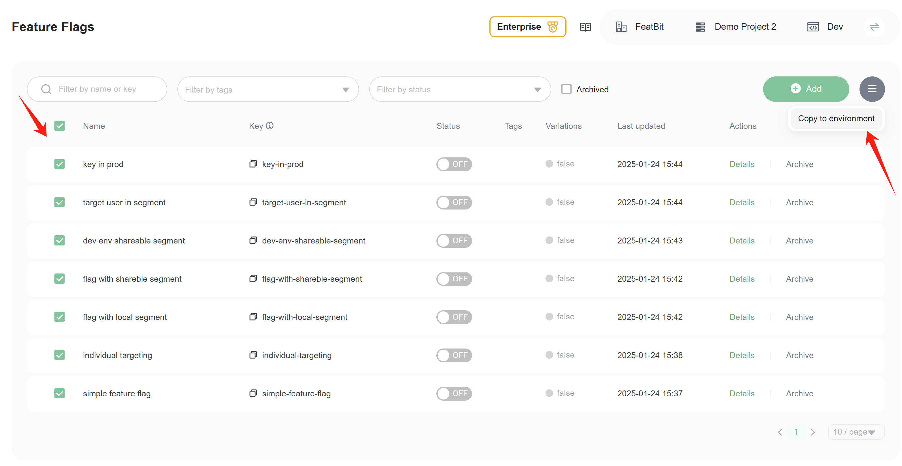
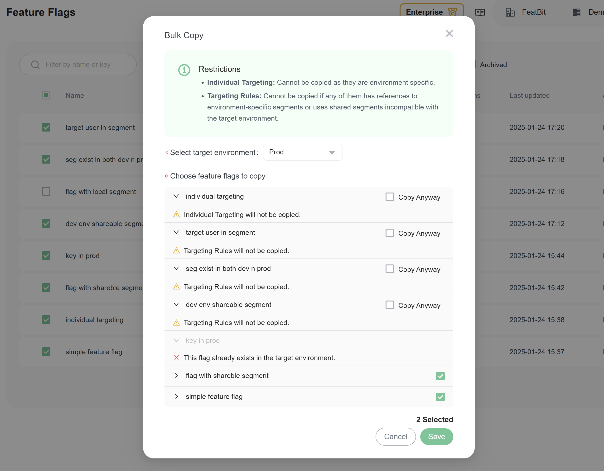

# Copy feature flags across project environments

## Overview

This topic explains how to copy feature flags across different project environments within your organization.

## Copy Feature Flags

In the flags list page, click the **Copy To** action button and then the dialog shows up:

After that, choose the target environment to which you want to copy the flag, a precheck will then be done to make sure if we can fully copy the flag to the target environment

If there is no issue to you, click the **Save** button to confirm, and the feature flag will be copied to the target project environment.

## Batch Copy

Select the flags you want to copy from the flags list. Then, click the **Batch Copy To** button, as shown below:

Choose the target environment to which you want to copy the flags. Then, check the flags you want to copy. Once you've made your selections, click the **Save** button.

## Current Restrictions

Certain scenarios will prevent the fully copying of feature flags:

1. **Duplicate Keys**: A flag cannot be copied if the target environment already contains a flag with the same key.
2. **Individual Users**: Individual user targets cannot be copied because user data is environment-specific.
3. **Restricted Shareable Segments**: Targeting rules cannot be copied if the flag references a shareable segment, but the scope of that shareable segment does not contain the target environment.
4. **Environment-Specific Segments**: Targeting rules cannot be copied if the flag references an environment-specific segment.

As shown below, a warning message will appear if you attempt to copy a feature flag that has one or more of these restrictions.

