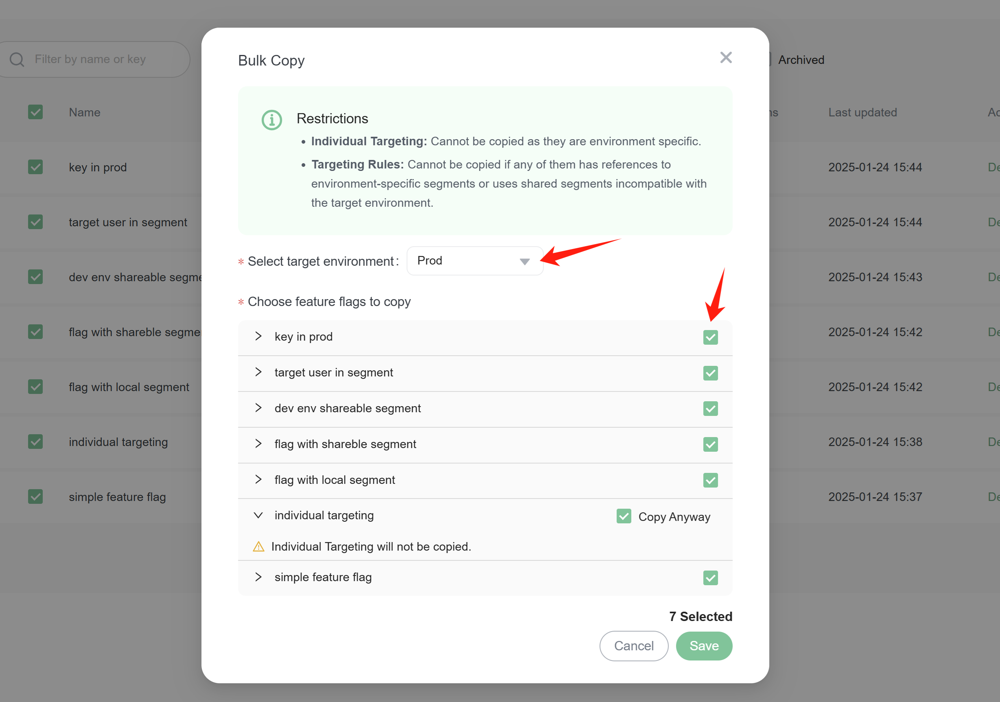
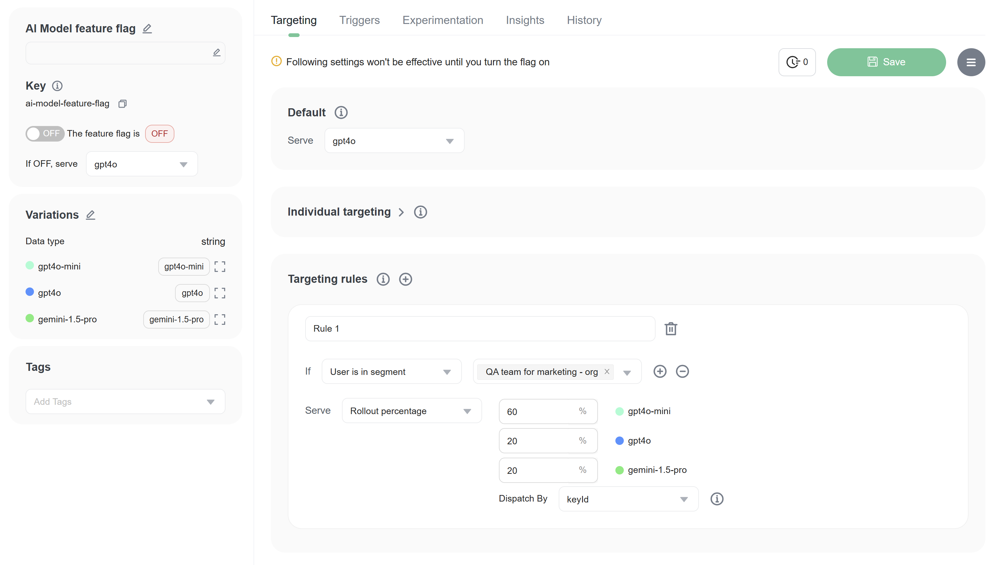

import { Callout } from 'nextra/components'

# Copy feature flags (with settings) across environments

## Overview

This topic explains how to copy feature flags (with settings) from an environment to another in the same project.

## Select the flags to copy

Select the flags you want to copy from the list. Then, click the 'Copy to environment' button, as shown below:

Choose the target environment to which you want to copy the flags. Then, select the flags you want to copy. Once you've made your selections, click the 'Save' button.

This process will copy both the flags and their settings to the target environment, as shown below.

However, there are some restrictions on which settings can be copied, and certain feature flags or settings cannot be copied.

## Restrictions on copying feature flags and their settings

Certain scenarios will prevent the copying of feature flags and their settings:

1. If the target environment already contains the same feature flag key, it will not be copied.
2. If the feature flag includes a shareable segment, but the scope of the shareable segment does not include the target environment, the feature flag can be copied, but the targeting rules will not be.
3. If the targeting rules contain a non-shareable segment, the feature flag can be copied, but the targeting rules will not be.
4. Individual targeting users will not be copied.
5. Any element related to individual targeting users in the feature flag or segment will impact the entire copy process.

As shown below, a warning message will appear if you attempt to copy a feature flag that has one or more of these restrictions."

