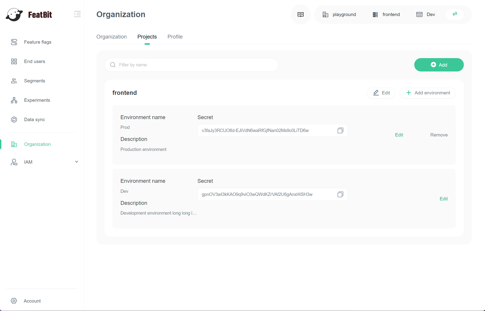
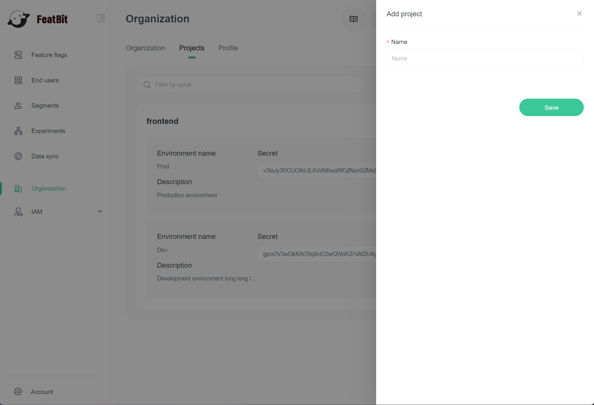
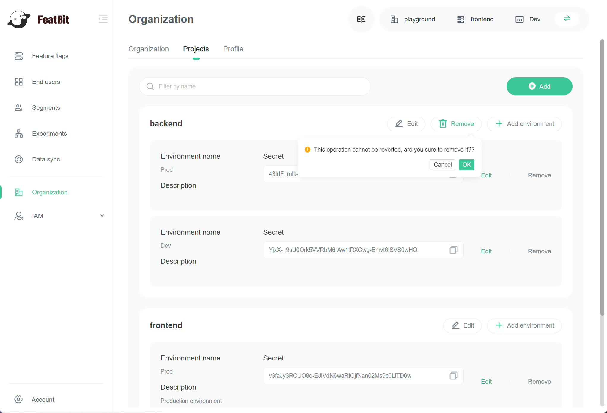

import { Callout } from 'nextra/components'

# Projects

## Overview

This topic explains what projects are in FeatBit, and how you can use them to manage different teams, and tasks across your organization.

## Understanding projects

Projects let you manage multiple different business objectives from one FeatBit account. For example, you can create one project called "Ecommerce" and another project called "Accounting". Every project has its own unique set of environments and feature flags.

Environments are organizational units contained within a project. To learn more, read [Environments](environments.md).

A common pattern is to map each project in your FeatBit instance to a specific product your company makes. For example, a mobile application, web app, and back-end services that are presented to the user as one product might all fit in one project because they likely will share most flags.

## Projects and environments

You can create multiple environments within each project. All projects must have at least one environment.

Here is an image of the projects list:

## Creating new projects

To create a new project:

1. Navigate to the **Organization** page.
2. Click the **Projects** tab.
3.  Click **Add**. The "Add project" drawer appears:&#x20;

4. Give your project a human-readable Name.
5. Click **Save**.

You just created a project. It appears in the list.

## Deleting projects

You can delete a project when you are no longer using it.

<Callout type="warning">
Delete with caution, as deleting a project is permanent and also deletes all the environments and flags within it.
</Callout>

To delete a project:

1. Navigate to the **Organization** page.
2. Click the **Projects** tab.
3. Find the project you want to delete.
4.  Click **Remove**. A confirm dialog appears.

5. Click **Ok**.

Your project is now deleted.
