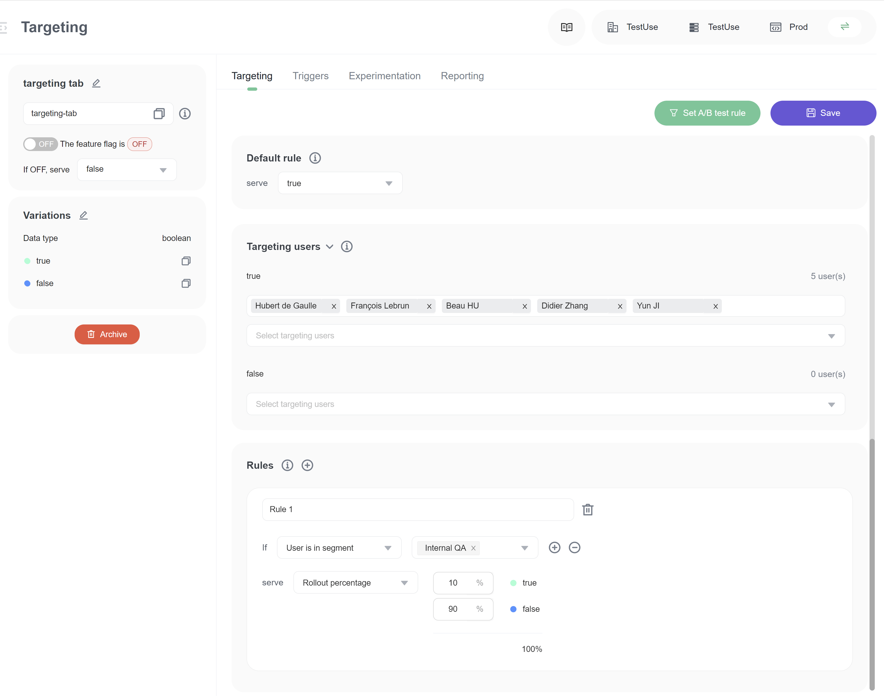

import { Callout } from 'nextra/components'

# Targeting users with flags

## Overview 

This category explains how to use a flag's **Targeting** tab to control which users receive a variation of a feature flag. Configuring which users receive which flag variation is referred to as a flag's targeting.

## Using the Targeting tab 

You can use the **Targeting** tab to roll features out for internal testing, private betas, or usability tests before performing a broader rollout. You can even set expiration dates for flag targeting if you know you only want users to receive a flag for a specific period of time (future feature).

While the **Targeting** tab uses the language of targeted "users," a user can be any identifier that uniquely corresponds to a target. You can target users of your application, email addresses, systems, services, machines, resources, or anything else that can be uniquely identified.

Here is an image of a flag's **Targeting** tab:

To understand better, you can read the articles in detail:

* [Targeting rules](targeting-users-with-flags/targeting-rules)
* [Percentage rollouts](targeting-users-with-flags/percentage-rollouts)
* [Individual user targeting](targeting-users-with-flags/individual-user-targeting)

