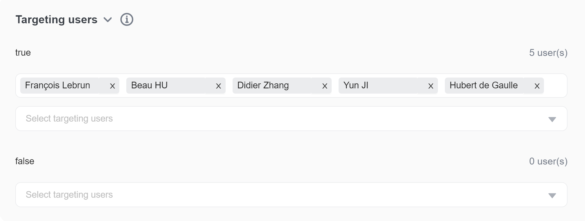
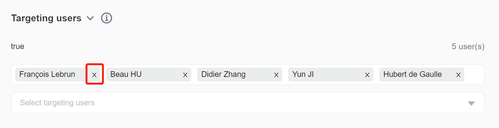

import { Callout } from 'nextra/components'

# Individual user targeting

## Overview 

This topic explains how to use a flag's **Targeting** tab to control which individual users receive a variation of a feature flag.

## Assigning users to a variation 

The "Targeting users" section of the **Targeting** tab allows you to assign individual users to a particular flag variation.

> Only target small numbers of users individually
>
> We recommend using individual targeting for very small numbers of individual users. Individually targeting more than 100 users per variation may cause performance degradation.

If your application is already sending data back to FeatBit, you can search for users by name or user key. These strings are case sensitive. Hover over the user row for more attributes for that user.

If you need to target a user that FeatBit doesn't know about, you can enter their key manually. These users display in yellow until they encounter a feature flag.

In the screenshot below, specific users are receiving the first variation of a flag. That flag is targeted to them. This means that these users will receive that flag variation when they access the flag.

## Removing targeted users 

You can remove a user from a flag's targeting list by clicking the user's name. To do this:

1. Navigate to the flag's **Targeting** tab.
2. In the "Targeting usrs" section, find the name of the user you wish to remove.
3.  Click the **X** next to their name to remove them:

