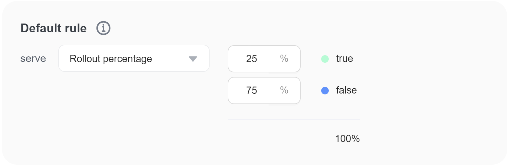

import { Callout } from 'nextra/components'

# Percentage rollouts

## Overview 

This topic explains how to use percentage rollouts to release new features to users incrementally.

Percentage rollouts let you manage the risk of deployment by releasing a feature to users gradually. You can roll out your feature to a small percentage of random users and, as you become more confident, your feature is working as intended, increase the percentage over time.

## Creating percentage rollouts 

You can create a percentage rollout in a flag's targeting rule or a flag's default rule.

Here is an image of a percentage rollout in a default rule:

In this example, 25% of users will receive the new feature. If the new feature works as expected, you can increase the percentage of users receiving the new feature incrementally, until it eventually reaches 100%.

If you want to roll out a variation to a very small percentage of your users, you can assign less than 1% to a variation. You can use up to three decimal places, for example, 0.125%.

## Understanding percentage rollout logic 

When you set up a percentage rollout, each user receives a particular variation based on their user key.

The percentage rollout logic generates a hash based on user keyId. The SDK uses this hash to generate a percentage value for that user. That value, compared to the value set for the percentage rollout value, determines which variation a user receives. The hash has partitions from 0 to 2147483648. When you assign flag variations, the hash assigns values from 0 to 2147483648 to users in each partition, in order. For example, when you assign 50% to variation A, FeatBit serves variation A to hash partitions from 1 to 1073741824.

A common use case for percentage rollouts is to increment the percentage of users targeted by a flag over time until 100% of the users receive one variation of a flag. When you change the percentage allocation of users to flag variations, those users are reassigned different flag variations based on their partition's position in the 0 to 2147483648 hash list. For example, if you change the percentage of users receiving variation A from 50% to 70%, partitions 1073741825 to 1503238554 would be added to the set of partitions already receiving variation A.

### Using advanced rollouts 

You can assign variations to users based on any user attribute in the **Dispatch by** menu.

For example, you can roll out a feature to 25% of users, but instead of being assigned to a variation randomly, users will be assigned to a variation based on the value of their `team-region` attribute. This ensures that FeatBit assigns all users with matching attribute-value pairs to the same variation.

Here is an image of an advanced rollout:

