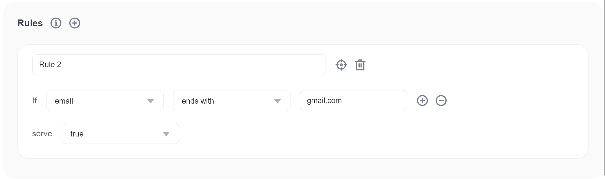
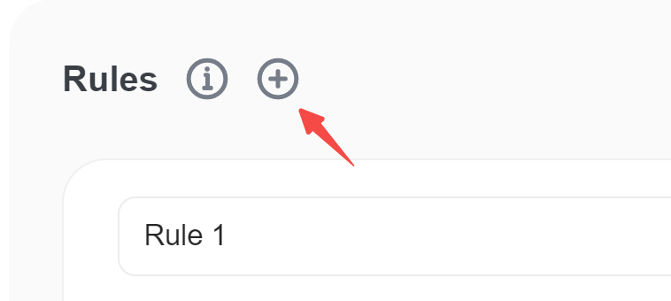
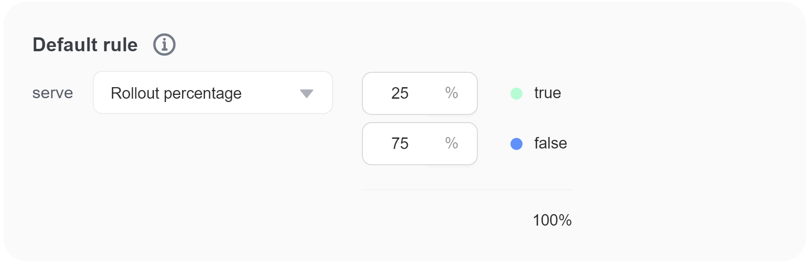
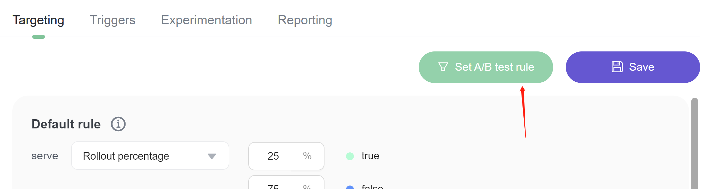
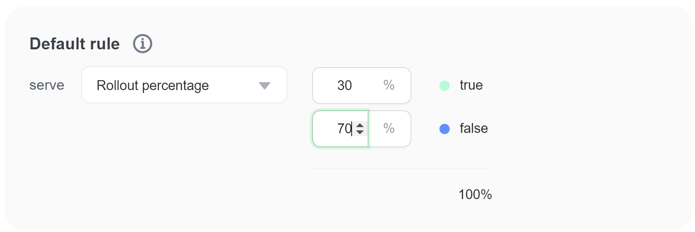
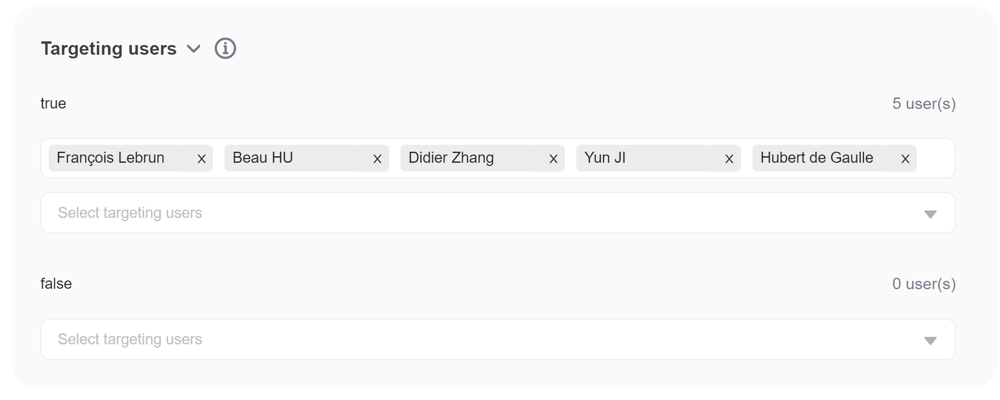
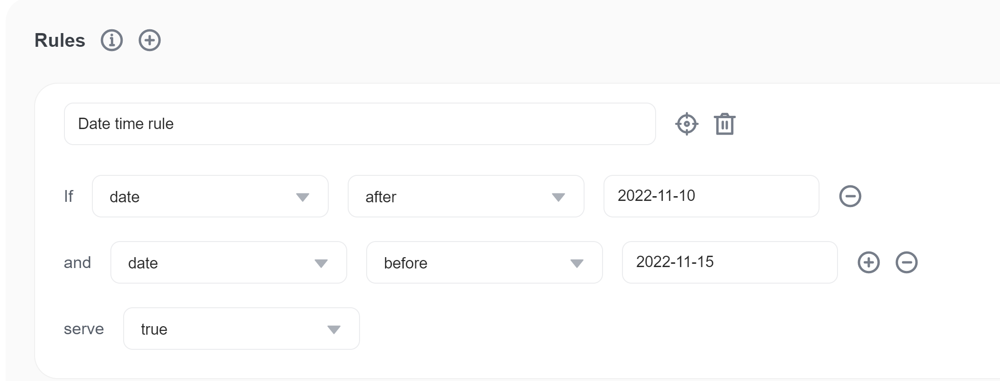
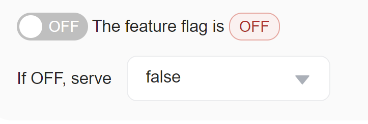

import { Callout } from 'nextra/components'

# Targeting rules

## Overview 

This topic explains how to use targeting rules to target segments of users based on their built-in and custom user attributes.

## Creating targeting rules 

Targeting rules can have one or more conditions.

Each condition has three parts:

* A built-in or custom **user attribute**, which defines the scope of the condition's impact, such as only targeting an email address. To learn more, read [User attributes](targeting-rules.mdx#user-attributes).
* An **operator**, which sets differentiating characteristics of the attribute, such as limiting the condition to emails that end with certain extensions. If a condition specifies multiple values for the operator to track, the operator iterates over the array. To learn more, read [Operators](targeting-rules.mdx#operators).
* A **value**, which identifies the attribute by a value you specify, such as `gmail.com`.

Here is an image of a user targeting rule:

To create a rule that serves `true` to all users whose email address ends with `gmail.com`:

1. Click **Add rules** icon. 

2. Enter a name for the rule.
3. Choose `email` from the **Select an attribute** menu.
4. Choose `ends with` from the **Select an operator** menu.
5. Enter `gmail.com` in the **values** field.
6. Choose `true` from the **serve** menu.
7. Click **save**.

If a targeting rule references any custom attributes with `null` values, then the flag skips that rule.

You can add multiple conditions to a rule. Here is how rules handle multiple conditions and values:

* Users must meet _all_ the conditions in a rule to match the rule. If any of the conditions are not met, the user will not match the rule.
* If a condition has multiple values, FeatBit considers the condition met if there is a match on _any_ of the values.

#### Percentage rollouts 

If you want only a portion of users matching a rule to receive a particular variation, you can serve a percentage rollout.

Here is an image of the percentage rollout section:

In this example, 25% of users will receive the `true` variation.

To learn more, read [Percentage rollouts](percentage-rollouts.md).

#### Experimentation 

After you save a targeting rule, you can click the **Set A/B test rule** button to run an experiment on the rule. To learn more, read [Creating experiments](../../experimentation/creating-experiments.md).&#x20;

Here is an image of the **et A/B test rule** button on a flag's targeting rule:

#### User attributes 

FeatBit includes built-in attributes for users. Here are some examples of common user attributes:

* `keyId`
* `name`

For a full list of built-in user attributes, read [Built-in user attributes](../users-and-user-segments/user-attributes.md).

FeatBit also allows you to create your own custom user attributes. For instance, you might want to target users based on plan, group, role, location, or organization. Using custom user attributes, you could show some features to users on your regular plan, and additional features to users on your premium plan. Or you could roll out a new feature to 30% of organizations, rather than 30% of users.

To learn more, read [User attributes](../users-and-user-segments/user-attributes.md).

#### Operators 

FeatBit supports the following operators:

| Operator | Attribute type | Meaning |
| ------------------------------------ | ------------- | ------------ |
| is one of `=`, is not one of `!=`  | string, number, boolean, date | Exact match |
| ends with, does not end with | string | String suffix match |
| starts with, does not start with | string | String prefix match |
| matches, does not match | string | Regular expression match |
| contains, does not contain | string | Substring match |
| greater than `>`, less than `<`, greater than or equal to `>=`, less than or equal to `<=` | number | Numeric comparisons |
| user is in segment, user is not in segment | segment names | User is included or excluded by the targeting rules for the named segments. To learn more, read [User segments](../users-and-user-segments/user-segments). |

## Setting the default rule 

FeatBit defines a final default rule, for any users that don't match any of the targeting rules on the page. As with other rules, you can choose to serve a specific variation, or apply a percentage rollout to any remaining users.

Here is an image of the percentage rollout section:

Now, 30% of all users who have not been targeted by any other rules will receive `true`.

If you do not want to target users based on user key or any custom attributes, you can use the default rule to control the flag's rollout for all users.

## Setting the default off variation 

When the toggle is turned off, FeatBit will serve the default off variation for your feature flag. For boolean flags, the default off variation is set to `false`. For multivariate flags, you select one of your custom variations. You can customize the default off variation for both boolean and multivariate flags in the **Targeting** tab.

## Evaluation order 

The **Targeting** tab evaluates rules in the order below:

### If feature is turned ON

1. Targeting individual users \

   1. First variation
   2. Second variation
   3. Third variation
   4. ...
2. Targeting user customized rules\

   1. First rule displayed in UI
   2. Second rule displayed in UI
   3. Third rule displayed in UI
   4. ...
3. Target remaining users through the configuration in **Default Rule**

<Callout type="info">
If a user matches multiple rules, the first matching rule applies.
Customized rules can be re-ordered by clicking on the left edge of a rule and dragging it up or down.
</Callout>

### If feature is turned OFF

Serve variation pre-defined in OFF section\

