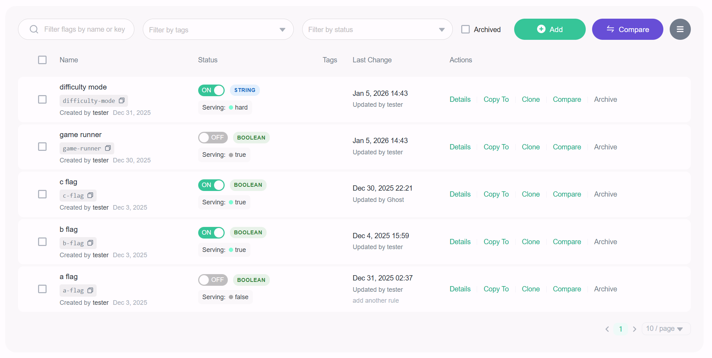
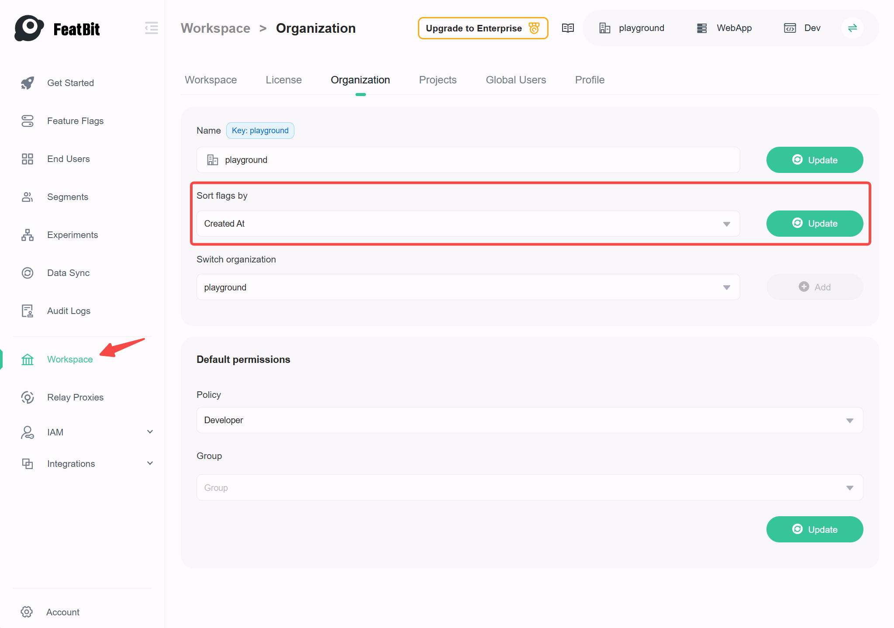

# The flag list

## Overview

This topic explains how to use the feature flags list, which shows your feature flags and gives you options to create, modify, and manage them.

## Viewing feature flags

All of your feature flags **within an environment** appear on the flags list. Creating a new flag adds it to the list, and archiving a flag removes it from the list. You can use the search bar to find a flag by name, key, tag, or status.
By default, the archived flags **will not** be shown in the list, to view them, you need to check the **Archived** checkbox.

Here is an image of the feature flags list:

## Sort feature flags

By default, the most recently created flags appear first, and you can configure this default sorting behavior at the **organization level**.
We currently support two sorting options:

- **Recently created**: Flags are sorted based on their creation date, with the most recently created flags appearing first.
- **Key Alphabetical order**: Flags are sorted in alphabetical order based on their keys.

Here is an image showing how to configure the default sorting behavior:

