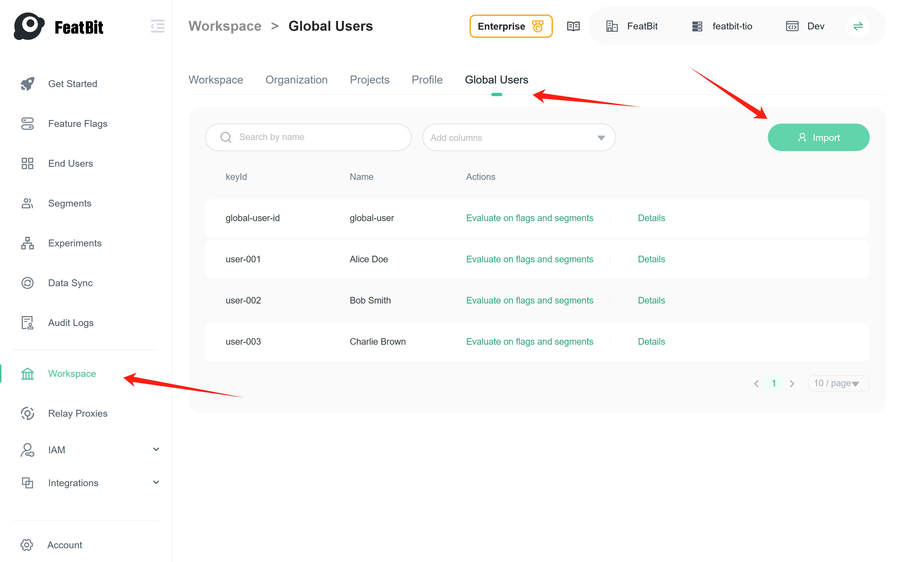
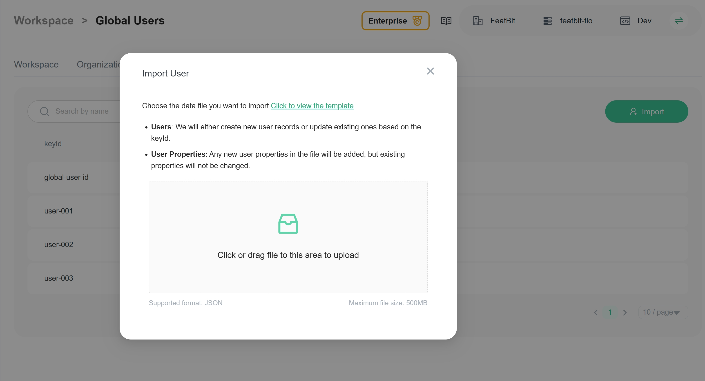
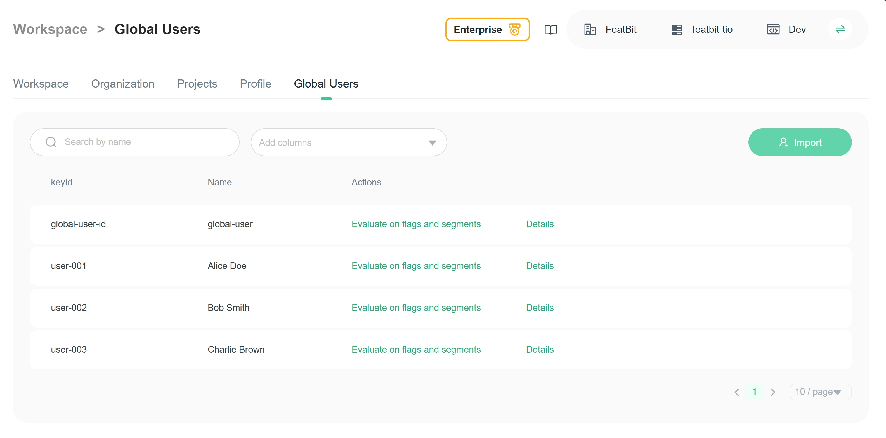
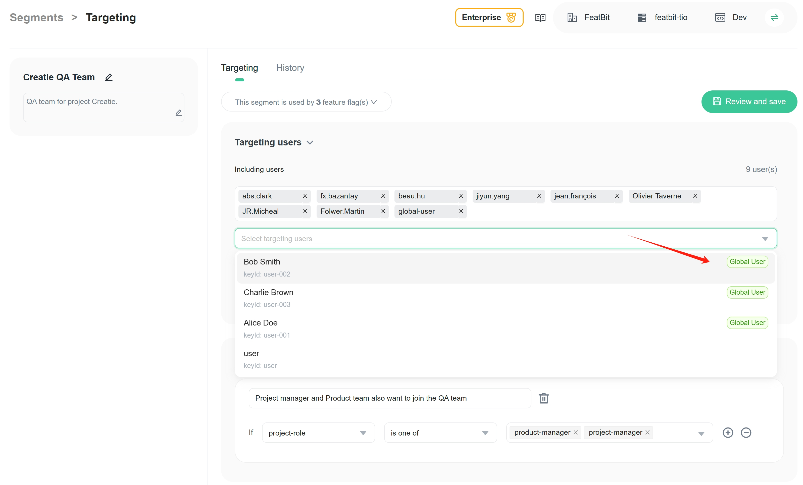

# Global Users

Global users can be used across all projects and environments in your organization.

1. You can add a global user to a feature flag or a segment's Targeting rules.
2. You can add a global user to a shared segment's Targeting rules.

This can simplify the feature flag and segment target settings across multiple projects and teams.

For example, a QA team might be responsible for testing new features across multiple projects. Instead of configuring the same QA segments in each environment and project every time, you can create a global user for the QA team and add it to the global shared QA segments. This prevents redundant work.

## Import Global Users

1. Go to the **Workspace** page, and switch to the **Global Users** tab.

2. Click the **Import** button, and choose the JSON file you want to import.

3. After a successful import, you can see the imported users in the list.

## Add Global User to Targeting Rules

Go to the **Feature Flags** or **Segments** page, and switch to the **Targeting** tab. In the **Targeting users** section, you can select the global users you want to add.

