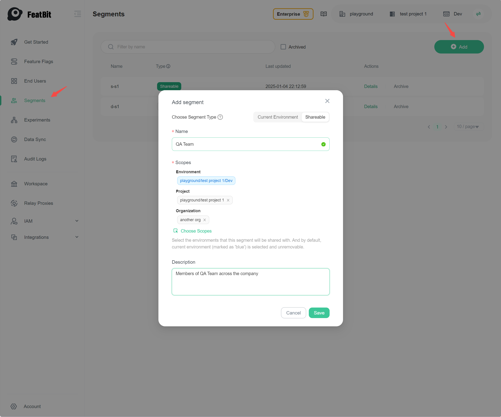

# Shareable Segments

## Overview

Shareable Segments allow you to define a group of users that can be reused across different environments, projects, or
organizations. This simplifies management and ensures consistency when targeting the same user groups in various
contexts.

## Create a Shared Segment

1. Navigate to the **Segments** page.
2. Click the **Add** button.
3. Enter a human-readable **Name** for the shared segment.
4. Choose the **Scopes** of the shared segment.
5. (Optional) Add a **Description**.
6. Click the **Save** button. The segment's details page appears.

## Scopes

A shareable segment can have one or more of the following scopes:

- **Environment:** The segment can be used within the specific environment(s) you select.
- **Project:** The segment can be used across all environments within the selected project(s).
- **Organization:** The segment can be used across all environments within the selected organization(s).

And by default, the current environment is selected and cannot be removed.

## Current Limitations

- After a shared segment is created, you cannot change its **Scopes**.
- A regular segment can reference both global users and environment users, but a shared segment can only reference
  global users. That's because the environment users are specific to the environment, and the shared segment is meant to
  be used across different environments.