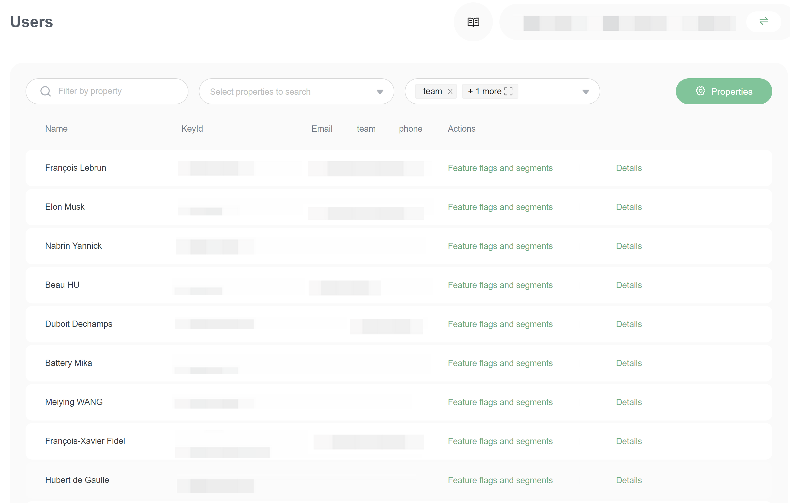
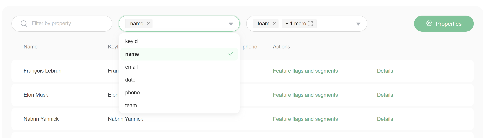
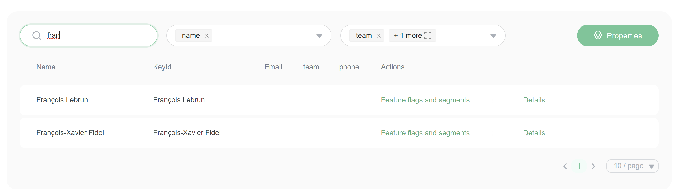
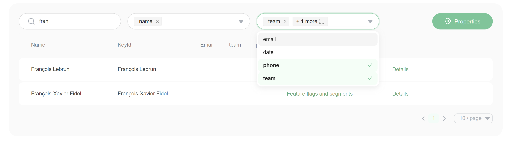

# The user list

## Overview

This topic explains what the **Users** list is, how it is populated, and how to use it.

The **Users** list gives you a summary view of how each user experiences all of the features in your app, and lets you customize their experience from one screen. You can even set expiration dates for flag targeting, or remove flags targeted to individual users.

### Understanding the Users list 

The **Users** list populates automatically when users encounter a feature flag and are evaluated by a FeatBit SDK. The data in the list is populated from the user data you send in variation calls, as well as data from identify calls. 

> **Warning!** The SDK does not use the attributes on the **Users** list to evaluate flags
>
> The SDK only evaluates flags based on the user object you provide in the evaluation call. The SDK does not use the attributes shown on the **Users** list, and user attributes are not synchronized across SDK instances. You must provide all applicable user attributes for each evaluation for your targeting rules to apply correctly.&#x20;

Here is an image of the **Users** list:

From the list, you can filter users by standard or custom attributes.&#x20;

### Filtering users 

You can filter users on the **Users** list by standard or custom attributes.

To filter users:

1. Select the attributes.\

2. Input the filtering value.\

It supports only String type filters. Please give us feedback in [FeatBit GitHub's issues or discussion](https://github.com/featbit/featbit) if you want more.

### Customizing the Users list

You can customize which attributes appear on the **Users** list. To start, click the attributes selector. Here is a screenshot of the attributes selector on the list:

## User storage

The **Users** list shows stored user information. A user will appear on the list after a flag sends an `identify` or `flag evaluation` event for them. Users won't be deleted automatically. Users information are stored in MongoDB.&#x20;

## Removing a user

For now, you can't remove/delete a user. You can post your feedback in [FeatBit GitHub's issues or discussion](https://github.com/featbit/featbit). You can contact your engineer to delete users in MongoDB database.
