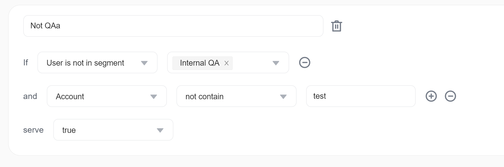
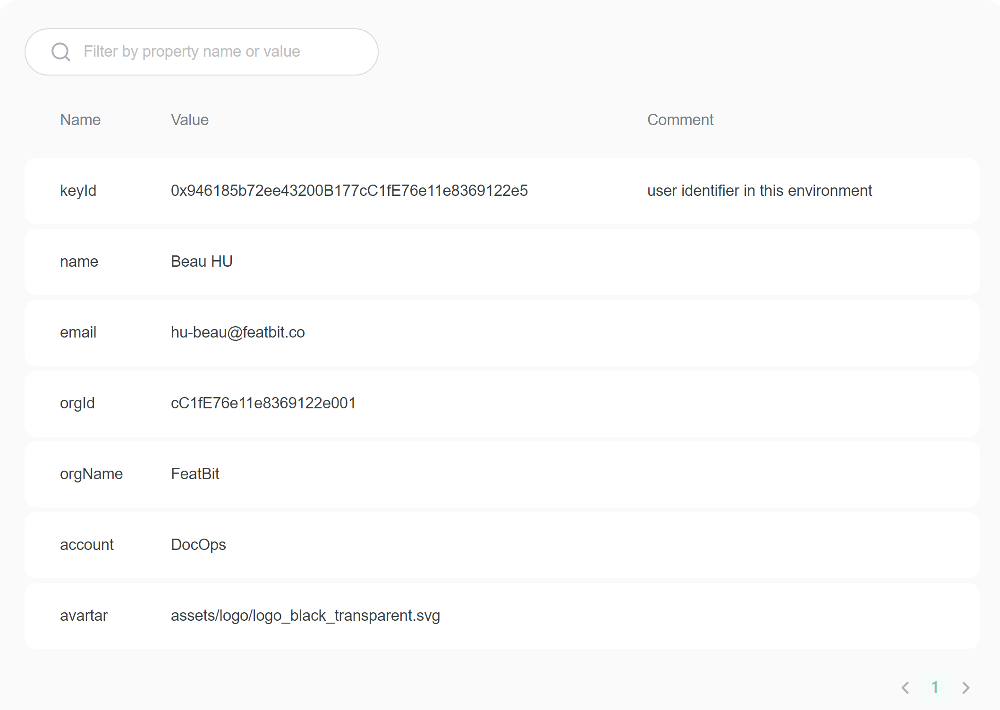
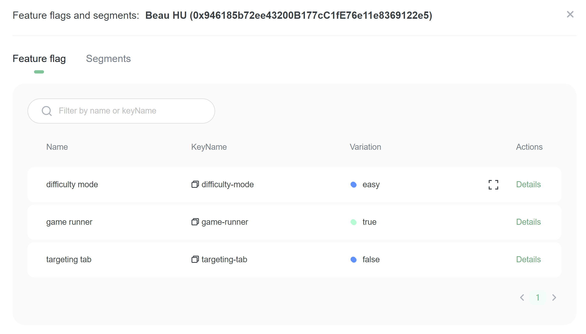
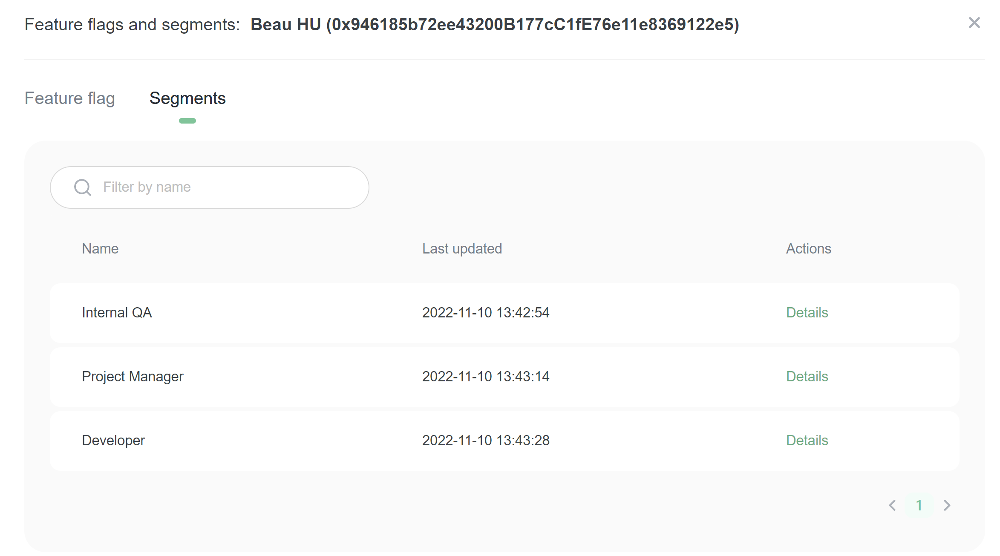

# User Attributes

## Overview 

This topic explains what user attributes are, how they impact what you receive in FeatBit, how to configure them, and how FeatBit uses them to calculate and display flag settings for users.

## Understanding user attributes 

Users are people, services, machines, or other resources that encounter feature flags in your app. Any identifier that uniquely corresponds to a target can be designated as a user.

A more precise way to refer to one user is as a "user object." A user object is a collection of a user's attributes, identified by a unique user key. It includes all of the information about a user that FeatBit can use in a feature flag evaluation.

FeatBit provides two types of user attributes: built-in attributes, and custom attributes. By default, a user's values for both types of user attributes are displayed on the **Users** list.&#x20;

## Targeting based on user attributes

You can use built-in and custom user attributes in flag targeting rules. For example, imagine you want a flag to serve the `true` variation to users who are not in the segment `Test Segment`, and whose `Account` custom attribute does not contain `test`.

Here is what the rule would look like:

After you have set up the conditions for your rule, you can decide whether your users will receive one variation, or a percentage rollout across several variations. To learn more, read [Targeting rules](../targeting-users-with-flags/targeting-rules.md).

## Viewing and managing users 

By default, all of the attributes in your user objects are sent to FeatBit. This data lets FeatBit determine the expected flag variations for users and powers the autocomplete functionality throughout the FeatBit user interface (UI).

You can access user pages from the **Users** list. Here is a user pages in the FeatBit UI:

### User attributes list

### User feature flags list

### User segment list

