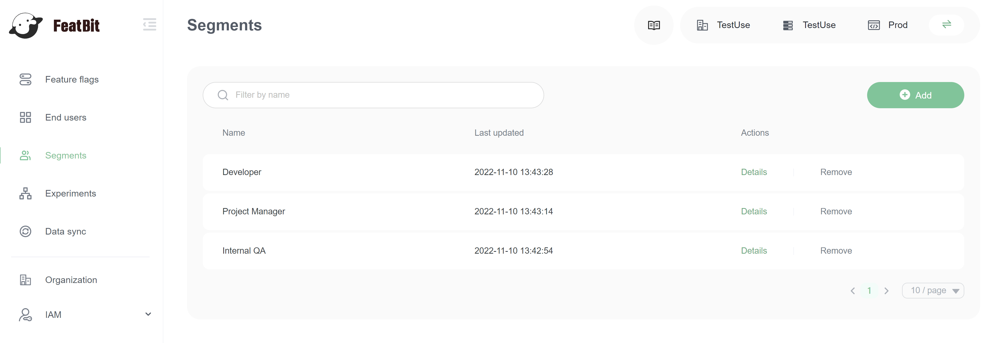
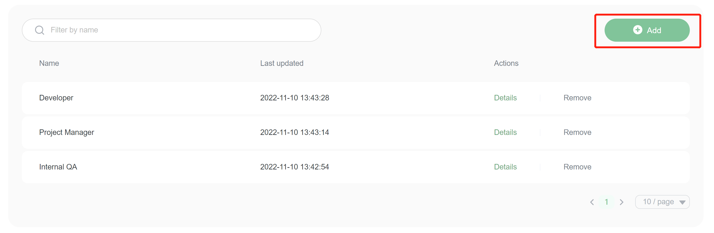
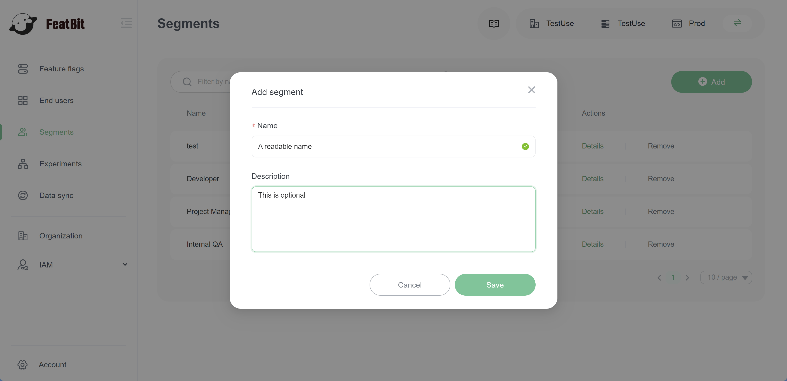
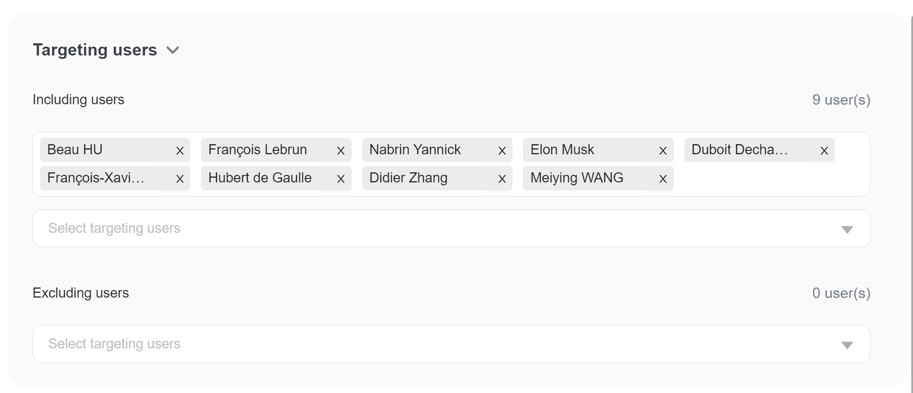
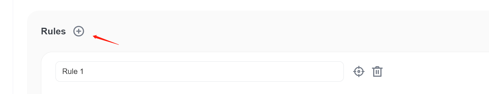
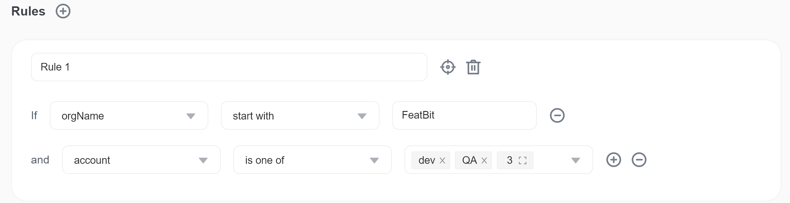
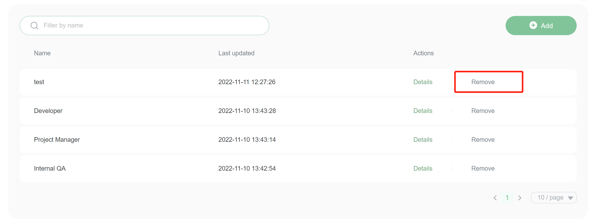
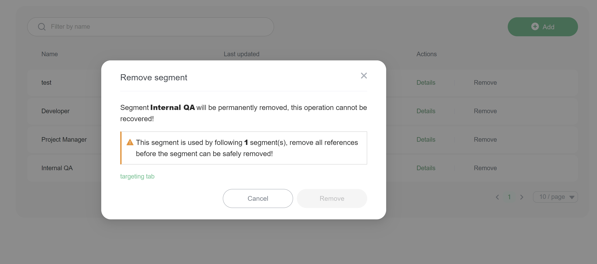

# User Segments

## Overview

This topic explains how to build and manage user segments. User segments let you target groups of users individually or by attribute.

## Understanding user segments 

User segments are lists of users that you can use to manage flag targeting behavior in bulk. Segments are useful for keeping groups of users, like `beta-users` or `enterprise-customers`, up to date. They allow you to more quickly turn features on or off for certain groups with confidence.

There are some differences between flag and segment targeting that you should be aware of:

* Segments are environment-specific. They do not populate in environments other than the one you created them in.
* Segment targeting cannot reference another user segment.

## Using the Segments list 

You can view segments on the **Segments** list. From the list, you can filter segments by name.

## Creating user segments 

To create a new segment:

1. Navigate to the **Segments** list.
2.  Click **Add**. The "Add segment" panel appears.

3. Give your segment a human-readable **Name**.
4. (Optional) Add a **Description**.

5. Click **Save**. The segment's **Targeting** tab appears.

## Customizing user segments 

You can customize a segment to apply to different users or attributes, or exclude users and attributes, in the segment's **Targeting** tab. Segment targeting rules function the same way as flag targeting rules. To learn more, read [Targeting users](../targeting-users-with-flags/targeting-rules.md).

To customize a segment:

1. Navigate to the **Targeting** tab of the user segment you wish to modify.
2.  Individually target users with the **Including users** or **Excluding users** options.\

3.  Click  **+** button beside **Rules** to create a custom rule for this segment. The custom rule menu appears:\

4. Specify an **attribute**, an **operator**, and **values** for the rule.
5.  If you want to add more criteria, click the **plus button** beside the rule criteria.\

6. Click **Save**.

> Understanding segment rule logic
>
> When you specify rules for a segment, FeatBit parses them in order of appearance from top to bottom. You can change how segment targeting applies based on the order of the rules you create.
>
> If user matched one of the rules, user is treated as a **Included users**

## Deleting segments 

To delete a segment, find the segment you want to delete on the **Segments** list and click **Remove**.

If a feature flag is using the segment, you should first remove it from feature flag.

