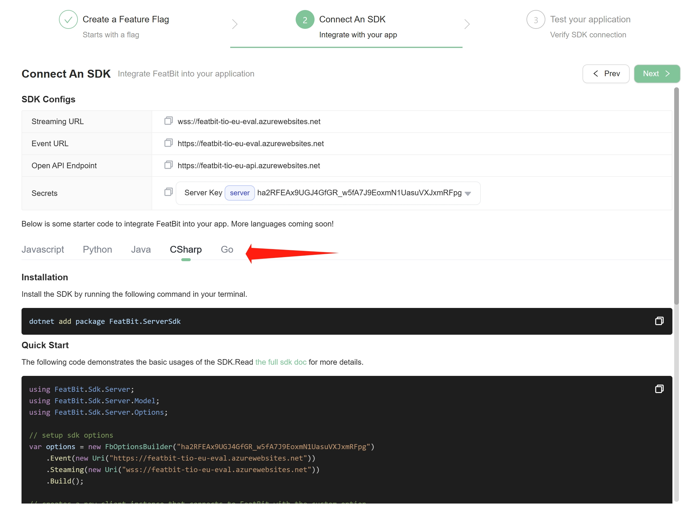
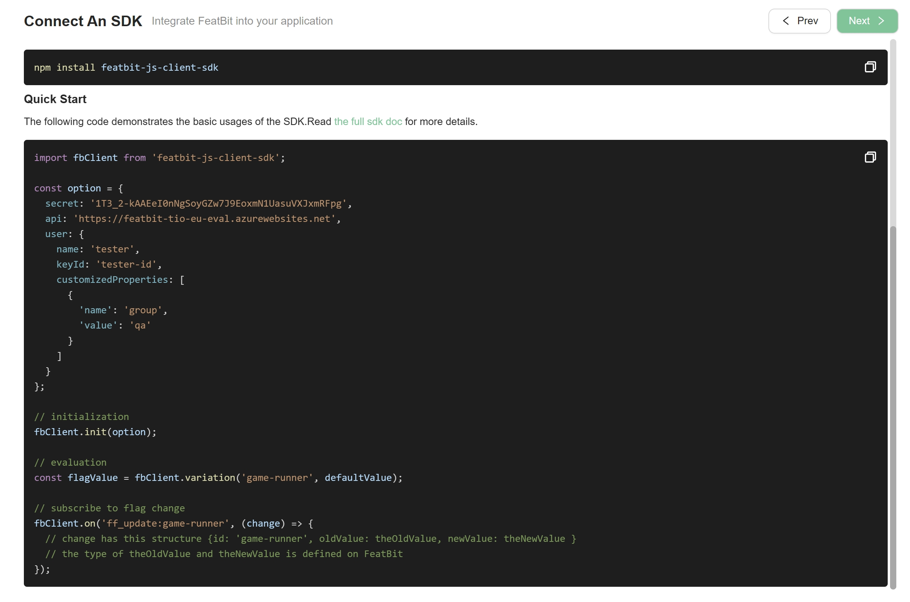

import { Callout } from 'nextra/components'

# 4. Connect an SDK

The use of SDK is an essential skill for understanding how to deliver, control, and experiment with the software through feature flags.

In the last step "Try interacting with the demo", you've learned how to use feature flags to make the game component appear/disappear, and switch the difficulty mode of the game. Now let's see how it's implemented in the code.

## Follow the guide in the portal

The easiest way is to follow the instructions on the portal's Getting Started page. In the portal, you can

**Step 1**. Select one of the feature flags you just created in the previous step. Then click the "Next" button to go to step 2.

**Step 2**. Choose a programming language you're comfortable with. Copy the automatically generated code and run it in your IDE.

The code generated by the portal contains all necessary elements, such as:

- SDK installation
- SDK initialization with server URL, environment key
- Identification of a user with customized properties
- Feature flag implementation
- Feature flag evaluation 
- Feature flag update listener
- And so on

## Connect SDKs manually

We provide a variety of client-side, server-side, and mobile SDKs to choose from. You can select the language you're good at to accelerate completing your quick start.

<Callout type="info" emoji="👾">
  We recommend that you use our SDK, because we have already implemented the best practices for you.
</Callout>

### Javascript

We provide a client-side [Javascript/Typescript SDK](https://github.com/featbit/featbit-js-client-sdk). We also provide a "Dino Game" sample for [React](https://github.com/featbit/featbit-samples/tree/main/samples/dino-game/interactive-demo-react) and [Vue](https://github.com/featbit/featbit-samples/tree/main/samples/dino-game/interactive-demo-vue). This SDK works perfectly with Typescript, React, Vue, Angular, etc.

The SDK's GitHub repository contains a full tutorial on how to use it. It also provides a sample project for you to try out.

### .NET

We provide a [server-side .NET SDK](https://github.com/featbit/featbit-dotnet-sdk) for you to use. This SDK can be used in your console APP or ASP.NET Core APP.

It can also work for front-end application such as WPF, WinForm, MAUI, etc. But we don't recommend you to use it in mobile application because it consumes more battery power than a real mobile SDK.

The SDK's GitHub repository contains a full tutorial on how to use it. It also provides a sample project for you to try out.

### Java

We provide a [Java SDK](https://github.com/featbit/featbit-java-sdk) for you to use. This SDK can be used in your console APP or Spring Boot APP. 

The SDK's GitHub repository contains a full tutorial on how to use it. It also provides a sample project for you to try out.

### Python

We provide a [Python SDK](https://github.com/featbit/featbit-python-sdk). The SDK's GitHub repository contains a full tutorial on how to use it. It also provides a sample project for you to try out.

### Go

We provide a [Go SDK](https://github.com/featbit/featbit-go-sdk). The SDK's GitHub repository contains a full tutorial on how to use it. It also provides a sample project for you to try out.

### REST APIs & WebSocket

For any other language or framework that we didn't provide an SDK yet, you can use our REST APIs to get feature flags. See the documentation [here](../api-docs/get-users-feature-flags-with-api). 

You can use our WebSocket interface to get real-time feature flag update. Please join our Slack channel to get more information about this feature.

