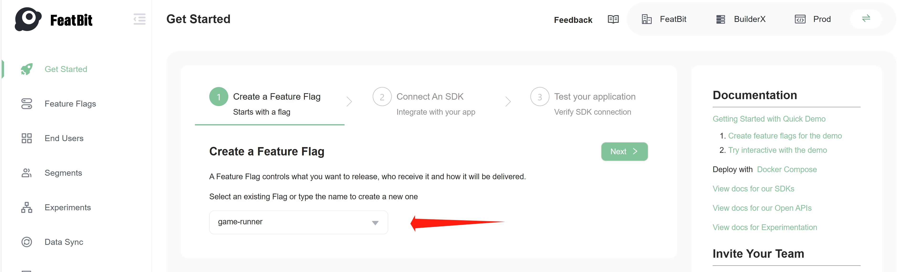

import { Callout } from 'nextra/components'

# 3. Connect an SDK

The use of SDK is an essential skill for understanding how to deliver, control, and experiment with the software through feature flags.

In the last step "Try interacting with the demo", you've learned how to use feature flags to make the game component appear/disappear, and switch the difficulty mode of the game. Now let's see how it's implemented in the code.

## Follow the guide in the portal

The easiest way is to follow the instructions on the portal's Getting Started page. In the portal, you can

**Step 1**. Select one of the feature flags you just created in the previous step. Then click the "Next" button to go to step 2.

**Step 2**. Choose a programming language you're comfortable with. Copy the automatically generated code and run it in your IDE.

The code generated by the portal contains all necessary elements, such as:

- SDK installation
- SDK initialization with server URL, environment key
- Identification of a user with customized properties
- Feature flag implementation
- Feature flag evaluation 
- Feature flag update listener
- And so on

For a list of supported SDKs, please check out the [SDK Overview](../sdk/overview#supported-sdks) page.

