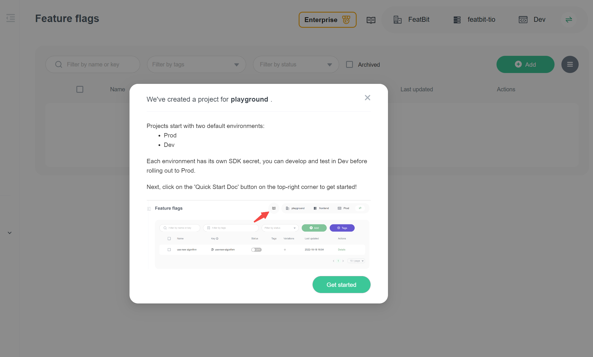

import { Callout } from 'nextra/components'

# 1. Create a feature flag

In this topic, you will learn how to create feature flags for the demo "Dino Game".

## Prerequisites

We assume that 

1. You have successfully logged in to the [FeatBit Cloud](https://app.featbit.co).
2. Or you have successfully installed FeatBit through [Docker Installation](../installation/full-installation.md).

## Login and Create Organization and Project

If this is your first time login in, you need to specify your organization and project through the guide below. Click on the "Complete" button to finish this step.

After completing the process above, you will be redirected to the **Get Started** page. You will see an onboarding guide (shown in the image below).

## Create a feature flag

Create a new feature flag and name it "**game runner**" in the dropdown box, then click **Next** button.

<Callout type="info" emoji="ℹ️">
  This is a quick start, so that you can only create a boolean feature flag in this guide. If you want to create a feature flag with other data types, you can follow the guide in the [Create a feature flag](create-a-multi-variant-feature-flag) article.
</Callout>

## Use feature flag with SDKs

A feature flag can control remotely the behavior of your application. You can use the feature flag in your application by integrating the FeatBit SDK. In the second step "Connect an SDK", it includes the integration code for the FeatBit SDKs.

As image shown above, by default the "Get Started" page showed the code snippet for 5 SDKs:

- Javascript SDK for web applications.
- Node.js SDK
- Python SDK
- Java SDK
- Go SDK
- .NET SDK for server-side applications

You can copy the code snippet and paste it into your application. The code snippet is a simple example of how to use the FeatBit SDK in your application, it includes:

- Initialize the FeatBit SDK with the API key.
- Identify the user.
- Evaluate a feature flag.
- And so on.

FeatBit also provides other SDKs for different platforms (such as React, React Native, .NET client, and so on), you can find them in the [SDKs page](../sdk/overview). In the detail page of each SDK, you will discover the more information and examples of how to use the SDK.

## Verification SDK's connection

After integrate the SDK and running your application, you can verify the connection between your application and FeatBit by checking the testing result in the 3rd step of "Get Started". As shown in the image below, you can see the testing result of the feature flag "game runner".

<Callout type="info" emoji="ℹ️">
  If the verification fails, it might just be a small bug in the verification process. You can continue reading the next articles to see if you can control the behavior of the feature by changing its flag status.
</Callout>

## Next

In the next topic, you will learn how to play with FeatBit's feature flag and control the feature behavior in the ["Try interacting with the demo"](try-interacting-with-the-demo.md) article.

