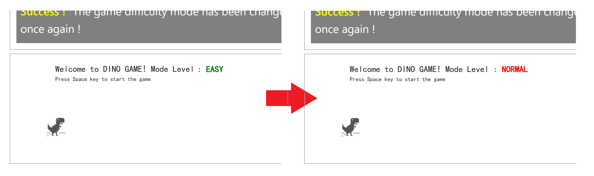

import { Callout } from 'nextra/components'

# 3. Create a multiple variants feature flag

## Create feature flag

Back to the **Feature Flags** page, click "**+ Add**" button on the top right corner to create a new feature flag.

Create a feature flag, and name it "difficulty mode", and then:

- Choose `string` as **Variation type**.
- Add three variants and give them the values `easy`, `normal`, and `hard`.

- If the flag is OFF, serve ``easy`` as the default value. 
- If the flag is ON, serve ``normal`` as the default value.
- By default, trun the feature flag OFF.

Then click the "Save" button to create the feature flag.

## Interacting with the demo

Back to the demo page, click "Next Task" button, the dino game demo show you how to change game difficulty.

Following the instruction in the image above, change the rule, you will see the change happens in the game area.

## Next

You have successfully completed the task of creating feature flags and interacting with the demo. In the upcoming topics, you will learn more about:

- [Integrating the FeatBit SDK into your application.](connect-an-sdk.md).
- [Basic guides for using FeatBit](how-to-guides/testing-in-production.md).