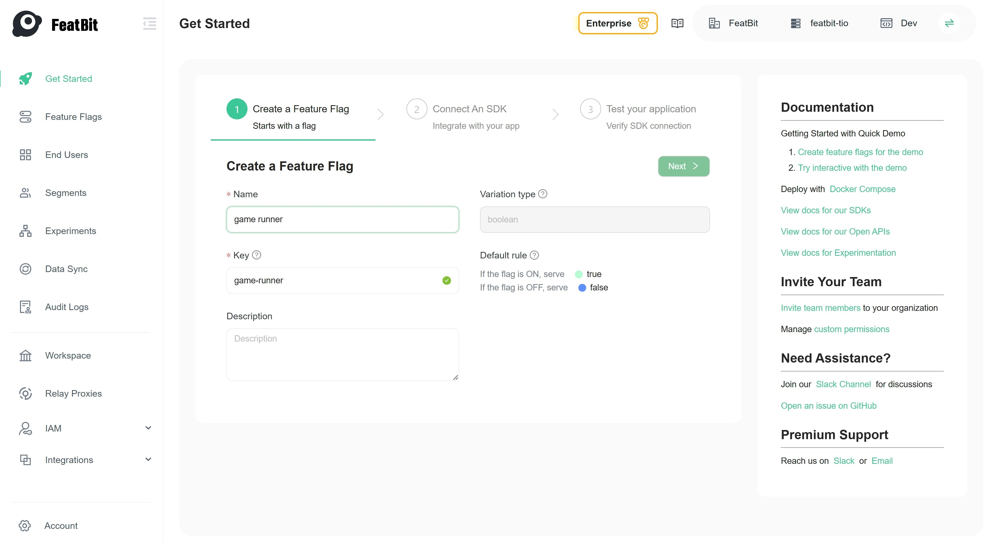
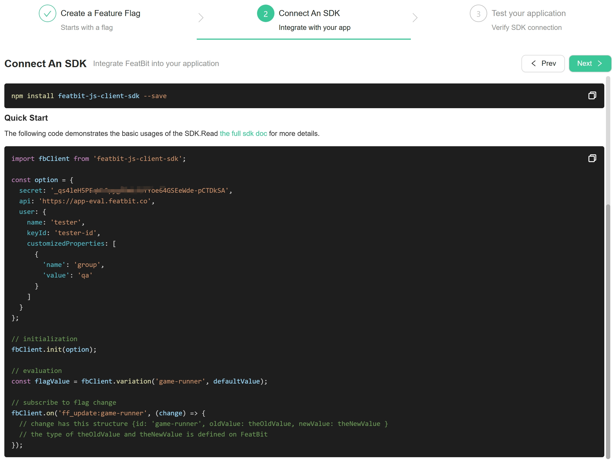

import { Callout } from 'nextra/components'

# Create a Feature Flag

## Introduction

Feature flags, also known as feature toggles, allow developers to enable or disable certain features in their applications dynamically. 
This guide will walk you through the process of creating and managing feature flags for the Dino Game demo using FeatBit.

## Prerequisites

Before proceeding, ensure the following:

1. You have successfully logged in to the [FeatBit Cloud](https://app.featbit.co).
2. Alternatively, you have installed FeatBit via [Docker Installation](../installation/full-installation.md).

## Initialize Environment

If this is your initial login, follow the steps below to specify your organization and project name.

Once completed, click the **Get Started** button to proceed.

## Create a feature flag

Create a new feature flag named "**game runner**" and click **Next**.

<Callout type="info" emoji="ℹ️">
  This guide demonstrates creating a boolean feature flag for simplicity. For different data types, refer to our [Create a multi-variant feature flag](create-a-multi-variant-feature-flag) guide.
</Callout>

## Connect An SDK

The second step provides starter code to integrate FeatBit into your app and demonstrates basic usages of the SDK. 
The image below shows the JavaScript starter code. For a list of supported SDKs, please check out the [SDK Overview](../sdk/overview#supported-sdks) page.

## Verify SDK Connection

You can verify the connection between your application and FeatBit in the third step of "Get Started" by running the starter code provided in the second step. 
The image below shows the testing result of the feature flag "game runner".

## Next Steps

In the following chapter, you will learn how to interact with the Dino Game demo.