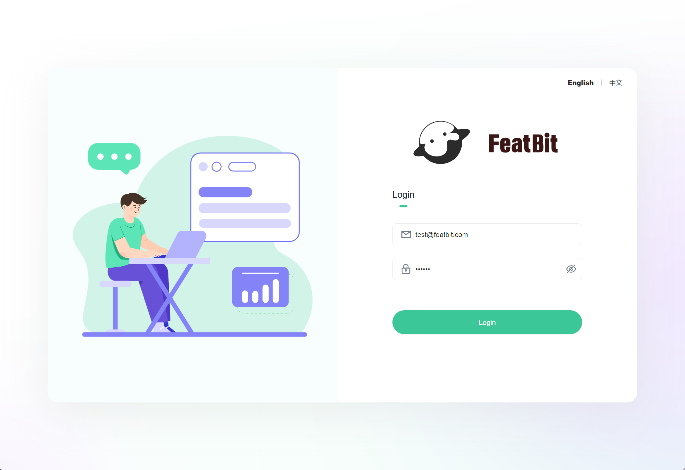
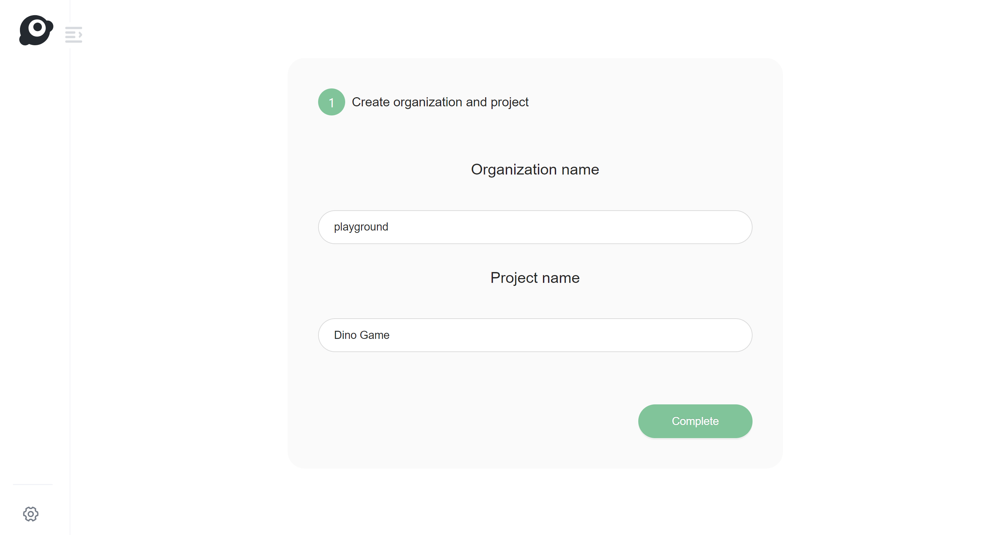
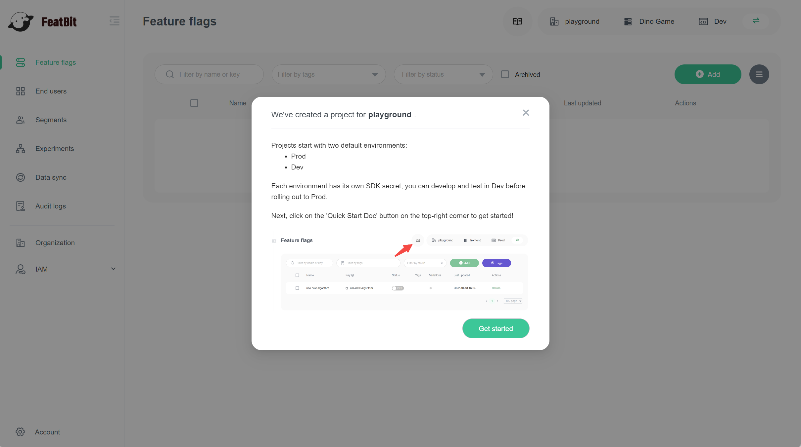
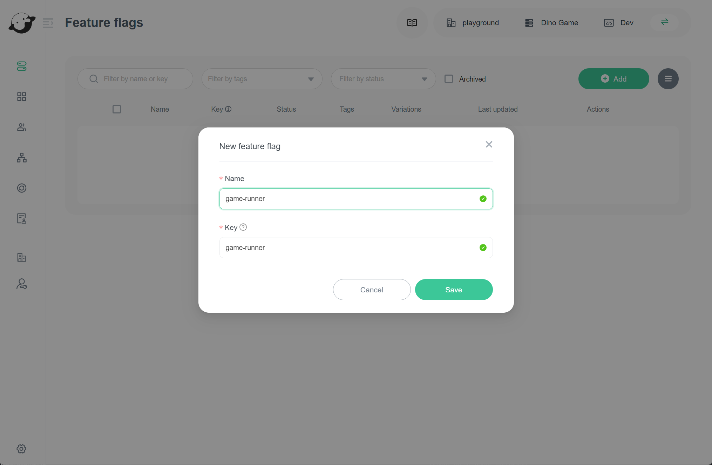
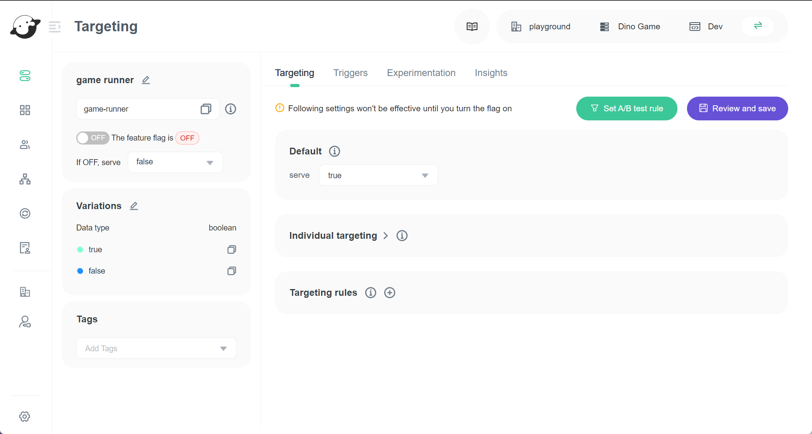
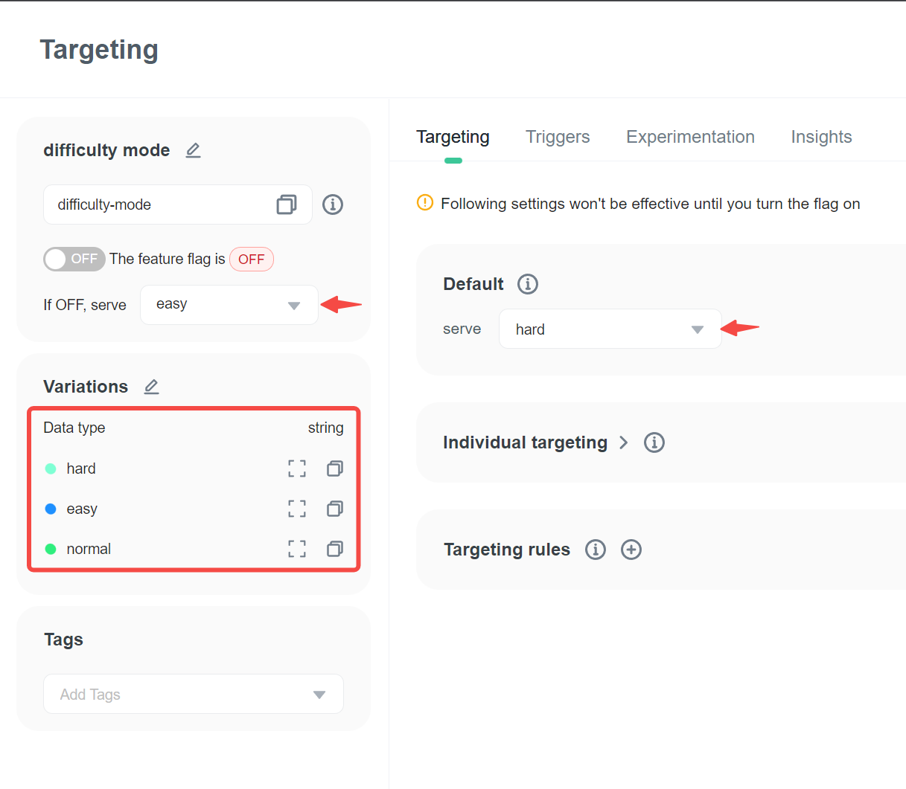

import { Callout } from 'nextra/components'

# 1. Create two feature flags

In this topic, you will learn how to create feature flags for the demo "Dino Game".

## Prerequisites

We assume that you have successfully installed FeatBit through [Docker Installation](../installation/full-installation.md).

## Login to the portal

Before creating the feature flag, you must log in to the portal. Open your browser, and open the website [`http://localhost:8081/`](http://localhost:8081/). Default username and password are:

* username: test@featbit.com
* password: 123456

If this is your first time login in, you need to specify your organization and project through the guide below. Click on the "Complete" button to finish this step.

After completing the process above, you will be redirected to the feature flag list page. You will see an onboarding guide (shown in the image below).

## Create two flags for demo

### 1. Create a "game runner" feature flag

In the flag list, click **Add** button, and then texts "**game runner**" as the name of the feature flag.

<Callout type="info" emoji="ℹ️">
  This feature flag will be used in the following topics, be sure you have the same information as the image below. The flag's key are case sensitive.
</Callout>

Click on the "Save" button to create the feature flag, then you will see the detail page of feature flag "game runner".

> See the article [Targeting users with flags](../feature-flags/targeting-users-with-flags/) to get more information about the Targeting tab.

### 2. Create a "difficulty mode" feature flag&#x20;

Go back to "the flag list", create a feature flag, and name it "**difficulty mode**".

<Callout type="info" emoji="ℹ️">
  This feature flag will be used in the following topics, be sure you have the same information as the image below. The flag's key are case sensitive.
</Callout>

In the targeting page of this feature flag, find the flag variation area on the left side panel.

#### 1. To edit variation values

* Enter edit variations mode
* Modify the value of `true` to `hard`&#x20;
* Modify the value of `false` to `easy`
* Add a new variation with the value `normal`

#### 2. Changed the `DateType` from `boolean` to `string`

#### 3. Click on save button to save the modification.

You will see the return variations are changed:

1. The default rule section's return value is changed from `true` to `hard`
2. The return variation when feature flag is OFF is changed from `false` to `easy`

## Next

**Congratulation**, now you have successfully created 2 feature flags, you will learn how to use these feature flags in the next topic ["Try interacting with the demo"](try-interacting-with-the-demo.md).
