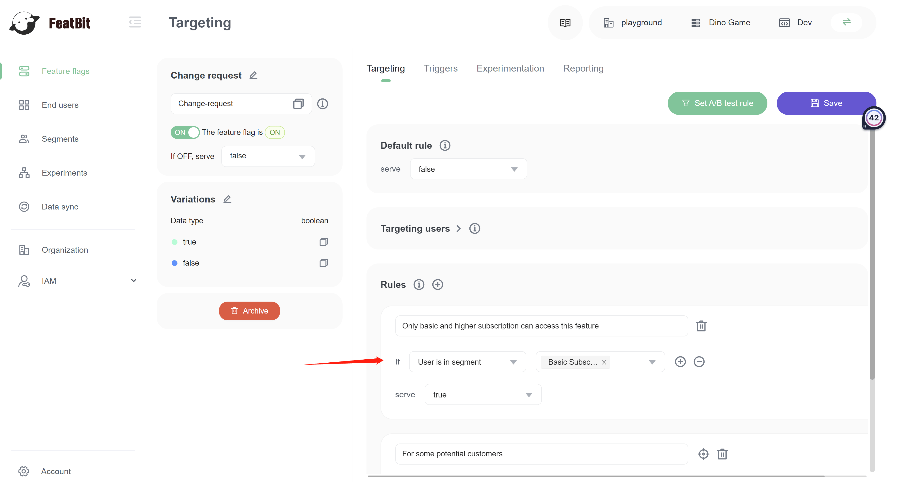
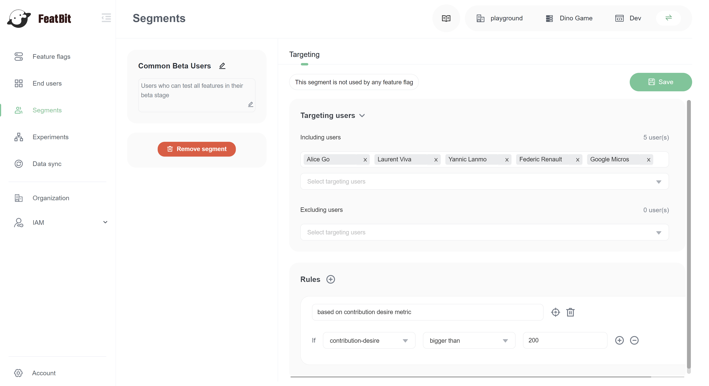

# Entitlement

> **Entitlements**
>
> “Entitlements” refers to enabling or disabling software features, services, and products for customers. FeatBit provides an intuitive UI for managing entitlements with feature flags, and provides access controls to ensure that only the right people in your organization can toggle such flags. Sales reps can give prospects access to a trial version of your software, customer support agents can enable functionality for users lacking access to features for which they paid, product managers can grant beta users access to their application, and so on—all with little developer intervention.

## Prerequisites

We assume that you've already completed the last three tutorials in "Get Started":

* You have successfully created two feature flags, `game runner` and `difficulty mode` in the tutorial [Create 2 flags for the demo](../create-two-feature-flags.md).
* You have essential experience with how to [interact with the "`Dino Game` " demo](../try-interacting-with-the-demo.md).
* You know how to [connect an SDK](../connect-an-sdk/) to your program or the "Dino Game" demo:
  * Download a demo code sample
  * Initialize SDK
  * Identify a user with customized properties.
  * Implement a feature flag to deliver, and control the feature

## Use segment as a subscription group

You have lots of feature flags to control features and several subscriptions. Each subscription is allowed to access some of features which are controlled by feature flags.

You need to create standard subscription segment to access features. For example, you can create a subscription named "Basic Subscription".

## Sales use feature flags for giving features access to a subscription segment

Add this segment to feature flags. For example, we let users who are in "Basic Subscription" can access the feature "Change Request". In the feature flag "Change request", you just need to add a rule that **if user is in segment 'basic subscription or higher', this user can see and access this feature**.

After saving the change of feature flag, only users who are in basic subscription can see and use faeture "Change request".

## PM grant beta users access to a feature

First, we create a segment for beta users. Everytime PM update this segment, it will be updated in all feature flags which used this segment.

Imaging that the feature "Change request" has a version 2, before the we upgrade this new version to customers, PM want to do a beta test in production with Beta users. We just need to add another customized rule that **If users are in "Common Beta Users" segment, they have access to version 2 of feature "Change request"**.

## Feature usage statistics and management

You can see feature usage statistics in **Reporting** tab of a feature flag.

FeatBit didn't allow you to create a customized dashboard for managing features, but we think it's a must-have feature in many situations when teams manage their entitlement. Especially when they connect their entitlement system with the billing system for monetizing their software.
