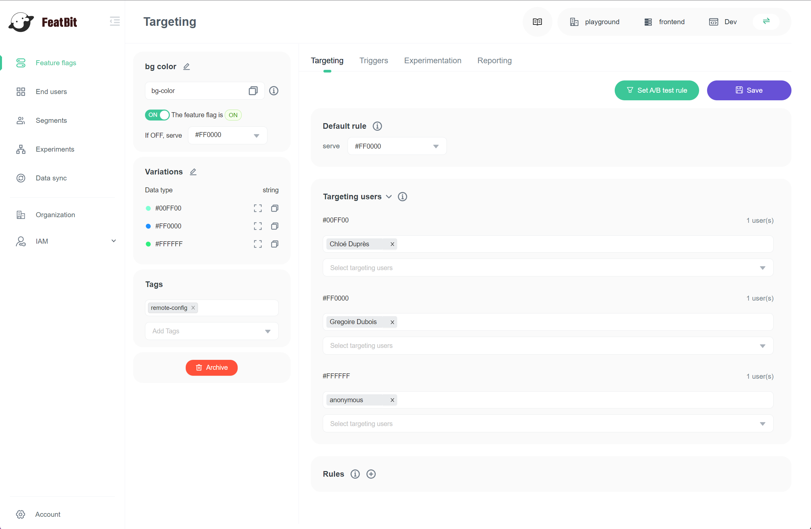
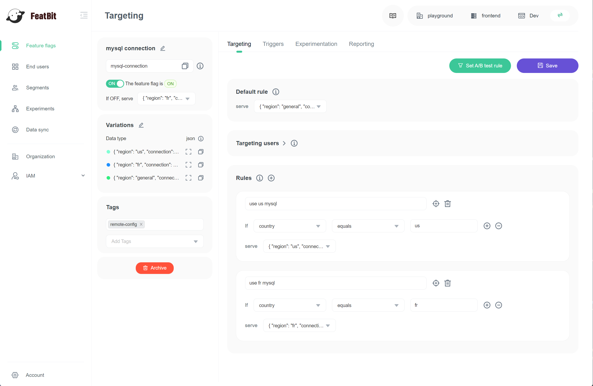

# Remote Config

## Overview

[Remote config](https://www.featbit.co) lets you alter an application in real-time, without having to wait for a deployment or app store approval. At a high level, it’s a key-value store in the cloud, and apps running on end-user devices use these key-value pairs to configure desired user experiences.

## Difference with feature flag

To summarize the difference, it comes down to the type of data managed by each. [Feature flags](https://www.featbit.co) are, by their very nature, binary - they’re either on or off. Developers often use Remote configuration for managing settings that can’t be represented through a boolean.

Depending on the application, the two work together to give developers or application managers more finite control over how the application operates without requiring deployment of an updated version of the application.

Fortunately, FeatBit allows application managers to manage both feature flags and remote configuration. After you create a feature flag, you can just **turn it on** and **change its variation data type** to string, number or json to "convert" this feature flag to a remote config.

## Examples

Here are some remote config examples.

### Background Color

In this example, we created a "bg color" remote config to get different color for different user.

### MySql Connection

In this example, we created a "mysql connection" remote config to get different mysql connections for different regional instances.

