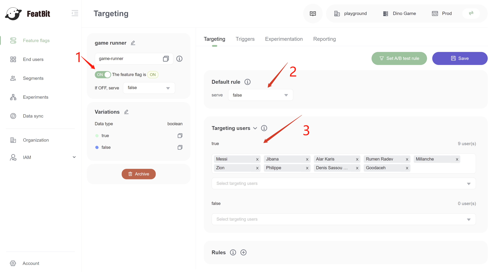
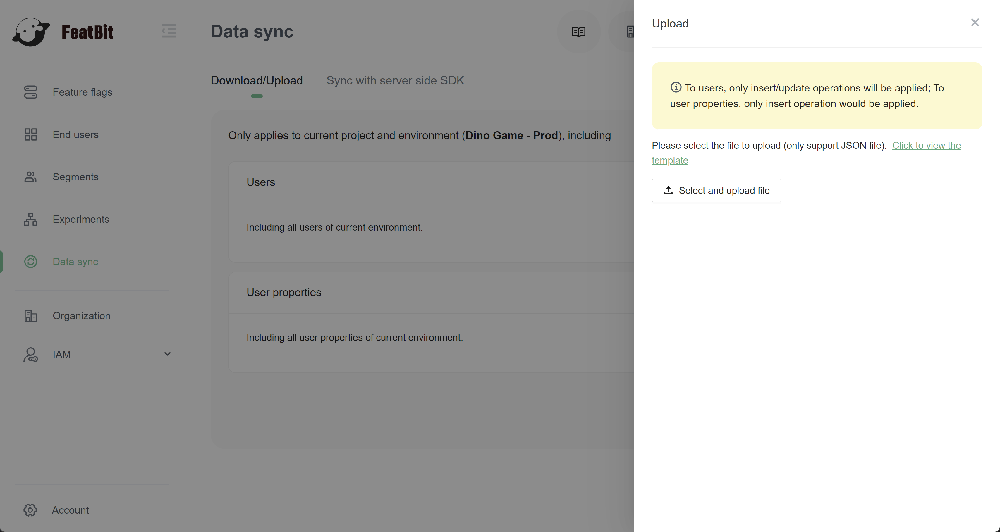
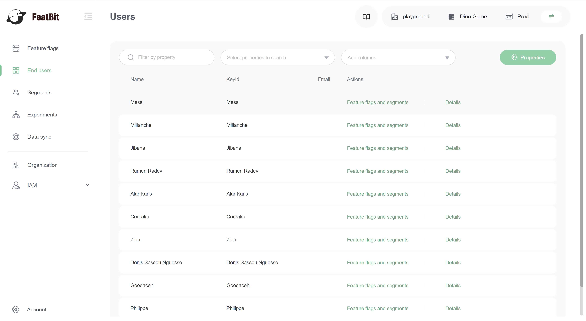
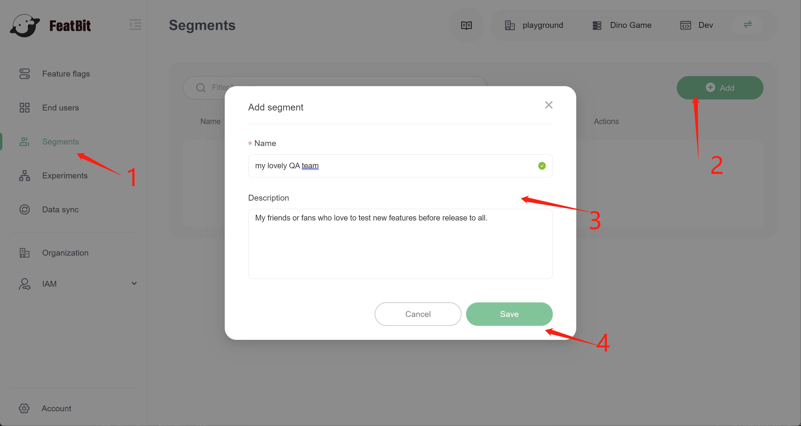
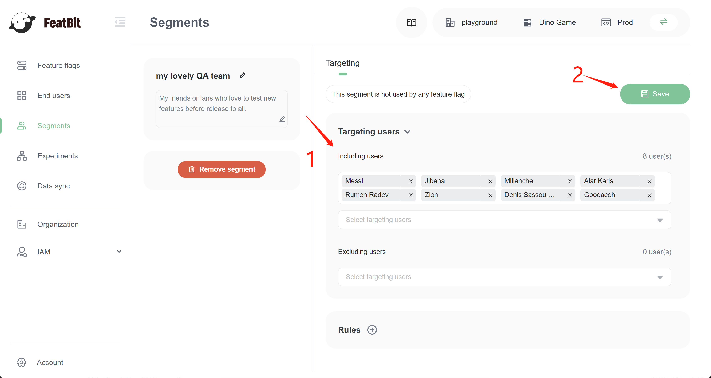
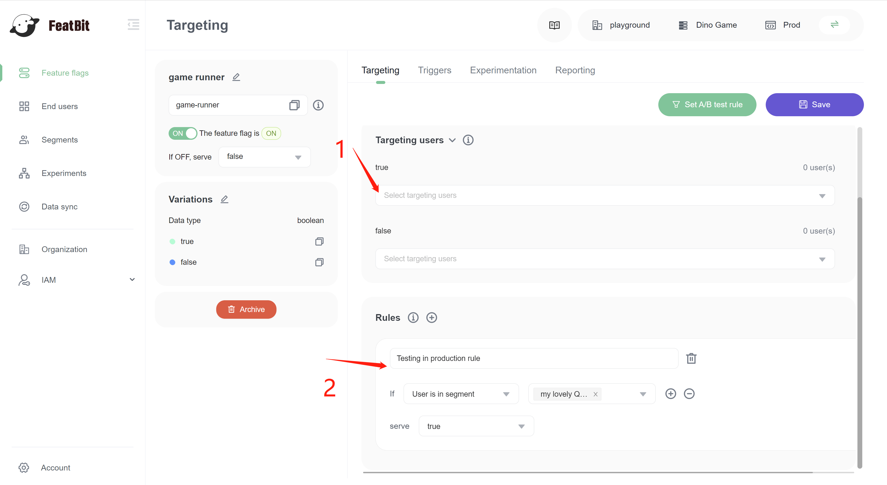
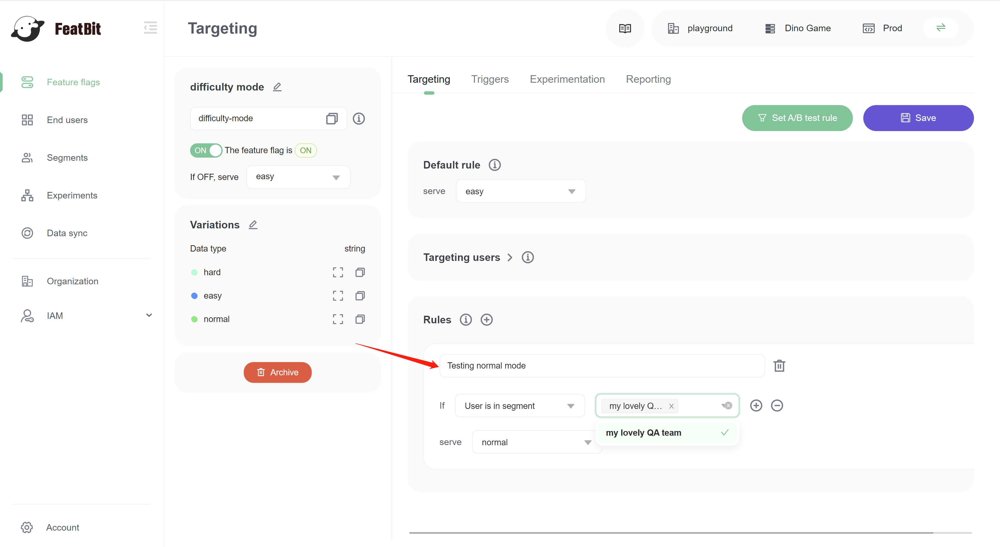

# Testing in production

> What is **Testing in production**
>
> It’s impossible to replicate a production environment. The only sure way to know how a feature will perform in the real world is to test it with real users. Feature flags give you the control you need to test in production safely. Take advantage of FeatBit’s targeting capabilities to expose a new feature to a subset of specific users. If system performance suffers, you can halt the rollout and limit the blast radius of the incident. But if all goes well, you can gradually release the new feature to a wider audience.

## Prerequisites

We assume that you've already completed the last 3 tutorials in "Get Started":

* You have successfully created two feature flags `game runner` and `difficulty mode` in the tutorial [Create 2 flags for the demo](../create-two-feature-flags.md).
* You have basic experience with how to [interact with the "`Dino Game` " demo](../try-interacting-with-the-demo.md).
* You know how to [connect an SDK](../connect-an-sdk/) to your program or to "Dino Game" demo:
  * Download a demo code sample
  * Initialize SDK
  * Identify a user with customized properties.
  * Implement a feature flag to deliver, and control the feature

## Use individual users to test in production

The game has been deployed online. Before you release it to all players, you want to test it with some close friends. You can use the "Targeting users" section to add your friends to the "allowlist".

Go to the targeting page of your "game runner" feature flag, expand the section "Targeting Users". You will see two selection-list for each variation `true` and `false`.

To add your friends to the "allowlist", we just need to:

1. Add your friends' game username to selection-list below `true`.
2. Turn on the feature flag.
3. Set the default rule to `false`.

Three steps above told to FeatBit that the feature flag "game runner" is turned on. Only users in the true list of Targeting users section can have a `true` variation (can play game).

### Where users come from?

Users in the true list can imported by three ways:

1. In "Data sync" section, you can import all users to FeatBit through a predefined JSON file.

2. When user registered in your running application, user information is saved to system.

3. You can also input username directly in "Targeting users" selection-lists. If user doesn't exist, it will add a new user in "End users" list.

Users information can be found in "End users" page.

## Use the QA segment to test in production

Your friends like your game, they want to always test new features before release to the public. They became reusable users for testing (like a QA team). For making our work easier next time we release a new feature, you can create a segment QA, this segment will be used each time you deploy a new feature of the game.

Go to page "Segments", create a segment with name "my lovely QA team".

In the segment detail page, we add my lovely test users into "Including users" list, then we click save. This segment can be shared cross different feature flags.

We go back to the feature flag list and open "game runner" feature flag's "Targeting" page.

1. Remove all users in the true list of "Targeting users" section.
2. Add "my lovely QA team" to customized rule.
   1. Add a new customized rule and name it (for example, "Testing in production rule").
   2. Choose "User is in segment" as IF condition.
   3. Select "my lovely QA team" section to section list.
   4. Select `true` in serve area.

The configuration above means if users is in segment "my lovely QA team", DinoGame will release to this user. This configuration can also be implemented in other feature flags for testing in production for other features, like "difficulty mode".

The segment is also called a reusable segment, it can be used across different feature flags. Update one segment means updating all feature flags which used this segment.
