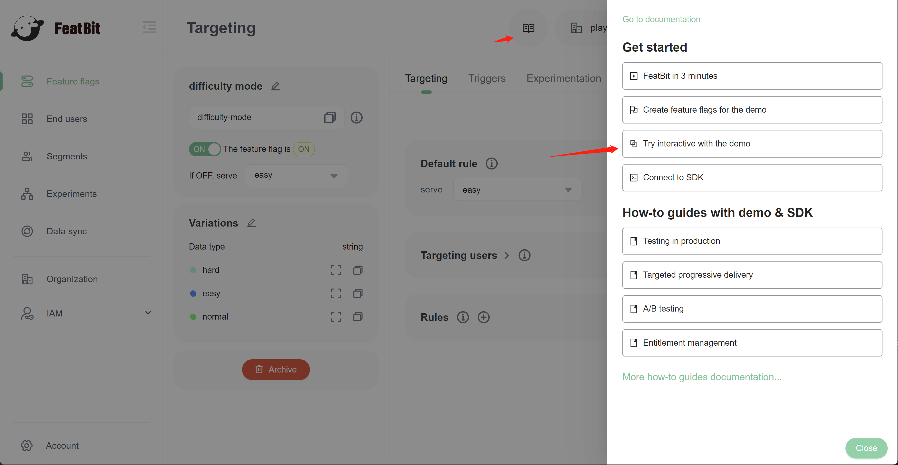
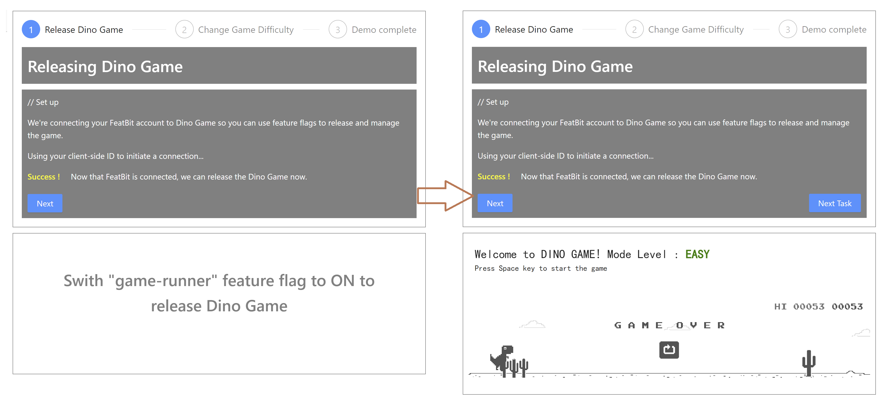
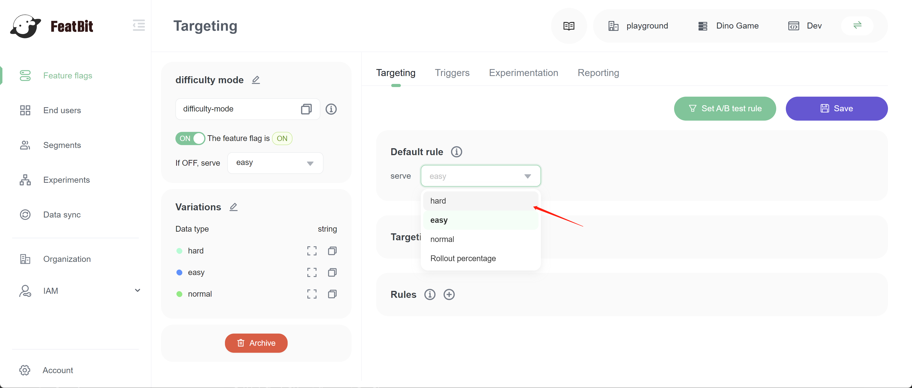

# 2. Try interacting with the demo

You created two feature flags "game runner" and "difficulty mode" in the last step, you can use these two flags to interact with the "Dino Game" demo.&#x20;

To interact with the demo, you open the "Quick start" panel then click on step "3. Try interacting with the demo". Then you will be directed to the "Dino Game" demo page.

In this demo, you will learn how to turn your feature flag ON to make the "Dino Game" appear in the game area. In reverse, if you turn the feature flag OFF, the game will disappear immediately.&#x20;

You will also learn how to use a feature flag's variation to control the game's difficulty mode.&#x20;

After playing with the demo, you can continue with the next step "[Connect an SDK](connect-an-sdk)".
