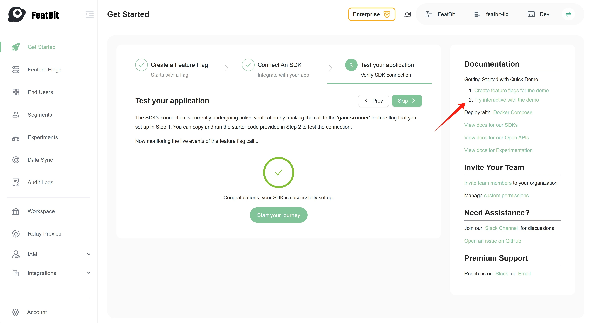
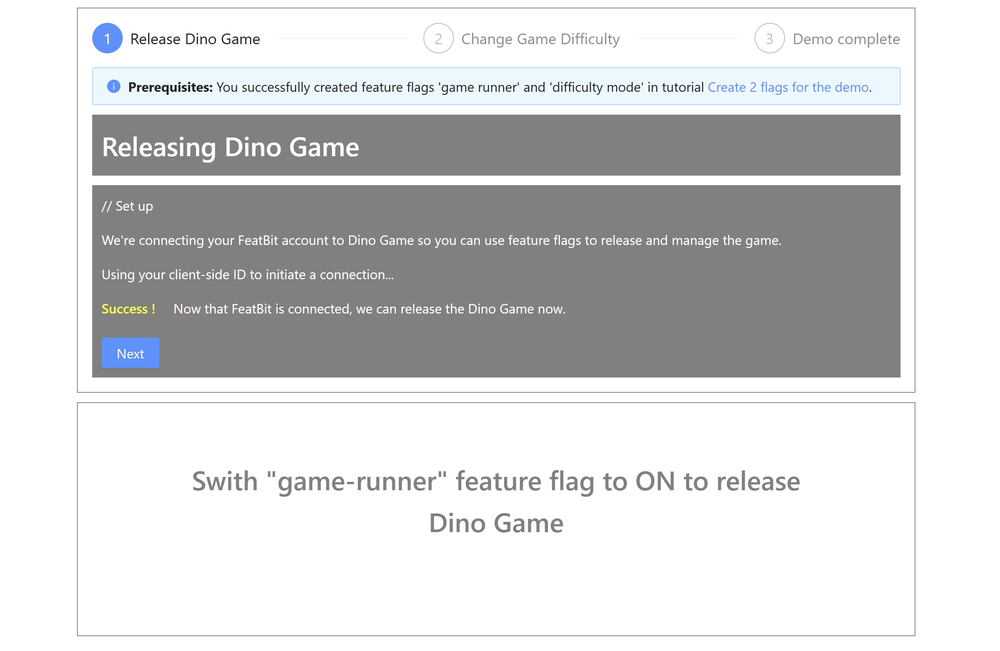
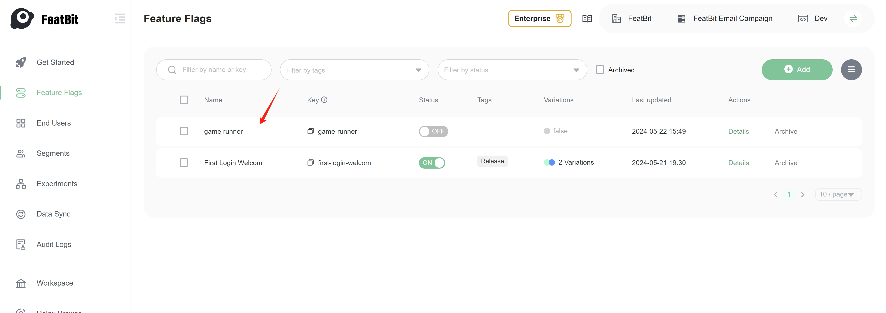
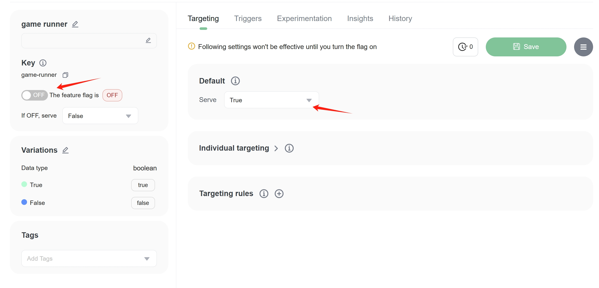

import { Callout } from 'nextra/components'

# 2. Try interacting with the demo

On the right side of the "Get Started" page, click the "Try interacting with the demo" button to start the demo.

In the demo page, by default, the "Dino Game" is hidden, the game page shows a message "Swith 'game-runner' feature flag to ON to release Dino Game".

Now, switch to the **feature flags** list page and find the feature flag "game runner" that you created in the last step.

Click on the item or "Detail" button to see the detail page of the feature flag "game runner". 

Turn on the feature flag, then go back to the demo page. You will see the "Dino Game" appears in the game area.

<Callout type="info" emoji="ℹ️">
  Turn on the flag means that the SDK will evaluate the feature flag and return `true` to the application. In reverse, if you turn off the flag, the SDK will return `false` to the application. `True` is commonly used to enable the feature, and `false` is used to disable the feature, but it depends on how you use the feature flag in your application.
</Callout>

Next page, you will learn how to use a feature flag's variation to control the game's difficulty mode.