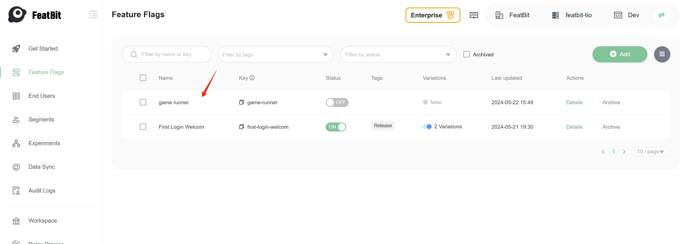

import { Callout } from 'nextra/components'

# 2. Try interacting with the demo

Click the "Try interacting with the demo" button on the right side of the "Getting Started" page to start the demo.

In the demo page, the "Dino Game" is hidden by default, the game page shows the message "Switch 'game-runner' feature flag to ON to release Dino Game".

Now go to the **Feature Flags** page and find the "game runner" feature flag you created in the previous step.

Click on the item or "Detail" button to see the detail page of the feature flag "game runner". 

Turn on the feature flag, then go back to the demo page. You will see the "Dino Game" appear in the game area.

<Callout type="info" emoji="ℹ️">
  Turn on the flag means that the SDK will evaluate the feature flag and return `true` to the application. In reverse, if you turn off the flag, the SDK will return `false` to the application. `True` is typically used to enable the feature, and `false` is used to disable the feature, but it depends on how you use the feature flag in your application.
</Callout>

In the next chapter, you will learn how to use a feature flag's variation to control the game's difficulty mode.