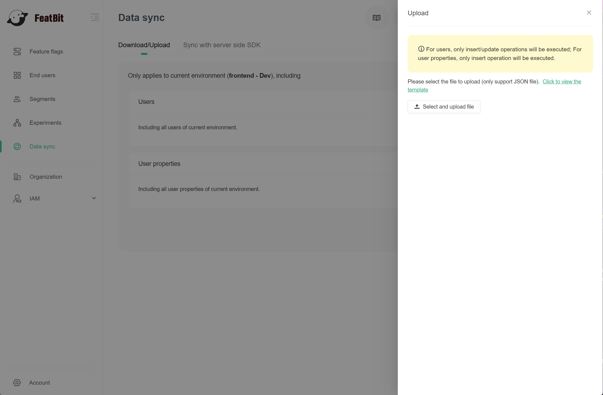

# End Users

## Overview

This topic explains how to download and upload end users for current environment.

Here is an image of the download/upload end-user page:

<figure><figcaption>
The "Download/Upload" page
</figcaption></figure>

## Download

To download current environment end-users:

1. Navigate to the **Data sync** page.
2. Click the **Download/Upload** tab.
3. Click **Download**.

The server will then return a json file which contains all end-users and all user properties.

## Upload

To upload current environment end-users:

1. Navigate to the **Data sync** page.
2. Click the **Download/Upload** tab.
3.  Click **Upload**. The upload end-users drawer appears:

    <figure><figcaption>
The "Upload" drawer.
</figcaption></figure>


When you upload end-users to the server:

* For users, only insert/update operations will be executed.
* For user properties, only insert operation will be executed.

