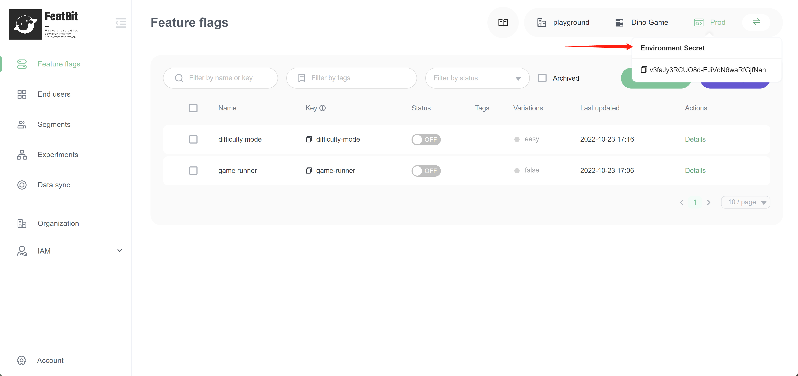
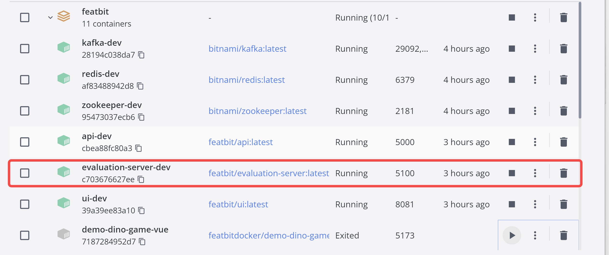
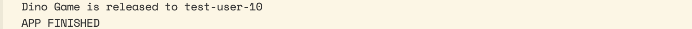
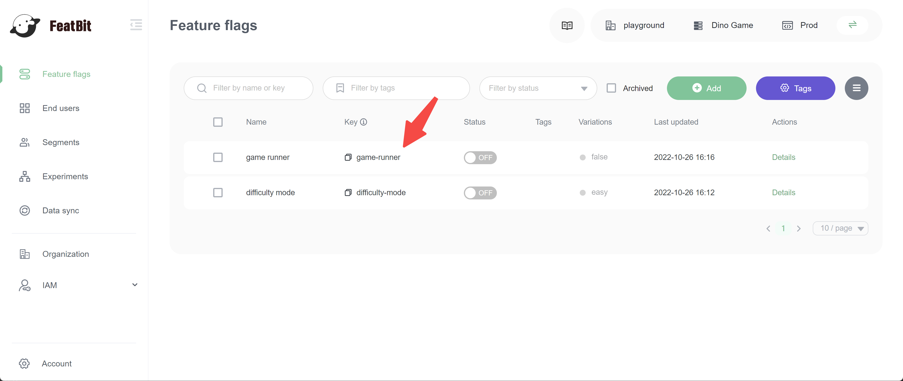

# Java SDK

## Guide

* [Install Java SDK in your project](java-sdk.md#install-java-sdk)
* [Create a FeatBit client Instance](java-sdk.md#create-a-featbit-client-instance)
* [initialize a FeatBit enduser](java-sdk.md#initialize-a-fbuser)
* [implement a flag to control the feature](java-sdk.md#initialize-a-featbit-enduser)
* [Code Source & SDK's tutorial](java-sdk.md#code-source-and-sdks-tutorial)

## Install Java SDK

**Apache Maven**

```xml
<dependency>
  <groupId>co.featbit</groupId>
  <artifactId>featbit-java-sdk</artifactId>
  <version>1.0.4</version>
</dependency>
```

**Gradle Groovy DSL**

```
implementation 'co.featbit:featbit-java-sdk:1.0.4'

```

## Create a FeatBit client Instance

After you install and import the SDK, create a single, shared instance of the FeatBit client

```java
private static final FBConfig config = new FBConfig.Builder()
                .eventURL(eventUrl)
                .streamingURL(streamUrl)
                .build();
                
FBClient client = new FBClientImp(envSecret, config);
```

**envSecret**: the environment secret. **mandatory**. This identifies the connection between your application and FeatBit. You can find the environment secret by hovering your mouse on the environment name (check the image below).

<figure><figcaption></figcaption></figure>

**remote url**: event url and streaming url to FeatBit service. **mandatory**. The default URL in docker-compose is http://localhost:5100.

<figure><figcaption></figcaption></figure>

## Initialize a FeatBit enduser&#x20;

```java
FBUser user = new FBUser.Builder(userKey)
                .userName(userName)
                .custom(key, value)
                .build();
```


**FBUser**: the user connected to your APP

* **userName**: the user name. **mandatory**
* **userKey**: the unique identifier. **mandatory**
* **customizedProperties**: any customized properties you want to send to the back end. It is extremely powerful when you define targeting rules or segments. **not mandatory**

## Implement a flag to control the feature

```java
if (client.isInitialized()) {
    boolean boolValue = client.boolVariation(yourFeatureFlagKey, user, false));
    if (boolValue) {
            System.out.println(String.format("Dino Game is released to %s", u.getUserName()));
    } else {
            System.out.println(String.format("Dino Game not released to %s", u.getUserName()));
    }
}
client.close();
```

<figure><figcaption></figcaption></figure>

`isInitialized` is use to check if the client is already initialized, this clause is **not mandatory**.

Use `boolVariation` method to get the boolean value of the bool type feature flag for a specified user.

Note that feature flag key, user, default value are both **mandatory**.

<figure><figcaption></figcaption></figure>

## Code Source & SDK's tutorial

The interactive demo DinoGame has been written in different Frameworks. Every step taught in this tutorial can be found in these code source:

* [Java Demo](https://github.com/featbit/featbit-samples/tree/main/samples/dino-game/demo-java)
* [SpringBoot Demo](https://github.com/featbit/featbit-samples/tree/main/samples/dino-game/demo-springboot)

Java SDK is also open sourced, you can check the code source and ReadMe to discover more about the SDK, for example: developer mode, bootstrap, The complete list of the available parameters in option. [Click here to link to the GitHub page of SDK](https://github.com/featbit/featbit-java-sdk).
