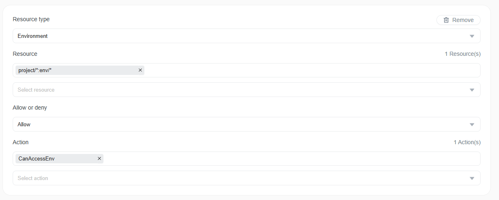
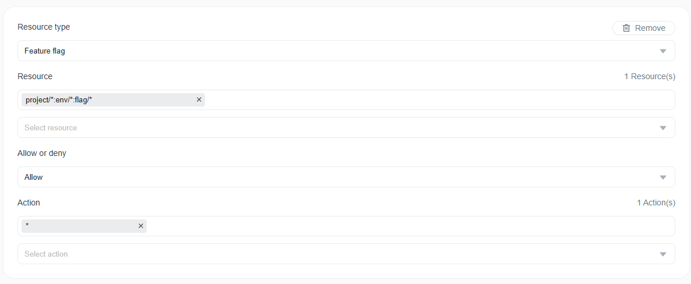

# FAQ

**I upgraded from a previous version to FeatBit 5.2.0 and sudden my account is not able to log into FeatBit**

In the version 5.2.0, we fixed a bug that allowed users without the **canAccessEnv** permission to read data from environments. 
If you are using FeatBit-managed policies (**Owner**, **Administrator**, or **Developer**), no action is required. If you are using custom policies, 
ask your owner to grant the **canAccessEnv** permission for the relevant environments.

**I upgraded from a previous version to FeatBit 5.2.0 and sudden my account is not able to manage (CRUD) feature flags**

FeatBit 5.2.0 introduced the feature fine-grained access control feature, enabling more granular control over flag modifications.
If you are using FeatBit-managed policies (**Owner**, **Administrator**, or **Developer**), no action is required. If you are using custom policies, ask your owner to grant the **all actions** (*) permission so users can manage feature flags.

