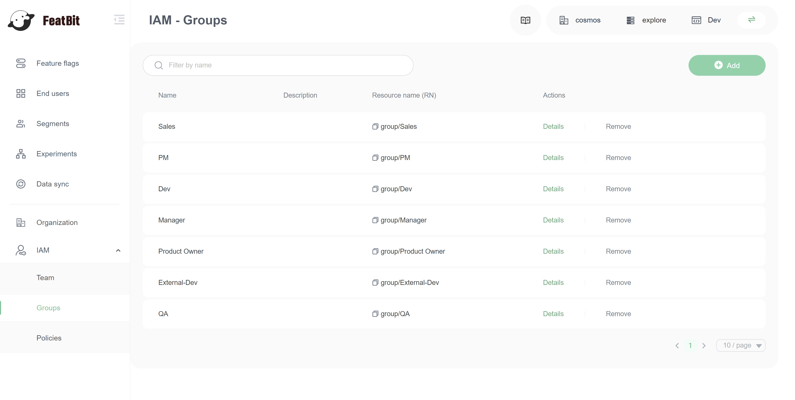

# Groups

An IAM group is a collection of IAM members. Groups let you specify permissions for multiple members, which can make it easier to manage the permissions for those members. For example, you could have a group called _Admins_ and give that group typical administrator permissions. Any member in that group automatically has _Admins_ group permissions.

If a new user joins your organization and needs administrator privileges, you can assign the appropriate permissions by adding the user to the _Admins_ user group. If a person changes jobs in your organization, instead of editing that user's permissions, you can remove them from the old user groups and add them to the appropriate new user groups.

You can attach a policy to a group so that all of the users in the user group receive the policy's permissions. Here are some important characteristics of groups:

* A group can contain many users, and a user can belong to multiple user groups.
* Groups can't be nested; they can contain only users, not other user groups.
* There is no default group that automatically includes all users in the FeatBit account. If you want to have a group like that, you must create and assign each new user.
* The number and size of IAM resources in the FeatBit account, such as the number of groups, and the number of groups that a user can be a member of, are limited.

## Create a group

1\. Go to the **Groups** page under the IAM section

2\. Click **Add** button

3\. Input the name and the description (optional) of the group

4\. Click **Save** button

5\. Click on the group you just created in the groups list to go to the group detail page.

6\. You will see the group page

## Group detail page

Group detail page is composed of 4 parties:

1. **Name** and **description** of the group
2. **Resource name** of the group, this will be used in future functionalities of IAM
3. **Team** tab, the member list contained in this group
4. **Policies** tab, permissions assigned to this group

## Group list

In the group list, you can filter groups by name

## Add members to the group

1\. Go to group detail page, switch to **Team** tab

2\. Set selector to `All`, you will see all members in the organization

3\. Find the memebrs you want to add to the group. (you can filter by email). Click **Add** button on the member item in list.

4\. Change selector from `All` to `Contained by current group`. You will only see the members contained in the group.

5\. Click **Remove** button if you want to remove members from a group.

## Attaching permission policies to a group

1\. On the group detail page, switch to **Policies** tab

2\. Set selector to `All`, you will see all policies

3\. Find the policies you want to attach to the group. (you can filter by policy's name). Click **Add** button on the member item in list.

4\. Change selector from `All` to `Attached to current group`. You will only see the policies attached to this group.

5\. Click **Remove** button if you want to remove policies from a group.

